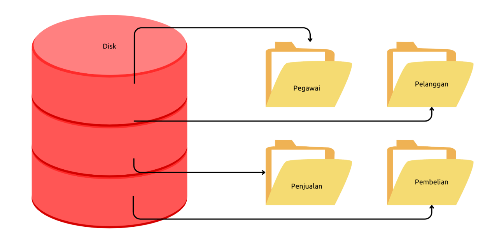

# Tutorial MySQL Database

Source: [Tutorial MySQL Database](https://docs.google.com/presentation/d/1v4HllRI-BNj4EdJFLh4_jISq_dcosHoAVo5-LME-ghY/edit?usp=sharing)

<details>
    <summary>Agenda</summary>
    <ul>
        <li>Pengenalan MySQL</li>
        <li>Menginstall MySQL</li>
        <li>Tipe Data</li>
        <li>Database Table</li>
        <li>Insert, Update, Delete, Select</li>
        <li>Transaction</li>
        <li>Table Relationship</li>
        <li>Join</li>
        <li>Dan lain-lain</li>
    </ul>
</details>

## Pengenalan Sistem Basis Data

### Pengenalan Relational Database

-   Ada banyak sekali jenis-jenis DBMS, seperti Relational Database, Document Database, Key-Value Database, dan lain-lain
-   Namun yang masih populer dan kebanyakan orang gunakan adalah relational database
-   Relational database cukup mudah dimengerti dan dipelajari karena kita sudah terbiasa menyimpan data dalam bentuk tabular (tabel) seperti di Microsoft Excel atau di Google Docs Spreadsheet
-   Selain itu, relational database memiliki perintah standard menggunakan SQL sehingga kita mudah ketika ingin berganti-ganti aplikasi database (seperti MySQL, Oracle, PostgreSQL, dan lain-lain)

### Cara Kerja DBMS

<figure>
    
    <figcaption>Cara Kerja DBMS</figcaption>
</figure>

### Database Client

-   Database Client adalah aplikasi yang digunakan untuk berkomunikasi dengan DBMS
-   Biasanya DBMS sudah menyediakan database client sederhana yang bisa kita gunakan untuk berkomunikasi dengan DBMS agar lebih mudah
-   Atau kita bisa membuat aplikasi untuk berkomunikasi dengan DBMS, misal membuat aplikasi database client menggunakan Java, PHP, atau bahasa pemrograman lainnya

### Database File

-   Mayoritas DBMS menyimpan datanya di file, walaupun ada beberapa database yang hanya menyimpan datanya di memory (RAM)
-   Namun jangan berpikir file database yang disimpan berupa file seperti Excel atau CSV (Comma Separated Value), tapi jauh lebih kompleks
-   Database File akan di optimasi oleh DBMS agar mempermudah DBMS dalam manajemen datanya, seperti insert, update, delete dan select
-   Tiap DBMS biasanya memiliki cara masing-masing mengelola Database File nya, dan kita tidak perlu harus tau, karena yang kita perlu tahu hanya cara berkomunikasi ke DBMS

### SQL

-   Structured Query Language
-   Merupakan bahasa yang digunakan untuk mengirim perintah ke DBMS
-   SQL adalah bahasa yang mudah karena hanya berisi instruksi untuk menyimpan, mengubah, menghapus atau mengambil data melalui DBMS
-   Secara garis besar, semua perintah SQL di Relational Database itu hampir sama, namun biasanya tiap DBMS ada improvement yang membedakan hal-hal kecil dalam perintah SQL, namun secara garis besar perintahnya tetap sama

## Pengenalan MySQL

### MySQL

-   MySQL adalah DBMS Relational OpenSource yang paling populer di dunia saat ini
-   Tidak hanya OpenSource, MySQL juga gratis untuk digunakan
-   MySQL pertama kali dibuat dan diperkenalkan tahun 1995 oleh David Axmark dan Michael Widenius
-   MySQL sangat populer sekali terutama dikalangan programmer web PHP
-   https://www.mysql.com/

### Kenapa Belajar MySQL?

https://db-engines.com/en/ranking/relational+dbms

### MySQL Community vs MySQL Enterprise

-   Saat kita membuka halaman website resmi MySQL, jangan sampai salah download aplikasi MySQL
-   MySQL menawarkan pilihan versi MySQL Enterprise, yaitu DBMS MySQL Yang berbayar
-   MySQL yang versi gratis adalah MySQL Community
-   MySQL Enterprise sendiri lebih ke versi improvement dari MySQL Community, biasanya menambahkan support dan monitoring
-   Jika menggunakan MySQL Community, maka kita harus tangani semuanya sendiri, dari masalah dan monitoring MySQL nya

### MySQL vs MariaDB

-   Tahun 2008 MySQL di akuisisi oleh perusahaan Sun Microsystem
-   Namun Tahun 2009, Sun Microsystem diakuisisi oleh perusahaan Oracle (Pemilik DBMS Oracle)
-   Hal ini menyebabkan 2 founder MySQL keluar dari MySQL dan membuat project baru bernama MariaDB
-   MariaDB Sebenarnya fork dari MySQL, jadi apa yang bisa dilakukan di MySQL bisa dilakukan di MariaDB
-   Sehingga sekarang jangan terlalu bingung jika ada MySQL dan MariaDB, karena sebenarnya itu dari source code yang sama, mungkin ada perbedaan kecil, namun secara garis besar sebenarnya tetap sama
-   https://mariadb.org/

### Cara kerja MySQL Server

Sama seperti gambar [cara kerja DBMS](#cara-kerja-dbms), tapi DBMS nya adalah MySQL Server

## Menginstall MySQL

### Menginstall MySQL

-   Menginstall MySQL banyak caranya, bisa download langsung dari halaman website resminya
-   Atau bisa menggunakan aplikasi yang mem-bundle MySQL seperti XAMPP yang biasa digunakan oleh programmer PHP
-   Jika sudah menginstall MySQL / MariaDB menggunakan XAMPP, tidak perlu menginstall lagi MySQL, karena jika bentrok, maka salah satu aplikasi MySQL nya tidak akan bisa jalan

### Menggunakan MySQL Client

-   MySQL Client adalah aplikasi berbasis terminal yang disediakan oleh MySQL untuk berkomunikasi dengan MySQL Server
    > `mysql` adalah client. Sedangkan untuk servernya adalah `mysqld`
-   Karena berbasis terminal, sehingga MySQL Client sangat cocok untuk kita gunakan misal ketika di server production, dimana kita menginstall MySQL di linux server yang berbasis terminal misal
-   Kita tidak perlu menginstall MySQL Client secara terpisah, karena sudah tersedia di dalam aplikasi MySQL ketika kita menginstallnya

### MySQL Workbench

-   MySQL Workbench adalah aplikasi MySQL Client berbasis Desktop yang disediakan oleh MySQL
-   MySQL Workbench adalah aplikasi gratis
-   Aplikasi MySQL Workbench sangat mempermudah kita melakukan manajemen data di MySQL karena berbasis Desktop
-   https://www.mysql.com/products/workbench/

## Database

### Database

-   Database adalah tempat kita menyimpan table di MySQL
-   Jika kita misalkan table di MySQL adalah sebuah file, maka database adalah folder nya, dimana kita bisa menyimpan banyak table di sebuah database
-   Biasanya pembuatan kita akan membuat satu database untuk satu jenis aplikasi, walaupun satu aplikasi bisa menggunakan lebih dari satu database, namun lumrahnya, satu aplikasi akan menggunakan satu database

<figure>
    
    <figcaption>Ilustrasi Database</figcaption>
</figure>

### Perintah-Perintah (Query) di Database

```sql
# Melihat Semua Database di MySQL
show databases;

# Membuat Database
create database nama_database;

# Memilih Database
use nama_database;

# Menghapus Database
drop database nama_database;

```

## Tipe Data

### Tipe Data

-   Saat kita membuat tabel di Excel, kita bisa menentukan tipe data apa yang kita masukkan ke tiap kolom di Excel
-   Di MySQL, kita juga bisa menentukan tipe data tiap kolom yang kita buat di sebuah tabel
-   Ada banyak sekali tipe data yang tersedia di MySQL, dari yang sederhana, sampai yang kompleks.
-   Biasanya kita akan menggunakan tipe data sesuai dengan kebutuhan kolom yang perlu kita buat

### Tipe Data per Kolom

| id (number) | Nama (text) | Harga (number) | Jumlah (number) |
| :---------- | :---------- | :------------- | :-------------- |
| 1           | Apel        | 5000           | 100             |
| 2           | Jeruk       | 2000           | 200             |
| 3           | Semangka    | 10000          | 50              |
| ...         | ...         | ...            | ...             |

## Tipe Data Number

### Tipe Data Number

-   Secara garis besar, tipe data number di MySQL ada 2 jenis:
    1. Integer, atau tipe number bilangan bulat
    2. Floating Point, atau tipe data number pecahan

### Tipe Data Integer

| Type      | Length in Bytes | Minimum Value (Signed) | Maximum Value (Signed) | Minimum Value (Unsigned) | Maximum Value (Unsigned) |
| :-------- | :-------------- | :--------------------- | :--------------------- | :----------------------- | :----------------------- |
| TINYINT   | 1               | -128                   | 127                    | 0                        | 255                      |
| SMALLINT  | 2               | -32768                 | 32767                  | 0                        | 65535                    |
| MEDIUMINT | 3               | -8388608               | 8388607 to             | 0                        | 16777215                 |
| INT       | 4               | -2147483648            | 2147483647             | 0                        | 4294967295               |
| BIGINT    | 8               | -9223372036854775808   | 9223372036854775807    | 0                        | 18446744073709551615     |

### Tipe Data Floating Point

| Type   | Length in Bytes | Minimum Value (Signed)    | Maximum Value (Signed)   | Minimum Value (Unsigned)       | Maximum Value (Unsigned) |
| :----- | :-------------- | :------------------------ | :----------------------- | :----------------------------- | :----------------------- |
| FLOAT  | 4               | -3.402823466E+38          | -1.175494351E-38         | 1.175494351E-38                | 3.402823466E+38          |
| DOUBLE | 8               | -1.79769313248623157E+308 | -2.2250738585072014E-308 | 0, and 2.2250738585072014E-308 | 1.79769313248623157E+308 |

### Decimal

-   Selain Integer dan Floating Point, di MySQL terdapat tipe data DECIMAL
-   Ini tipe data number khusus yang bisa ditentukan jumlah precision dan scale nya
    |DECIMAL(Digit, Precission)|MIN|MAX|
    |:-|:-|:-|
    |DECIMAL(5,2)| -999.99|999.99|
    |DECIMAL(5,0)| -99999|99999|
    |DECIMAL(3,1)| -99.9|999|
    |DECIMAL(3)| -999|999|

### Number Attribute

| Type     | Description                                                                                                    |
| :------- | :------------------------------------------------------------------------------------------------------------- |
| TYPE(N)  | Where N is an integer and display width of the type is upto N digits.                                          |
| ZEROFILL | The default padding of spaces is replaced with zeros. So, for a column INT(3) ZEROFILL, 7 is displayed as 007. |

## Tipe Data String

### Tipe Data String

-   Selain number, biasanya kita sering menyimpan data di dalam tabel dalam bentuk tulisan
-   Tipe data ini namanya tipe data String atau Text
-   Ada banyak tipe data String di MySQL

### CHAR dan VARCHAR

-   Pertama tipe data String di MySQL adalah CHAR dan VARCHAR
-   Kita bisa menentukan jumlah panjang maksimal karakter yang bisa ditampung oleh CHAR dan VARCHAR dengan menggunakan kurung buka lalu masukan jumlah maksimal karakter dan diakhiri kurung tutup
-   Misal, CHAR(10) atau VARCHAR(10) artinya tipe data String dengan maksimal jumlah karakternya adalah 10 karakter
-   Maksimum ukuran CHAR atau VARCHAR adalah 65535 karakter

### Perbedaan CHAR dan VARCHAR

| **Value**  | CHAR(4)    | **Storage Required** | VARCHAR(4) | **Storage Required** |
| :--------- | :--------- | :------------------- | :--------- | :------------------- |
| '&nbsp;'   | '&emsp;'   | 4 bytes              | '&nbsp;'   | 1 byte               |
| 'ab'       | 'ab&ensp;' | 4 bytes              | 'ab'       | 3 byte               |
| 'abcd'     | 'abcd'     | 4 bytes              | 'abcd'     | 5 byte               |
| 'abcdefgh' | 'abcd'     | 4 bytes              | 'abcd'     | 5 byte               |

### TEXT

-   Selain CHAR dan VARCHAR, tipe data String yang lainnya adalah TEXT
-   Berbeda dengan CHAR dan VARCHAR yang kita bisa tentukan panjang maksimum nya, TEXT tidak sudah memiliki maksimum panjang nya
-   Terdapat 4 tipe data TEXT
    -   TINYTEXT dengan maksimum 255 karakter (~256 bytes)
    -   TEXT dengan maksimum 65535 karakter ( ~64 kb)
    -   MEDIUMTEXT dengan maksimum 16777215 karakter (~16MB)
    -   dan LONGTEXT dengan maksimum 4294967295 karakter (~4GB)

### ENUM

-   ENUM adalah tipe data String yang bisa kita tentukan pilihan pilihannya
-   Misal kita bisa membuat
    -   ENUM(‘Pria’, ‘Wanita’), artinya hanya bisa menerima data Pria atau Wanita
    -   ENUM(‘Programmer’, ‘Zaman’, ‘Now’), artinya hanya bisa menerima data Programmer, Zaman atau Now

## Tipe Data Date dan Time

### Tipe Data Date dan Time

-   Selain tipe data Number dan String, biasanya kadang kita sering menyimpan data waktu atau tanggal
-   Sebenarnya bisa kita gunakan String untuk menyimpan data waktu atau tanggal, namun itu tidak di rekomendasikan, karena akan menyulitkan kita ketika nanti butuh melakukan manipulasi waktu atau tanggal di MySQL

### Jenis-Jenis Tipe Data Date dan Time

Kapan menggunakan DATETIME dan TIMESTAMP:
[stack overflow](https://stackoverflow.com/questions/409286/should-i-use-the-datetime-or-timestamp-data-type-in-mysql)

| Tipe Data Date dan Time | Format              | Contoh              |
| :---------------------- | :------------------ | :------------------ |
| DATE                    | YYYY-MM-DD          | 2020-10-10          |
| DATETIME                | YYYY-MM-DD HH:MM:SS | 2020-10-10 10:10:10 |
| TIMESTAMP               | YYYY-MM-DD HH:MM:SS | 2020-10-10 10:10:10 |
| TIME                    | HH:MM:SS            | 10:10:10            |
| YEAR                    | YYYY                | 2020                |

## Tipe Data Boolean

### Tipe Data Boolean

-   BOOLEAN adalah tipe data kebenaran, yang artinya datanya hanya ada dua jenis, benar atau salah
-   Benar direpresentasikan dengan data TRUE, sedangkan salah direpresentasikan dengan data FALSE

## Tipe Data Lainnya

### Dan Lain-Lain

-   Sebenarnya masih banyak jenis tipe data yang lain yang didukung oleh MySQL, namun itu bisa kita pelajari jika memang ada kebutuhan spesifik
-   Seperti misal tipe data BLOB, SPATIAL, JSON, SET dan lain-lain
-   https://dev.mysql.com/doc/refman/8.0/en/data-types.html

## Table

### Table

-   Data biasanya disimpan di dalam tabel di MySQL
-   Tiap tabel biasanya menyimpan satu jenis data, misal ketika kita membuat aplikasi toko online, kita akan membuat tabel barang, tabel pelanggan, tabel penjual, dan lain-lain
-   Sebelum kita bisa memasukkan data ke tabel, kita wajib terlebih dahulu membuat tabelnya terlebih dahulu
-   Dan tiap tabel yang kita buat, wajib ditentukan kolom-kolom nya, dan tipe data tiap kolom nya
-   Kita juga bisa mengubah tabel yang sudah terlanjur dibuat, seperti menambah kolom baru, mengubah kolom yang sudah ada, atau menghapus kolom

### Storange Engines

-   MySQL memiliki berbagai cara melakukan pengolahan data, hal ini disebut Storage Engines.
-   Saat ini, yang biasa dan populer digunakan adalah InnoDB
-   Untuk melihat storage engines apa saja yang terdapat di MySQL, kita bisa menggunakan perintah : SHOW ENGINES;
<figure>
    
    <figcaption>Show Engines in my own MySQL</figcaption>
</figure>

### Melihat Table

```sql
SHOW TABLES;
```

### Membuat Table

```sql
CREATE TABLE barang
(
    kode    INT,
    nama    VARCHAR(100),
    harga   INT,
    jumlah  INT
) ENGINE = InnoDB;
```

### Melihat Struktur Table (Gunakan salah satu baris perintah)

```sql
DESCRIBE nama_table;
DESC nama_table;
SHOW CREATE TABLE nama_table;
```

### Mengubah Table (Gunakan salah satu baris perintah)

```sql
ALTER TABLE barang
    ADD COLUMN nama_column TEXT,
    DROP COLUMN nama,
    RENAME COLUMN nama TO nama_baru,
    MODIFY nama VARCHAR(100) AFTER jumlah,
    MODIFY nama VARCHAR(100) FIRST;
```

### Null Value

-   Null adalah nilai ketika kita tidak mengisi data ke dalam kolom
-   Secara default, saat kita membuat kolom, kolom tersebut bisa bernilai NULL, jika kita tidak ingin menerima nilai NULL, kita bisa menambahkan NOT NULL ketika pembuatan kolom nya

### Default Value

-   Saat kita menyimpan data ke dalam tabel, lalu kita hanya menyimpan beberapa kolom (tidak semuanya), kolom yang tidak kita beri nilai secara default nilainya adalah NULL
-   Jika kita ingin mengubah default value nya, kita bisa menambahkan perintah DEFAULT NILAI ketika pembuatan kolom nya
-   Khusus tipe data DATETIME atau TIMESTAMP, jika kita ingin menggunakan default value dengan nilai waktu saat ini, kita bisa gunakan kata kunci CURRENT_TIMESTAMP

### Membuat Ulang Table

```sql
TRUNCATE nama_tabel;
```

> `TRUNCATE` menghapus semua data dan membuat ulang seluruh tabel

### Menghapus Tabel

```sql
DROP TABLE nama_tabel;
```

> `DROP` menghapus permanen suatu tabel

## Insert Data

### Insert Data

-   Sebelum kita meng memasukkan data kedalam tabel, tabel harus dibuat terlebih dahulu
-   Kita bisa menyebutkan kolom mana yang ingin kita isi, jika kita tidak menyebutkan kolom nya, artinya kolom tersebut tidak akan kita isi, dan secara otomatis kolom yang tidak kita isi, nilainya akan NULL, kecuali memiliki DEFAULT VALUE
-   Untuk memasukkan data kedalam tabel, kita bisa menggunakan perintah SQL yang bernama INSERT

### Membuat Tabel Produk

```sql
CREATE TABLE products
(
    id              VARCHAR(10)     NOT NULL,
    nama            VARCHAR(100)    NOT NULL,
    description     TEXT,
    price           INT UNSIGNED    NOT NULL,
    quantity        TIMESTAMP       NOT NULL DEFAULT CURRENT_TIMESTAMP,
    created_at      TIMESTAMP       NOT NULL DEFAULT CURRENT_TIMESTAMP
) ENGINE = InnoDB;
```

### Memasukkan Data

```sql
INSERT INTO products(id, name, price, quantity)
VALUES ('P0001', 'Mie Ayam Original', 15000, 100);

INSERT INTO products(id, name, description, price, quantity)
VALUES ('P0002', 'Mie Ayam Bakso Bakso Tahu', 'Mie Ayam Original + Bakso Tahu', 15000, 100);
```

### Memasukkan Beberapa Data Sekaligus

```sql
INSERT INTO products(id, name, price, quantity)
VALUES ('P0003', 'Mie Ayam Ceker', 20000, 100),
       ('P0004', 'Mie Ayam Spesial', 25000, 100),
       ('P0005', 'Mie Ayam Yamin', 15000, 100);
```

## Select Data

### Select Data

-   Untuk mengambil data di tabel, kita bisa menggunakan SQL dengan kata kunci SELECT
-   SELECT bisa digunakan untuk mengambil semua kolom yang ada di tabel, atau sebagian kolom saja
-   Jika kita ingin mengambil semua kolom, kita bisa gunakan karakter `*` (bintang)
-   Jika kita hanya ingin mengambil beberapa kolom saja, kita bisa sebutkan nama-nama kolom yang ingin kita ambil datanya

### Mengambil Data

```sql
SELECT * FROM products;

SELECT id, name, price, quantity FROM products;
```

## Primary Key

### Primary Key

-   Saat kita membuat tabel, idealnya tiap tabel memiliki Primary Key
-   Primary key adalah sebuah kolom yang kita tunjuk sebagai id dari tabel tersebut
-   Primary key adalah identitas untuk tiap baris data di dalam tabel
-   Primary key harus unik, tidak boleh ada data dengan primary key yang sama
-   Kita bisa menunjuk kolom yang akan kita jadikan primary key

### Primary Key di Multiple Column

-   Kita bisa membuat primary key dengan kombinasi beberapa kolom
-   Namun disarankan untuk tetap menggunakan satu kolom ketika membuat primary key
-   Kecuali ada kasus khusus, seperti membuat tabel yang berelasi MANY TO MANY (yang nanti akan kita bahas)

### Menambah Primary Key Ketika Membuat Tabel

```sql
CREATE TABLE products
(
    id              VARCHAR(10)     NOT NULL,
    nama            VARCHAR(100)    NOT NULL,
    description     TEXT,
    price           INT UNSIGNED    NOT NULL,
    quantity        TIMESTAMP       NOT NULL DEFAULT CURRENT_TIMESTAMP,
    created_at      TIMESTAMP       NOT NULL DEFAULT CURRENT_TIMESTAMP,
    PRIMARY KEY (id)
)
```

### Menambah Primary Key di Tabel

```sql
ALTER TABLE products
    ADD PRIMARY KEY (id);
```

## Where Clause

### Where Clause

-   Saat mengambil data menggunakan perintah SQL SELECT, kadang kita ingin melakukan pencarian data
-   Misal, kita ingin mengambil data barang yang harganya 1jt, atau mengambil data barang yang quantity nya 0 (stok nya kosong)
-   Hal ini bisa kita lakukan dengan `WHERE` clause setelah perintah SELECT

### Mencari Data

```sql
SELECT id, name, price, quantity
FROM products
WHERE quantity = 0;
```

### Update Data

-   Untuk mengubah data di tabel, kita bisa menggunakan perintah SQL `UPDATE`
-   Saat menggunakan SQL UPDATE, kita harus memberi tahu data mana yang akan di update dengan WHERE clause
-   Hati-hati ketika meng-update data di table, jika sampai WHERE clause nya salah, bisa-bisa kita malah meng-update seluruh data di tabel
-   Untuk update, kita harus beritahu, kolom mana yang akan di update

### Menambah Kolom Kategori

```sql
ALTER TABLE products
    ADD COLUMN category ENUM ('Makanan', 'Minuman', 'Lain-Lain')
        AFTER name;
```

### Mengubah Satu Kolom

```sql
UPDATE products
SET category = 'Makanan'
WHERE id = 'P0001';
```

### Mengubah Beberapa Kolom

```sql
UPDATE products
SET category    = 'Makanan'
    description = 'Mie Ayam + Ceker'
WHERE id = 'P0003';
```

### Mengubah Dengan Value di Kolom

```sql
UPDATE products
SET price = price + 5000
WHERE id = 'P0004';
```

## Delete Data

### Delete Data

-   Setelah kita tahu cara menambah, mengubah dan mengambil data di tabel, terakhir yang perlu kita ketahui adalah menghapus data di table
-   Untuk menghapus data di table, kita bisa menggunakan perintah SQL DELETE
-   Perintah SQL `DELETE` sama seperti UPDATE, kita perlu memberi tahu data mana yang akan di hapus dengan WHERE clause
-   Dan hati-hati, **jangan sampai salah menentukan WHERE clause**, karena jika salah, bisa-bisa kita akan menghapus seluruh data di table

### Menghapus Data

```sql
DELETE
FROM products
WHERE id = 'P0009';
```

## Alias

### Alias

-   MySQL memiliki fitur untuk melakukan alias untuk kolom dan tabel
-   Alias berguna jika kita ingin mengubah nama kolom atau nama tabel ketika melakukan SELECT data
-   Mungkin saat ini alias untuk tabel tidak terlalu terlihat gunanya, tapi nanti ketika kita telah mempelajari tentang JOIN, maka fitur alias untuk tabel sangat berguna sekali

### Alias untuk Kolom

```sql
SELECT  id           as 'Kode',
        name         as 'Nama',
        category     as 'Category',
        price        as 'Harga',
        quantity     as 'Stok'
FROM products;
```

### Alias untuk Tabel

```sql
SELECT  p.id           AS 'Kode',
        p.name         AS 'Nama',
        p.category     AS 'Category',
        p.price        AS 'Harga',
        p.quantity     AS 'Stok'
FROM products AS p;
```

## Where Operator

### Where Operator

-   Sebelumnya di materi where clause kita sudah menggunakan operator = (sama dengan)
-   Sebenarnya sangat banyak sekali operator yang bisa kita gunakan ketika menggunakan where clause
-   Sekarang kita akan bahas satu per satu

### Operator Perbandingan

| Operator   | Keterangan                   |
| :--------- | :--------------------------- |
| =          | Sama dengan                  |
| <> atau != | Tidak sama dengan            |
| <          | Kurang dari                  |
| <=         | Kurang dari atau sama dengan |
| >          | Lebih dari                   |
| >=         | Lebih dari atau sama dengan  |

### Mencari Data dengan Operator Perbandingan

```sql
SELECT id, name, price, quantity
FROM products
WHERE quantity > 100;
```

### AND dan OR Operator

-   Kadang kita ingin mencari data dengan beberapa gabungan kondisi, kita bisa menggunakan operator AND dan OR
-   AND dan OR digunakan untuk menggabungkan beberapa dua operator

### Hasil Operator AND

| Hasil Operator 1 | Operator | Hasil Operator 2 | Hasil Akhir |
| :--------------- | :------- | :--------------- | :---------- |
| Benar            | AND      | Benar            | Benar       |
| Salah            | AND      | Benar            | Salah       |
| Benar            | AND      | Salah            | Salah       |
| Salah            | AND      | Salah            | Salah       |

### Mencari Data dengan Operator AND

```sql
SELECT id, name, price, quantity
FROM products
WHERE quantity > 100 AND price > 100000;
```

### Hasil Operator AND

| Hasil Operator 1 | Operator | Hasil Operator 2 | Hasil Akhir |
| :--------------- | :------- | :--------------- | :---------- |
| Benar            | OR       | Benar            | Benar       |
| Salah            | OR       | Benar            | Benar       |
| Benar            | OR       | Salah            | Benar       |
| Salah            | OR       | Salah            | Salah       |

### Mencari Data dengan Operator OR

```sql
SELECT id, name, price, quantity
FROM products
WHERE quantity > 100 OR price > 100000;
```

### Prioritas dengan Kurung ()

```sql
SELECT id, name, price, quantity
FROM products
WHERE (category= 'Makanan' OR quantity > 500)
    AND price > 100000;
```

### Like Operator

-   LIKE operator adalah operator yang bisa kita gunakan untuk mencari sebagian data dalam String
-   Ini cocok sekali ketika kita hanya ingin mencari sebagian kata dalam String
-   Namun perlu diingat, operasi LIKE itu sangat lambat, oleh karena itu, tidak disarankan jika datanya sudah terlalu besar di tabel
-   Operasi LIKE tidak case sensitive, jadi huruf besar dan kecil tidak akan berpengaruh

### Hasil Operator LIKE

| LIKE Operator   | Hasil                   |
| :-------------- | :---------------------- |
| LIKE 'b%'       | String dengan awalan b  |
| LIKE '%a'       | String dengan akhiran a |
| LIKE '%arfani%' | String berisi arfani    |
| NOT LIKE        | Tidak LIKE              |

### Mencari Menggunakan LIKE Operator

```sql
SELECT *
FROM products
WHERE name LIKE '%mie%';
```

### NULL Operator

-   Untuk mencari data yang berisi NULL, kita tidak bisa menggunakan operator perbandingan = NULL.
-   Ada operator khusus untuk mencari data NULL, yaitu menggunakan NULL operator
-   IS NULL, artinya mencari yang NULL
-   IS NOT NULL, artinya mencari yang tidak NULL

### Mencari Menggunakan NULL Operator

```sql
SELECT *
FROM products
WHERE description IS NULL;
```

### Between Operator

-   Kadang kita ingin mencari data yang >= dan <= secara sekaligus
-   Misal kita ingin mencari products yang harganya antara 10000 sampai 20000
-   Untuk melakukan ini, kita bisa menggunakan WHERE price >= 10000 AND price <= 20000
-   Namun ada operator BETWEEN yang bisa kita gunakan agar lebih sederhana
-   Untuk kebalikannya, kita bisa gunakan NOT BETWEEN

### Mencari Menggunakan BETWEEN Operator

```sql
SELECT *
FROM products
WHERE price BETWEEN 10000 AND 20000;
```

### IN Operator

-   Operator IN adalah operator untuk melakukan pencarian sebuah kolom dengan beberapa nilai.
-   Misal kita ingin mencari products dengan category Makanan atau Minuman, maka kita bisa menggunakan operator IN

### Mencari Menggunakan IN Operator

```sql
SELECT *
FROM products
WHERE category IN ('Makanan', 'Minuman');
```

## Order By Clause

### Order By Clause

-   Untuk mengurutkan data ketika kita menggunakan perintah SQL SELECT, kita bisa menambahkan `ORDER BY` clause
-   ORDER BY clause digunakan untuk mengurutkan data berdasarkan kolom yang dipilih, dan jenis urutan (`ASC` atau `DESC`)
-   Kita juga bisa mengurutkan tidak hanya terhadap satu kolom, tapi beberapa kolom

### Mengurutkan Data

```sql
SELECT *
FROM products
ORDER BY price ASC, id DESC;
```

## Limit Clause

### Limit Clause

-   Mengambil seluruh data di tabel bukanlah pilihan bijak, apalagi jika datanya sudah banyak sekali
-   Kita bisa membatasi jumlah data yang diambil dalam SQL SELECT dengan `LIMIT` clause
-   Selain membatasi jumlah data, kita juga bisa meng-skip sejumlah data yang tidak ingin kita lihat
-   LIMIT biasanya digunakan saat melakukan paging di aplikasi kita

### Membatasi Hasil Query

```sql
SELECT *
FROM products
WHERE price > 0
ORDER BY price
LIMIT 2;
```

### Skip Hasil Query

```sql
SELECT *
FROM products
WHERE price > 0
ORDER BY price
LIMIT 2, 2;     # skip, limit
```

## Select Distinct Data

### Select Distinct Data

-   Saat melakukan query dengan SELECT, kadang kita mendapatkan data yang duplikat
-   Misal kita ingin melihat semua kategori di tabel products, maka otomatis hasil query SELECT akan duplikat, karena banyak sekali produk dengan kategori yang sama
-   Jika kita ingin menghilangkan data-data duplikat tersebut , kita bisa menggunakan SELECT dengan tambahan `DISTINCT` sebelum nama kolom nya

### Menghilangkan Data Duplikat

```sql
SELECT DISTINCT category
FROM products;
```

## Numeric Function

### Numeric Function

-   MySQL memiliki banyak sekali fitur untuk manipulasi data angka
-   Hal ini memudahkan kita untuk memanipulasi data angka
-   Secara garis besar, fitur ini dibagi menjadi dua, Arithmetic Operator dan Mathematical Function

### Arithmetic Operator

| Name   | Description                     |
| :----- | :------------------------------ |
| %, MOD | Module Operator                 |
| \*     | Multiplication Operator         |
| +      | Addition Operator               |
| -      | Minus Operator                  |
| -      | Change the sign of the argument |
| /      | Division Operator               |
| DIV    | Integer Division                |

### Menggunakan Arithmetic Operator

```sql
SELECT 10 + 10 as hasil

SELECT id, price DIV 1000 as 'Price in K'
FROM products;
```

### Mathematical Function

-   Selain arithmetic operator, ada juga mathematical function
-   Ini adalah kumpulan function yang terdapat di MySQL yang bisa kita gunakan sebagai fungsi-fungsi matematika
-   Ada banyak sekali, dan tidak bisa kita bahas semua
-   https://dev.mysql.com/doc/refman/8.0/en/mathematical-functions.html

### Menggunakan Mathematical Function

```sql
SELECT PI();

SELECT POWER(10, 2);

SELECT COS(10);
SELECT SIN(10);
SELECT TAN(10);
```

## Auto Increment

### Auto Increment

-   Kadang kita butuh angka yang berurut untuk membuat primary key, misal 1, 2, 3, dan seterusnya.
-   Untuk melakukan hal ini secara manual bukanlah hal bijak, apalagi jika aplikasi yang kita buat diakses oleh banyak orang secara bersamaan
-   MySQL memiliki fitur yang bernama auto increment, fitur ini bisa kita gunakan untuk menandai bahwa suatu primary key datanya diisi secara otomatis dari angka terakhir + 1
-   Dengan menggunakan auto increment, kita tidak perlu lalu memasukkan data primary key, ini akan otomatis dibuat oleh MySQL

### Membuat Tabel dengan Auto Increment

```sql
CREATE TABLE admin
(
    id          INT NOT NULL AUTO_INCREMENT,
    first_name  VARCHAR(100),
    last_name   VARCHAR(100),
    PRIMARY KEY (id)
) ENGINE = InnoDB;
```

### Memasukkan Data Tanpa Id

```sql
INSERT INTO admin(first_name, last_name) VALUES ('Eko', 'Khannedy');
INSERT INTO admin(first_name, last_name) VALUES ('Budi', 'Nugraha');
INSERT INTO admin(first_name, last_name) VALUES ('Joko', 'Morro');
```

### Melihat Id Terakhir

```sql
SELECT LAST_INSERT_ID();
```

## String Function

### String Function

-   Sama seperti number, di MySQL juga banyak menyediakan function untuk tipe data String
-   Ada banyak sekali function-function yang bisa kita gunakan
-   https://dev.mysql.com/doc/refman/8.0/en/string-functions.html

### Menggunakan String Function

```sql
SELECT id, LOWER(name) as 'Name Lower'
FROM products;

SELECT id, name, LENGTH(name) as 'Name Length'
FROM products;
```

## Date and Time Functions

### Date and Time Functions

-   MySQL juga menyediakan banyak sekali function yang bisa kita gunakan untuk mengolah data tipe Date dan Time
-   https://dev.mysql.com/doc/refman/8.0/en/date-and-time-functions.html

### Menambah Kolom Timestamp

```sql
SELECT id, created_at,
       EXTRACT(YEAR FROM created_at)  AS 'Year',
       EXTRACT(MONTH FROM created_at) AS 'Month',
FROM products;

SELECT id, YEAR(created_at), MONTH(created_at)
FROM products;
```

## Flow Control Function

### Flow Control Function

-   MySQL memiliki fitur flow control function
-   Ini mirip IF ELSE di bahasa pemrograman
-   Tapi ingat, fitur ini tidak se kompleks yang dimiliki bahasa pemrograman
-   https://dev.mysql.com/doc/refman/8.0/en/flow-control-functions.html

### Menggunakan Control Flow CASE

```sql
SELECT id,
       category,
       CASE category
            WHEN 'Makanan' THEN 'Enak'
            WHEN 'Minuman' THEN 'Segar'
            ELSE 'Apa itu?'
            END AS 'Category'
FROM products;
```

### Menggunakan Control Flow IF

```sql
SELECT id,
       price,
       IF(price <= 15000, 'Murah',
          IF(price <= 20000, 'Mahal', 'Mahal Banget')
          ) AS 'Mahal?'
FROM products;
```

### Menggunakan Control Flow IFNULL

```sql
SELECT id, name, IFNULL(description, 'Kosong')
FROM products;
```

## Aggregate Function

### Aggregate Function

-   MySQL mendukung function-function untuk melakukan aggregate
-   Misal, kita ingin melihat harga paling mahal di tabel product, atau harga termurah, atau rata-rata harga produk, atau total jumlah data di tabel, dan lain-lain
-   https://dev.mysql.com/doc/refman/8.0/en/aggregate-functions.html

### Menggunakan Aggregate Function

```sql
SELECT COUNT(id) AS 'Total Product' FROM products;

SELECT AVG(price) AS 'Rata-Rata' FROM products;

SELECT MAX(price) AS 'Harga Termurah' FROM products;

SELECT MIN(price) AS 'Harga Termahal' FROM products;

SELECT SUM(quantity) AS 'Total Stock' FROM products;

```

## Grouping

### Group By

-   Kadang saat melakukan aggregate, kita ingin datanya di grouping berdasarkan kriteria tertentu
-   Misal kita ingin melihat rata-rata harga product, tapi ingin per category
-   Atau kita ingin melihat total semua product, tapi per category
-   Hal ini bisa dilakukan di MySQL dengan menggunakan `GROUP BY` clause
-   GROUP BY clause ini hanya bisa digunakan jika kita menggunakan aggregate function
-   https://dev.mysql.com/doc/refman/8.0/en/group-by-modifiers.html

### Menggunakan GROUP BY

```sql
SELECT category,
       COUNT(id) as 'Total Product'
FROM products
GROUP BY category;

SELECT COUNT(id) AS 'Total Product', category FROM products GROUP BY category;

SELECT AVG(price) AS 'Rata-Rata', category FROM products GROUP BY category;

SELECT MAX(price) AS 'Harga Termurah', category FROM products GROUP BY category;

SELECT MIN(price) AS 'Harga Termahal', category FROM products GROUP BY category;

SELECT SUM(quantity) AS 'Total Stock', category FROM products GROUP BY category;
```

### HAVING Clause

-   Kadang kita ingin melakukan filter terhadap data yang sudah kita grouping
-   Misal kita ingin menampilkan rata-rata harga per kategori, tapi yang harganya diatas 10.000 misalnya
-   Jika menggunakan WHERE di SELECT, hal ini tidak bisa dilakukan
-   Untuk memfilter hasil aggregate function, kita harus menggunakan `HAVING` clause

### Menggunakan HAVING Clause

```sql
SELECT category,
       COUNT(id) as total
FROM products
GROUP BY category
HAVING total > 1;
```

## Constraint

### Constraint

-   Di MySQL, kita bisa menambahkan constraint untuk menjaga data di tabel tetap baik
-   Constraint sangat bagus ditambahkan untuk menjaga terjadi validasi yang salah di program kita, sehingga data yang masuk ke database tetap akan terjaga

### Unique Constraint

-   Unique constraint adalah constraint yang memastikan bahwa data kita tetap unique
-   Jika kita mencoba memasukkan data yang duplikat, maka MySQL akan menolak data tersebut

### Membuat Table dengan Unique Constraint

```sql
CREATE TABLE customers
(
    id          INT             NOT NULL AUTO_INCREMENT,
    email       VARCHAR(100)    NOT NULL,
    first_name  VARCHAR(100)    NOT NULL,
    last_name   VARCHAR(100),
    PRIMARY KEY (id),
    UNIQUE KEY email_unique (email)  # constraint nya
) ENGINE = InnoDB;
```

### Menambah / Menghapus Unique Constraint

```sql
ALTER TABLE customers
    ADD CONSTRAINT email_unique UNIQUE (email);

ALTER TABLE customers
    DROP CONSTRAINT email_unique;
```

### Check Constraint

-   Check constraint adalah constraint yang bisa kita tambahkan kondisi pengecekannya
-   Ini cocok untuk mengecek data sebelum dimasukkan ke dalam database
-   Misal kita ingin memastikan bahwa harga harus diatas 1000 misal
-   Maka kita bisa menggunakan check constraint

> Mirip seperti validasi, menambahkan kriteria

### Membuat Table dengan Check Constraint

```sql
CREATE TABLE products
(
    id          VARCHAR(10)     NOT NULL,
    name        VARCHAR(100)    NOT NULL,
    description TEXT,
    price       INT UNSIGNED NOT NULL,
    quantity    INT UNSIGNED NOT NULL DEFAULT 0,
    created_at  TIMESTAMP    NOT NULL DEFAULT CURRENT_TIMESTAMP,
    PRIMARY KEY (id),
    CONSTRAINT price_check CHECK ( price >= 1000 )
);
```

### Menambah / Menghapus Check Constraint

```sql
ALTER TABLE products
    ADD CONSTRAINT price_check CHECK ( price >= 1000 );

ALTER TABLE products
    DROP CONSTRAINT price_check;
```

## Index

### Index

-   Secara default, MySQL akan menyimpan data di dalam disk seperti tabel biasanya
-   Hal ini menyebabkan, ketika kita mencari data, maka MySQL akan melakukan pencarian dari baris pertama sampai terakhir, yang artinya semakin banyak datanya, maka akan semakin lambat proses pencarian datanya
-   Saat kita membuat index, MySQL akan menyimpan data dalam struktur data B-Tree (Balancing Tree) : https://en.wikipedia.org/wiki/B-tree (kolom disimpan dalam bentuk B-Tree)
-   Tidak hanya akan mempermudah kita saat melakukan pencarian, index juga akan mempermudah kita ketika melakukan pengurutan menggunakan ORDER BY
-   https://dev.mysql.com/doc/refman/8.0/en/optimization-indexes.html

### Cara Kerja Index

-   Kita bisa membuat lebih dari satu index di table, dan setiap kita membuat index, kita bisa membuat index untuk beberapa kolom sekaligus
-   Misal kita membuat index
-   (col1, col2, col3)
-   Artinya kita punya kemampuan untuk mencari lebih menggunakan index untuk kombinasi query di (col1), (col1, col2), dan (col1, col2, col3)

### Efek Samping Membuat Index

-   Index mungkin akan mempercepat untuk proses pencarian dan query data
-   Namun, saat kita membuat index, artinya MySQL akan melakukan proses update data di index tiap kali kita menambah, mengubah, atau menghapus data di table
-   Artinya Index membuat proses pencarian dan query lebih cepat, tapi memperlambat proses manipulasi data
-   Oleh karena itu, kita harus bijak saat membuat index

### Tidak Perlu Index

-   Saat kita membuat PRIMARY KEY dan UNIQUE constraint, kita tidak perlu menambahkan lagi index
-   Hal ini dikarenakan MySQL secara otoamtis akan menambahkan index para kolom PRIMARY KEY dan UNIQUE constraint

### Membuat Table dengan Index

```sql
CREATE TABLE sellers
(
id INT NOT NULL AUTO_INCREMENT,
name VARCHAR(100) NOT NULL,
name2 VARCHAR(100),
name3 VARCHAR(100),
email VARCHAR(100),
PRIMARY KEY (id),
UNIQUE KEY email_unique (email),
INDEX name1_name2_name3_index (name, name2, name3)     # Menambahkan index pada kolom name, sehingga pencarian pada kolom ini bisa dilakukan lebih cepat
) ENGINE = InnoDB;
```

### Menambah/Menghapus Index

```sql
ALTER TABLE sellers
ADD INDEX name_index (name);

ALTER TABLE sellers
DROP INDEX name_index;
```

## Full Text Search

### Masalah dengan LIKE operator

-   Kadang kita ingin mencari sebuah kata dalam tabel, dan biasanya kita akan menggunakan LIKE operator
-   Operasi yang dilakukan LIKE operator adalah dengan cara mencari seluruh data di tabel dari baris pertama sampai terakhir, hal ini membuat operasi LIKE sangat lambat
-   Menambah index di tabel juga tidak akan membantu, karena LIKE operator tidak menggunakan index
-   MySQL menyediakan fitur Full Text Search jika ada kasus kita ingin melakukan hal ini

### Full-Text Search

-   Full-Text Search memungkinkan kita bisa mencari sebagian kata di kolom dengan tipe data String
-   Ini sangat cocok ketika pada kasus kita memang membutuhkan pencarian yang tidak hanya sekedar operasi = (equlas, sama dengan)
-   https://dev.mysql.com/doc/refman/8.0/en/fulltext-search.html

### Membuat Table dengan Full-Text Search

```sql
CREATE TABLE products
(
    id          VARCHAR(10)     NOT NULL,
    name        VARCHAR(100)    NOT NULL,
    description TEXT,
    price       INT UNSIGNED NOT NULL,
    quantity    INT UNSIGNED NOT NULL DEFAULT 0,
    created_at  TIMESTAMP    NOT NULL DEFAULT CURRENT_TIMESTAMP,
    PRIMARY KEY (id),
    FULLTEXT product_search (name, description)
) ENGINE = InnoDB;
```

### Menambah / Menghapus Full-Text Search

```sql
ALTER TABLE products
    ADD FULLTEXT product_search (name, description);

ALTER TABLE products
    DROP INDEX product_search;
```

### Mode Full-Text Search

MySQL menyediakan beberapa mode untuk melakukan pencarian di Full-Text Search, kita bisa memilihnya sesuai kebutuhan kita

-   Natural Language, yaitu mencari seperti bahasa natural (per kata) : https://dev.mysql.com/doc/refman/8.0/en/fulltext-natural-language.html
-   Boolean, yaitu mencari dengan kemampuan mengandung kata (+) atau tidak mengandung kata (-) dan lain-lain : https://dev.mysql.com/doc/refman/8.0/en/fulltext-boolean.html
-   Query Expansion, yaitu mencari seperti natural language, namun melakukan dua kali pencarian, pencarian pertama menggunakan natural language, pencarian kedua melakukan pencarian dari kedekatan hasil pertama, misal kita mencari kata “bakso”, lalu ternyata di dalam “bakso” ada kata “mie”, maka kemungkinan query kedua akan mencari kata “mie” juga : https://dev.mysql.com/doc/refman/8.0/en/fulltext-query-expansion.html

### Mencari dengan Natural Languagen Mode

```sql
FROM products
WHERE MATCH(name, description)
            AGAINST('ayam' IN NATURAL LANGUAGE MODE);
```

### Mencari dengan Boolean Mode

```sql
SELECT *
FROM products
WHERE MATCH(name, description)
            AGAINST('+mie -bakso' IN BOOLEAN MODE);
```

### Mencari dengan Query Expansion Mode

```sql
SELECT *
FROM products
WHERE MATCH(name, description)
            AGAINST('bakso' WITH QUERY EXPANSION);
```

## Table Relationship

### Table Relationship

-   Dalam Relational DBMS, salah satu fitur andalan nya adalah table relationship. Yaitu relasi antar tabel
-   Kita bisa melakukan relasi dari satu tabel ke tabel lain.
-   Dalam kehidupan nyata pun pasti kita akan sering membuat relasi antar tabel
-   Misal, saat kita membuat aplikasi penjualan, di laporan penjualan pasti ada data barang. Jika di tabel artinya tabel penjualan akan berelasi dengan tabel barang
-   Misal dalam aplikasi kampus, tabel mahasiswa akan berelasi dengan tabel mata kuliah, dan tabel dosen
-   Dan lain-lain

### Foreign Key

-   Saat membuat relasi tabel, biasanya kita akan membuat sebuah kolom sebagai referensi ke tabel lainnya
-   Misal saat kita membuat tabel penjualan, di dalam tabel penjualan, kita akan menambahkan kolom id_produk sebagai referensi ke tabel produk, yang berisi primary key di tabel produk
-   Kolom referensi ini di MySQL dinamakan Foreign Key
-   Kita bisa menambah satu satu lebih foreign key ke dalam sebuah tabel
-   Membuat foreign key sama seperti membuat kolom biasanya, hanya saja kita perlu memberi tahu MySQL bahwa itu adalah foreign key ke tabel lain

### Membuat Table dengan Foreign Key

```sql
CREATE TABLE wishlist
(
    id          INT              NOT NULL AUTO_INCREMENT,
    id_product  VARCHAR(10)      NOT NULL,
    description TEXT,
    PRIMARY KEY (id),
    CONSTRAINT fk_wishlist_product
        FOREIGN KEY (id_product) REFERENCES products (id)
) ENGINE = InnoDB;
```

### Menambah/Menghapus Foreign Key

```sql
ALTER TABLE wishlist
    DROP CONSTRAINT fk_wishlist_product;

ALTER TABLE wishlist
    ADD CONSTRAINT fk_wishlist_product
        FOREIGN KEY (id_product) REFERENCES products (id);
```

### Keuntungan Menggunakan Foreign Key

-   Foreign key memastikan bahwa data yang kita masukkan ke kolom tersebut harus tersedia di tabel reference nya
-   Selain itu saat kita menghapus data di tabel reference, MySQL akan mengecek apakah id nya digunakan di foreign key di tabel lain, jika digunakan, maka secara otomatis MySQL akan menolak proses delete data di tabel reference tersebut

### Ketika Menghapus Data Berelasi

-   Seperti yang sebelumnya dibahas, ketika kita menghapus data yang berelasi, maka secara otomatis MySQL akan menolak operasi delete tersebut
-   Kita bisa mengubah fitur ini jika kita mau, ada banyak hal yang bisa dilakukan ketika data berelasi dihapus, defaultnya memang akan ditolak (RESTRICT)

### Behavior Foreign Key

| Behavior  | ON DELETE         | ON UPDATE             |
| :-------- | :---------------- | :-------------------- |
| RESTRICT  | Ditolak           | Ditolak               |
| CASCADE   | Data akan dihapus | Data akan ikut diubah |
| NO ACTION | Data Dibiarkan    | Data dibiarkan        |
| SET NULL  | Diubah jadi NULL  | Diubah jadi NULL      |

### Mengubah Behavior Menghapus Relasi
```sql
ALTER TABLE wishlist
    ADD CONSTRAINT fk_wishlist_product
        FOREIGN KEY (id_product) REFERENCES products (id)
            ON DELETE CASCADE ON UPDATE CASCADE;
```

## Join

### Join
- MySQL mendukung query SELECT langsung ke beberapa tabel secara sekaligus
- Namun untuk melakukan itu, kita perlu melakukan JOIN di SQL SELECT yang kita buat
- Untuk melakukan JOIN, kita perlu menentukan tabel mana yang merupakan referensi ke tabel lain
- Join cocok sekali dengan foreign key, walaupun di MySQL tidak ada aturan kalau JOIN harus ada foreign key
- Join di MySQL bisa dilakukan untuk lebih dari beberapa tabel
- Tapi ingat, semakin banyak JOIN, maka proses query akan semakin berat dan lambat, jadi harap bijak ketika melakukan JOIN
- Idealnya kita melakukan JOIN jangan lebih dari 5 tabel, karena itu bisa berdampak ke performa query yang lambat

### Melakukan JOIN Table
```sql
SELECT * FROM wishlist
JOIN products ON (wishlist.id_product = products.id);

SELECT products.id, products.name, wishlist.description
FROM wishlist
JOIN products ON (products.id = wishlist.id_product);
```

### Membuat Relasi ke Table Customers
```sql
ALTER TABLE wishlist
    ADD COLUMN id_customer INT;

ALTER TABLE wishlist
ADD CONSTRAINT fk_wishlist_customer
FOREIGN KEY (id_customer) REFERENCES cutomers(id);
```

### Melakukan JOIN Multiple Table
```sql
SELECT customers.email, products.id, products.name, wishlist.description
FROM wishlist
JOIN products ON (products.id = wishlist.id_product)
JOIN customers ON (customers.id = wishlist.id_customer);
```

##

###

###

###

##

###

###

###

##

###

###

###

##

###

###

###

##

###

###

###

##

###

###

###

##

###

###

###

##

###

###

###

##

###

###

###

##

###

###

###

##

###

###

###

##

###

###

###

##

###

###

###

##

###

###

###

##

###

###

###

##

###

###

###

##

###

###

###
