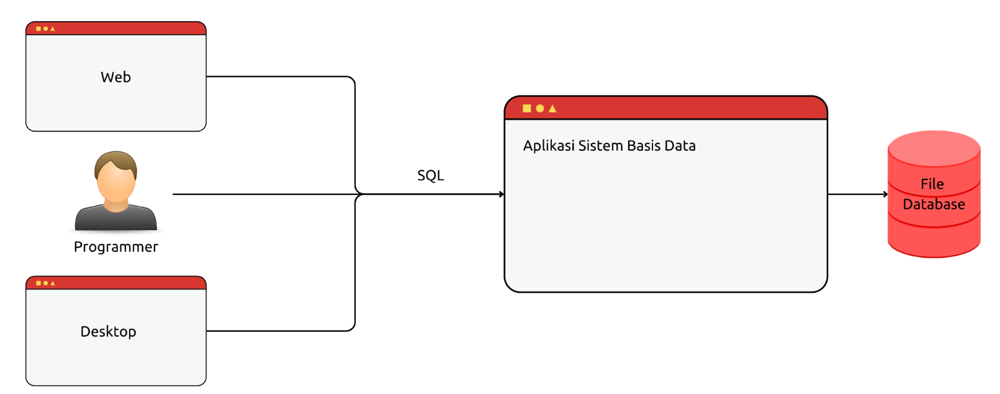

# Belajar Basis Data

    
Agenda

    <ul>
        <li>Basis Data</li>
        <li>Sistem Basis Data</li>
        <li>Basis Data Relational</li>
        <li>Model Data</li>
        <li>Model Data Relational</li>
        <li>Normalisasi Data</li>
        <li>Denormalisasi Data</li>
        <li>Aplikasi Sistem Basis Data</li>
    </ul>

## Basis Data

### Pendahuluan

-   Basis data (database) bisa diibaratkan seperti lemari arsip.
-   Seandainya kita bertugas mengelolanya, tentu kita akan merapikan data arsip di lemari tersebut, dari mulai memberi tanda, mengelompokkan arsipnya, dan lain-lain
-   Tujuannya adalah, agar ketika kita ingin mencari arsip, kita bisa dengan mudah mencarinya, karena sudah mengataur tata letak arsip di lemari tersebut.

### Diagram Arsip

  <figure>
    
    <figcaption>Diagram Arsip</figcaption>
  </figure>

### Apa itu Basis Data?

-   Basis Data terdiri dari dua kata, Basis dan Data
-   Basis bisa diartikan, tempat, gudang, atau tempat menyimpan
-   Data adalah representasi fakta dari dunia nyata, yang mewakili suatu objek, seperti manusia (karyawan, pelajar, mahasiswa, guru, dan lain-lain), barang, hewan, peristiwa, dan lain-lain. Data biasanya disimpan dalam bentuk angka, huruf, simbol, teks, gambar, dan lain-lain.
-   Basis Data biasanya disimpan didalam media penyimpanan berbasis disk (Seperti hardisk, flashdisk), hal ini agar data disimpan secara permanen.
-   Tapi ingat, tidak semua yang disimpan di disk itu bisa dibilang Basis Data, karena tujuan utama dalam Basis Data adalah pengaturan, pemilihan, pengelompokan, dan pengorganisasian data yang baik.

### Diagram Basis Data

  <figure>
    
    <figcaption>Diagram Basis Data</figcaption>
  </figure>

### Operasi Basis Data

-   Di dalam disk, basis data bisa dibuat atau juga dihapus atau juga diubah. Dan biasanya kita akan buat basis data dalam file berbeda tergantung jenis datanya, misal file pegawai, pelanggan, penjualan, dan lain-lain.
-   Dalam basis data, operasi basis data dikenal dengan operasi CRUD (_Create_, _Read_, _Update_, dan _Delete_)
-   _Create_, untuk membuat data baru
-   _Read_, untuk membaca / mencari data
-   _Update_, untuk mengubah data yang sudah ada
-   _Delete_, untuk menghapus data

### Tujuan Basis Data

-   _Speed_, kecepatan dalam mengambil/mencari data
-   _Space_, efisiensi dalam ruang penyimpanan
-   _Accuracy_, data yang akurat
-   _Availability_, ketersediaan data
-   _Completeness_, kelengkapan data
-   _Security_, keamanan data
-   _Shareability_, kemudahan berbagi data

### Contoh Penerapan Basis Data

-   Bank, dalam mengelola data nasabah, tabungan, transaksi, dan lain-lain
-   Rumah sakit, dalam mengelola data pasien, history rawar, dokter, dan lain-lain
-   Sekolah, dalam mengelola data guru, pelajar, mata pelajaran, nilai ujian, dan lain-lain
-   Toko Online, dalam mengelola data pelanggan, penjualan, barang, pembelian,pengiriman, dan lain-lain

## Sistem Basis Data

### Sistem Basis Data

-   Basis Data (database) perlu ada yang melakukan pengelolahan datanya
-   Pengelola basis data adalah program / aplikasi (software / perangkat lunak)
-   Gabungan aplikasi pengelola dan basis datanya, kita sebut dengan nama sistem basis data (database management system)

### Diagram Sistem Basis Data

  <figure>
    
    <figcaption>Diagram Sistem Basis Data</figcaption>
  </figure>

### Komponen Sistem Basis Data

-   Hardware (perangkat keras), komputer, laptop, server, dan lain-lain
-   Sistem Operasi, seperti Windows, Mac OS, Linux, dan lain-lain
-   Aplikasi Basis Data, seperti MySQL, PostgreSQL, SQL Server, dan lain-lain (untuk programmer). Microsoft Excel dan lain-lain (untuk end user)
-   User, pengguna seperti programmer, database admin, end user, dan lain-lain
-   Aplikasi lain, yang menggunakan basis data, seperti web, desktop, dan lain-lain

### Komponen Sistem Basis Data

  <figure>
    
    <figcaption>Komponen Sistem Basis Data</figcaption>
  </figure>

### Bahasa Basis Data
* Sistem basis data merupakan perantara antara basis data dan pengguna (orang ataupun aplikasi lain)
* Biasanya untuk mengelola basis data, kita akan menggunakan bahasa basis data, sesuai dengan sistem basis data yang kita gunakan
* Secara garis besar, dalam bahasa basis data terdapat dua jenis perintah:
  a. DDL (Data Definition Language), dan 
  b. DML (Data Manipulation Language)

### Data Definition Language
* DDL merupakan perintah-perintah dalam bahasa basis data untuk membuat struktur bentuk dari basis data yang akan kita buat
* Misalnya perintah untuk membuat, mengubah, atau menghapus basis data (arsip), tempat menyimpan tabel (file)
* Perintah untuk membuat, mengubah, menghapus table (tempat menyimpan data)
* Selain itu, dalam DDL kita juga perlu menentukan kamus data dari tiap table yang kita buat, seperti nama-nama kolom di tabel nya dan tipe data untuk kolom di tabel nya

### Data Manipulation Language
* DML merupakan perintah-perintah dalam bahasa basis data untuk memanipulasi data setelah kita buat struktur basis datanya menggunakan DDL
* Misalnya menambah, mengubah, menghapus, mencari data di tabel

### Diagram Bahasa Basis Data
  <figure>
    
    <figcaption>Diagram Bahasa Basis Data</figcaption>
  </figure>

## Model Data

### Model Data
* Model data merupakan konseptual untuk menggambarkan data, hubungan data, dan batasan data
* Model data dibuat dengan tujuan agar kita bisa tahu makna dari data dan juga relasi antar datanya
* Terdapat banyak cara untuk membuat model data, dan yang paling populer adalah menggunakan ERD (Entity Relationship Diagram)

### Fakta Dunia Nyata
* Seperti yang dibawah diawal tentang data, yaitu fakta dunia nyata (*real world*)
* Fakta dunia nyata disini bukan berarti data harus dalam bentuk sesuai yang berwujud, bisa juga sesuatu yang tidak berwujud
* Selain itu, fakta dunia nyata dalam basis data juga biasanya cakupannya lebih sempit, mengikuti ruang lingkup yang sedang ditinjau
* Misal data pengguna dalam ruang lingkup Bank (yaitu nasabah), pasti berbeda dengan ruang lingkup Rumah Sakit (yaitu pasien)

### Entity Relationship Model
* Model data dalam basis data, kebanyakan dibuat dalam bentuk Entity Relationship Model
* Dalam model ER, data dunia nyata direpresentasikan dalam komponen-komponen
* Terdapat beberapa komponen dalam model ER, yaitu *Entity*, *Attribute*, dan *Relationship*

### Entity
* Entity merupakan individu yang mewakili data (fakta) yang nyata, dan bisa dibedakan dari sesuatu yang lain
* Saat menentukan sebuah Entity, kita perlu lihat ruang lingkup yang sedang kita kerjakan
* Contoh, Orang mungkin bisa kita anggap sebagai satu Entity, namun dalam ruang lingkup Rumah Sakit, bisa jadi tidak dalam dibuat dalam satu Entity, karena Orang tergantung jenis nya, misal apakah Entity Pasien atau Entity Dokter

### Attribute
* Setiap Entity pasti memiliki Attribute yang mendeksripsikan karakteristik dari Entity tersebut
* Penentuan Attribute dalam Entity biasanya berdasarkan fakta yang ada dan yang dibutuhkan dalam ruang lingkup nya saja 
* Contoh dalam Entity Pasien, kita bisa menambahkan Attribute seperti Nomor Pasien, Nama Pasien, Alamat Pasien, dan lain-lain
* Dan fakta yang tidak masuk dalam ruang lingkup mungkin tidak kita perlu jadikan Attribute, misalnya Hobby Pasien, Harta Pasien, dan lain-lain
* Dalam Attribute, biasanya terdapat Attribute Kunci yang digunakan sebagai kunci representasi dari Entity tersebut, contoh misal Nomor Pasien

### Relationship
* Relationship merupakan hubungan antar Entity
* Detail tentang Relationship akan dibahas di materi Model Data Relationship
* Contoh misal dalam ruang lingkup Rumah Sakit, hubungan Entity Dokter dan Pasien adalah merawat misalnya

### Entity Relationship Diagram
* Setelah menentukan Entity, Attribute, dan Relationship, selanjutnya dalam ER, biasanya akan dibuat dalam bentuk diagram
* Entity Relationship Diagram (ERD) sangatlah sederhana, kita bisa merepresentasikan tiap Entity, Attribute, Relationship, dan hubungannya (Link) dengan gambar seperti di halaman selanjutnya

### Entity Relationship Diagram
  <figure>
    
    <figcaption>Entity Relationship Diagram</figcaption>
  </figure>

## Tahapan Pembuatan ERD

### Contoh Kasus : Toko Online
* Misal kita akan membuat Toko Online (ruang lingkup)

### Menentukan Entity
* Hal pertama yang perlu kita tentukan dalam membuat ERD adalah menentukan Entity yang akan terlibat dalam toko online tersebut
* Misal dalam toko online, kita akan menentukan tiga Entity yang terlibat, yaitu **Pembeli**, **Penjual**, dan **Barang**
* Perlu diingat, dalam toko online yang nyata, sebenarnya banyak sekali Entity yang terlibat

### Kode : Diagram Entity
  <figure>
    
    <figcaption>Diagram Entity</figcaption>
  </figure>

### Menentukan Attribute Key
* Setiap Entity wajib memiliki Attribute Key, maka selanjutnya kita perlu menentukan Attribute Key dari tiap Entity
* Misal pada:
  a. Pelanggan, Attribute Key nya adalah Email
  b. Penjuan, Attribute Key nya adalah Email, dan
  c. Barang, Attribute Key nya adalah SKU (nomor barang)

### Diagram : Attribute Key
  <figure>
    
    <figcaption>Diagram : Attribute Key</figcaption>
  </figure>

### Menentukan Attribute
* Setelah menentukan Attribute Key, selanjutnya kita bisa lanjutkan dengan menentukan Attribute dari tiap Entity yang masuk ke ruang lingkup yang akan kita buat

### Diagram : Attribute
  <figure>
    
    <figcaption>Diagram : Attribute</figcaption>
  </figure>

### Selanjutnya
* Selanjutnya kita perlu menentukan Relationship antar Entity, dan kita akan bahasa di materi tersendiri

## Implementasi Model Data

### Implementasi Model Data
* Implementasi model data merupakan tahapan untuk membuat basis data secara fisik yang ditempatkan dalam disk dengan bantuan sistem basis data
* Setelah selesai membuat ERD, kita bisa mulai membuat implementasi nya dalam basis data

### Implementasi Umum
* Secara umum, Entity yang kita buat di dalam ERD akan menjadi tabel di dalam basis data
* Dan Attribute yang kita buat dalam ERD, akan menjadi kolom di tabel di dalam basis data

### Diagram : Implementasi Entity Pelanggan
  <figure>
    
    <figcaption>Diagram : Implementasi Entity Pelanggan</figcaption>
  </figure>

### Diagram : Implementasi Entity Penjual
  <figure>
    
    <figcaption>Diagram : Implementasi Entity Penjual</figcaption>
  </figure>

### Diagram : Implementasi Entity Barang
  <figure>
    
    <figcaption>Diagram : Implementasi Entity Barang</figcaption>
  </figure>

### Kamus Data
* Dalam sistem basis data, setiap kolom di tabel yang kita buat perlu ditentukan tipe datanya
* Penentuan tipe data biasanya mengikuti tipe data yang tersedia di sistem basis data yang kita gunakan
* Secara umum ada beberapa tipe data yang umum biasa digunakan di sistem basis data

### Tipe Data
* **Text**, untuk kolom yang berisikan data karakter, misal Nama, Alamat, dan sejenisnya
* **Number**, untuk kolom yang berisikan data angka, misal Harga, Stok, dan sejenisnya
* **Date**, **Time**, **Timestamp** untuk kolom yang berisikan data tanggal, waktu, atau gabungan tanggal dan waktu, misalnya Tanggal Lahir, Waktu Pendaftaran, dan sejenisnya
* **Boolean**, untuku kolom yang berisikan data benar (true) atau salah (false), misal Status Menikah, dan sejenisnya
* Dan masih banyak tipe data lainnya
* Untuk detail tipe data tidak akan dibahas di materi ini, karens udah sangat spesifik ke aplikasi sistem basis yang kita gunakan

## Model Data Relational

### Relationship
* Seperti yang dibahas di materi sebelumnya, bahwa dalam Model ER, selain Entity dan Attribute, terdapat juga komponen Relationship
* Relationship menunjukkan hubungan antar Entity dengan Entity yang lain
* Misal hubungan antara Entity Penjual dengan Entity Barang. Relationship diantara keduanya mengandung arti bahwa penjual sedang berjualan/menjual barang

### Kardinalitas / Derajat Relasi
* Kardinalitas relasi menunjukkan tentang jumlah Entity yang dapat berelasi dengan Entity lainnya
* Contoh misal pada kasus Toko Online, Entity Penjual bisa berelasi dengan satu Entity Barang, atau lebih, atau bahkan tidak ada

### One to One (Satu ke Satu)
* **One to One** artinya hubungan antara Entity A misalnya, hanya bisa berhubungan dengan Entity B dengan maksimal hanya satu Entity saja
* Begitu pula sebaliknya, Entity B hanya bisa berelasi dengan satu Entity A

### Diagram : One to One
  <figure>
    
    <figcaption>Diagram : One to One</figcaption>
  </figure>

### One to Many (Satu ke Banyak)
* **One to Many** artinya hubungan antara Entity A misalnya, bisa berhubungan dengan banyak Entity B
* Tetapi tidak sebaliknya, Entity B hanya bisa berelasi dengan satu Entity A

### Diagram : One to Many
  <figure>
    
    <figcaption>Diagram : One to Many</figcaption>
  </figure>

### Many to One (Banyak ke Satu)
* **Many to One** artinya hubungan antara Entity A misalnya, hanya bisa berhubungan dengan satu Entity B
* Tetapi tidak sebaliknya, Entity B bisa berelasi ke banyak Entity A

### Diagram : Many to One
  <figure>
    
    <figcaption>Diagram : Many to One</figcaption>
  </figure>

### Many to Many (Banyak ke Banyak)
* **Many to Many** artinya hubungan antara Entity A misalnya, bisa berhubungan dengan banyak Entity B
* Begitu juga sebaliknya, Entity B bisa berelasi ke banyak Entity A juga

### Diagram : Many to Many
  <figure>
    
    <figcaption>Diagram : Many to Many</figcaption>
  </figure>

## Tahapan Membuat ERD Lanjutan

### Contoh Kasus : Toko Online (Lanjutan)
* Misal kita akan membuat Toko Online (ruang lingkup)
* Pada materi sebelumnya kita sudah membuat Entity dan Attribute, selanjutnya kita akan buat Relationship nya

### Menentukan Relationship
* Setelah kita selesai membuat Entity dan Attribute, selanjutnya kita perlu tentukan Relationship antar Entity
* Sama seperti sebelumnya, menentukan Relationship nya juga harus sesuai ruang lingkup yang sedang kita buat
* Pada kasus ruang lingkup Toko Online, misal kita akan buat Relationship dari Pembeli ke Barang dengan relasi **Membeli**
* Dan Relationship dari Penjual ke Barang dengan relasi **Menjual**

### Diagram : Relationship
  <figure>
    
    <figcaption>Diagram : Relationship</figcaption>
  </figure>

### Menentukan Attribute Foreign Key
* Saat kita membuat Entity, kita kaan menentukan **Attribute Key** atau dibilang **Primary Key**, yaitu atribut kunci yang merepresentasikan Entity tersebut
* Dalam Relationship, kita juga bisa menambahkan atribut, dan biasanya kita juga perlu menentukan **Attribute Foreign Key**, yaitu Attribute Key di Entity yang digunakan sebagai data untuk lookup (melihat) ke Entity pemilik relasi tersebut
* Pada kasus Membeli misal kita perlu tahu siapa yang membeli (Email Pembeli) dan barang apa yang dibeli (SKU Barang)
* Pada kasus Menjual, kita perlu tahu siapa yang menjual (Email Penjual) dan barang apa yang dijual (SKU Barang)

### Diagram : Attribute Foreign Key
  <figure>
    
    <figcaption>Diagram : Attribute Foreign Key</figcaption>
  </figure>

### Menentukan Derajat Relasi
* Selanjutnya, kita perlu tentukan derajat relasi untuk Relationship yang kita buat
* Pada kasus Membeli, kita bisa tentukan sebagai relasi Many to Many, karena satu Pembeli bisa membeli banyak Barang, dan satu Barang bisa dibeli banyak Pembeli
* Pada kasus Menjual, kita bisa tentukan sebagai relasi One to Many atau Many to One, karena misal satu Barang hanya bisa dijual oleh satu Penjual, namun satu Penjual bisa menjual lebih dari satu Barang 

### Diagram : Derajat Relasi
  <figure>
    
    <figcaption>Diagram : Derajat Relasi (N berarti banyak)</figcaption>
  </figure>

### Melengkapi Attribute Tambahan
* Bukan hanya Entity yang bisa memiliki Attribute
* Relationship pun bisa memiliki Attribute jika memang perlu
* Sebelumnya kita sudah menambah Attribute yang bersifat Foreign Key, sekarang kita bisa tambahkan Attribute yang sifatnya deskriptif
* Misal pada relasi Membeli, kita akan tambahkan atribut Jumlah
* Dan pada relasi Menjual, kita tidak akan menambah atribute deskriptif lainnya

### Diagram : Attribute
  <figure>
    
    <figcaption>Diagram : Attribute pada relationship (jumlah)</figcaption>
  </figure>

## Impelementasi Model Data Relational

### Menambah Relasi One to One
* Sebelum kita lanjut, kita akan coba tambahkan Entity yang berelasi One to One di kasus Toko Online kita
* Misal di kasus Toko Online, kita akan menambahkan Entity Dompet, dimana Pembeli hanya bisa memiliki satu Dompet, dan satu Dompet hanya dimiliki oleh satu Pembeli
* Dan di Dompet, kita akan tambahkan Attribute Key Email, dan Attribute Saldo

### Diagram : One to One
  <figure>
    
    <figcaption>Diagram : One to One (Email Pembeli adalah Foreign Key dari Entity Pembeli, dan Email Dompet adalah Foreign Key dari Entity Dompet)</figcaption>
  </figure>

### Implementasi One to One
* Pada kasus implementasi relasi One to One, terdapat dua cara
* Jika pada kasus tiap Entity dipastikan menggunakan Attribute Key dengan nilai sama, maka kita bisa gunakan Attribute Key di tiap Entity sebagai acuan untuk saling berelasi (ada kolom yang nilainya sama diantara dua atau lebih tabel)
* Namun jika pada kasus tiap Entity bisa memiliki Attribute Key yang berbeda, maka kita perlu membuat Attribute Foreign Key di salah satu Entity yang lebih lemah, dimana Attribute Foreign Key tersebut harus unique (tidak boleh ada yang sama)

### Diagram : Implementasi One to One
  <figure>
    
    <figcaption>Diagram : Implementasi One to One. Kolom Email Pembeli pada Tabel Dompet harus memiliki nilai yang unique untuk menunjukkan relasi one-to-one</figcaption>
  </figure>

### Implementasi One to Many atau Many to One
* Pada kasus relasi One to Many, implementasinya tergantung relasinya
* Jika pada kasus relasinya terdapat Attribute deskriptif, maka diperlukan tabel baru sebagai implementasi dari Relationshipnya
* Namun pada kasus relasinya tidak memiliki Attribute deskriptif, maka tidak perlu tabel baru, kita hanya butuh menambah Attribute Foreign Key di Entity yang bersifat Many

### Diagram : Implementasi One to Many
  <figure>
    
    <figcaption>Diagram : Implementasi One to Many. Nilai pada kolom Email Penjual adalah FK dari Tabel Penjual, dan boleh duplikat karena 1 Penjual bisa menjual beberapa barang, ini juga menunjukkan bahwa relasinya one-to-many</figcaption>
  </figure>

### Implementasi Many to Many
* Pada implementasi relasi Many to Many, maka diimplementasikan dalam bentuk tabel relasi
* Dimana di dalam tabel relasi tersebut terdapat semua Attribute Foreign Key dari semua Entity yang berelasi 

### Diagram : Implementasi Many to Many
  <figure>
    
    <figcaption>Diagram : Implementasi Many to Many. Membuat tabel baru (Tabel Membeli)  yang mewakili relasi</figcaption>
  </figure>

## Model Data Lainnya

### Model Data Lainnya
* Sebenarnya sampai materi Model Data Relational, kita sudah bisa membuat basis data yang baik
* Namun, pada kasus-kasus tertentu, kadang ada jenis model data lainnya
* Di materi ini, kita akan coba bahas beberapa model data lainnya, seperti :
  a. Weak Entity (entitas lemah)
  b. Sub Entity (entitas turunan)
  c. Unary Relationship (relasi tunggal)
  d. Multi Entity (relasi multi entitas)
  e. Redundant Relationship (relasi ganda)

### Weak Entity
* Entitas lemah sebenarnya adalah entitas biasa, namun sifatnya lemah, artinya dia tidak bisa berdiri sendiri
* Weak entity biasanya berelasi dengan entity utama
* Contoh pada kasus sebelumnya Dompet bisa dibilang weak entity, karena tidak bisa berdiri sendiri tanpa adanya Pembeli
* Atau, kita bisa pisahkan alamat menjadi entitas lemah, yang hanya bisa ada jika terdapat entitas Pembeli

### Diagram : Weak Entity
  <figure>
    
    <figcaption>Diagram : Weak Entity</figcaption>
  </figure>

### Sub Entity
* Saat membuat entity, bisa terjadi adanya beberapa entity yang lebih detail, yang memiliki kesamaan atribut, namun terdapat juga perbedannnya
* Contoh, pada kasus Entity Barang, kemungkinan akan ada banyak jenis barang, dan tiap jenis barang bisa berbeda atribut yang dimilikinya
* Misal saja kita tambahkan Entity Barang Laptop dan Barang Pakaian, kedua entity tersebut memiliki kesamaan, namun memiliki perbedaan juga
* Untuk menggambarkan Sub Entity, kita akan menggunakan **diagram ISA**(*... is a ...*) 

### Diagram : Sub Entity
  <figure>
    
    <figcaption>Diagram : Sub Entity. Barang Laptop is a Barang. Barang Pakaian is a Barang</figcaption>
  </figure>

### Unary Relationship
* Unary Relationship adalah relasi yang terjadi pada entitas dengan entitas dirinya sendiri
* Hal ini sering sekali terjadi
* Misal, pada kasus Toko Online, misal kita akan menambah fitur Referal (Member get Member), dan kita akan membolehkan Pembeli merekomendasikan Pembeli lain untuk mendapatkan bonus berupa saldo tertentu misalnya
* Pada kasus ini, berarti ktia harus membuat Unary Relationship dari Pembeli ke Pembeli lagi

### Diagram : Unary Relationship
  <figure>
    
    <figcaption>Diagram : Unary Relationship</figcaption>
  </figure>

### Multi Entity Relationship
* Relasi multi entitas merupakan relasi yang terjadi terhadap lebih dari dua entitas
* Pada kasus sebelumnya contohnya Pembeli memiliki relasi membeli dengan Barang
* Misal kita akan tambahkan Bank dengan relasi Pembeli membeli Barang, menggunakan Bank

### Diagram : Multi Entity Relationship
  <figure>
    
    <figcaption>Diagram : Multi Entity Relationship. Pembeli Membeli Barang & Pembeli Membeli (Menggunakan) Bank</figcaption>
  </figure>

### Redundant Relationship
* Relasi antar entitas boleh lebih dari satu, jika ada dua entitas memiliki relasi lebih dari satu antar entitas tersebut, artinya itu adalah relasi ganda
* Banyak kasus seperti ini, contohnya pada kasus relasi Pembeli dan Barang, misal kita tambahkan relasi Pembeli menyukai Barang
* Artinya tidak hanya Membeli, tapi juga Menyuakai

### Diagram : Redundant Relationship
  <figure>
    
    <figcaption>Diagram : Redundant Relationship</figcaption>
  </figure>

## Impelementasi Model Data Lainnya

### Impelementasi Model Data Lainnya
* Sekarang kita akan coba lihat bagaimana implementasi perubahan model data yang sudah kita lakukan di materi sebelumnya

### Diagram : Weak Entity
  <figure>
    
    <figcaption>Diagram : Weak Entity</figcaption>
    <figcaption>Tabel Dompet cukup 2 kolom saja (jika Email Tabel Dompet dan Tabel Pembeli sama). Tapi buat kolom Email Pembeli jika berbeda (dan nilai Email Pembeli harus unique)</figcaption>
    <figcaption>Tabel Alamat memiliki kolom Email Pembeli (FK dari Tabel Pembeli kolom Email) dan bisa duplikat karena relasinya one to many</figcaption>
  </figure>

### Diagram : Sub Entity
  <figure>
    
    <figcaption>Diagram : Sub Entity</figcaption>
    <figcaption>kolom SKU bernilai sama pada semua tabel (relasinya one-to-one antara entity utama dan sub entity)</figcaption>
  </figure>

### Diagram : Unary Relationship
  <figure>
    
    <figcaption>Diagram : Unary Relationship</figcaption>
    <figcaption>Cukup tambahkan kolom baru mewakili FK</figcaption>
  </figure>

### Diagram : Multi Entity Relationship
  <figure>
    
    <figcaption>Diagram : Multi Entity Relationship</figcaption>
    <figcaption>Tabel relationship menyimpan FK dari tabel lain</figcaption>
  </figure>

### Diagram : Redundant Relationship
  <figure>
    
    <figcaption>Diagram : Redundant Relationship</figcaption>
  </figure>

## Model Diagram Lainnya

### Model Diagram Lainnya
* Saat model data kita tidak terlalu kompleks, akan sangat mudah membuat diagram seperti yang sebelum sudah kita buat
* Namun saat model data kita sudah banyak dan kompleks, maka akan sulit untuk membuat diagram seperti yang sudah kita pelajari
* Sebenarnya implementasi Entity Relationship Diagram tidak hanya terbatas yang sudah kita praktekan, ada juga cara penggambaran yang lain, namun intinya adalah gambarnya tetap mudah dimengerti
* Contoh lain ERD adalah dengan membuat Entity seperti tabel

### Diagram : Entity dan Attribute
  <figure>
    
    <figcaption>Diagram : Entity dan Attribute</figcaption>
  </figure>

### Diagram : Relationship
  <figure>
    
    <figcaption>Diagram : Relationship</figcaption>
  </figure>

### Contoh Web untuk Membuat ERD
* https://draw.io/, bisa digunakan untuk membuat diagram secara manual menggunakan visual
* https://plantuml.com/, bisa digunakan untuk membuat diagram secara otomatis menggunakan kode teks

### Diagram : Contoh ERD dari PlantUML
* https://gist.github.com/khannedy/d3f2e143a545017bc4919672fbd2e3d9
* http://www.plantuml.com/plantuml/uml/SyfFKj2rKt3CoKnELR1Io4ZDoSa70000

  <figure>
    
    <figcaption>Diagram : Contoh ERD dari PlanntUML</figcaption>
  </figure>

## Normalisasi Data

### Normalisasi Data
* Normalisasi data adalah proses atau tahapan dalam membuat basis data, yang bertujuan untuk menghilangkan data redundancy / ganda dan data yang tidak konsisten
* Aturan dalam normalisasi data adalah membagi tabel besar menjadi tabel yang lebih kecil, dan menghubungkan menggunakan relasi

### Bentuk Normal Basis Data
* Pencetus relational model, Edgar Codd mengajukan teori normalisasi data dengan mengenalkan praktek bentuk normal ke-1, lalu dilanjut dengan ke-2 dan bentuk normal ke-3
* https://en.wikipedia.org/wiki/Edgar_F._Codd
* Sampai saat ini, bentuk normal basis data bisa sampai bentuk normal ke 6, namun kebanyakan pada prakteknya, bentuk normal basis data hanya sampai bentuk normal ke 3

### Contoh Kasus
* Normalisasi data biasanya mengacu pada hasil akhir dari sebuah ruang lingkup, berbeda dengan yang awal kita lakukan sebelumnya
* Normalisasi data biasanya datang dari kebutuhan akhir yang sudah selesai, lalu kita perlu membuat model data dari kebutuhan akhir tersebut
* Misal, kita akan coba buat sebuah model data, dari kebutuhan laporan Order dari sebuah toko online

  <figure>
    
    <figcaption>Laporan Order dari sebuah toko online</figcaption>
    <figcaption>Hasil diatas dinormalisasi menjadi model data yang lebih 'normal'</figcaption>
  </figure>

### Bentuk Tabel (Tidak Normal)
* https://docs.google.com/spreadsheets/d/1epqlWZiTkCmAWJRy_h2K35PjO9f60vVR6uDbKSRjK9k/edit?usp=sharing

## Jenis Atribut

### Jenis Atribut
* Sebelumnya kita mulai bahas tentang normalisasi data, ada yang perlu diketahui tentang jenis attribute, seperti
* Attribute Key
* Simple Attribute dan Composite Attribute
* Single-Value Attribute dan Multi-Value Attribute
* Mandatory Attribute
* Derived Attribute

### Attribute Key / Primary Key
* Key adalah nilai yang bisa digunakan sebagai identitas baris pada tabel yang sifatnya unik
* Biasanya Attribute Key dibilang juga dengan nama Primary Key
* Attribute Key milik entitas lain yang disimpan sebagai atribut di entitas lain, disebut Foreign Key

### Simple Attribute dan Composite Attribute
* Simple attribute adalah atribut yang tidak bisa diuraikan lagi, sedangkan composite attribute adalah atribut yang masih bisa diuraikan
* Pada kasus tabel kita, semua kolom sudah simple attribute, karena tidak bisa diuraikan lagi
* Seandainya misal kita ada kolom alamat yang berisikan kombinasi dari jalan kota provinsi negara dan kodepos, maka bisa dibilang kolom alamat tersebut adalah composite attribute

### Single-Value dan Multi-Value Attribute
* Single-value attribute adalah atribut yang memiliki satu nilai, sedangkan multi-value attribute adalah atribut yang memiliki nilai lebih dari satu
* Pada kasus tabel kita, kita sudah membuat semua kolom menjadi single-value attribute
* Seandainya kita gabungkan semua produk di satu kolom, maka bisa jadi itu adalah multi-value attribute

### Mandatory Attribute
* Mandatory attribute adalah atribut yang wajib diisi atau tidak boleh kosong (NULL)
* Pada kasus kita, produk 2,3, dan 4 adalah kolom yang tidak mandatory, karena bisa kosong

### Derived Attribute
* Derived attribute (atribut turunan) adalah atribut yang nilainya diperoleh dari hasil pengolahan atribut
* Pada kasus kita, contoh banyak sekali derived attribute, seperti produk total, total belanja, total berat, dan lain-lain

## Attribute Key

### Attribute Key
* Attribute Key adalah nilai yang bisa digunakan sebagai identitas baris pada tabel yang sifatnya unik
* Terdapat 3 jenis attribute key, yaitu:
  a. Superkey
  b. Candidate key, dan
  c. Primary key

### Attribute Key - Superkey
* Superkey merupakan satu atau lebih atribut yang dapat membedakan setiap baris data secara unik
* Misal pada tabel produk, yang bisa menjadi superkey adalah
* (kode produk, nama produk, berat produk, harga produk, kode penjual)
* (nama produk, kode penjual) jika bisa menjamin penjual tidak menjual barang yang sama
* (kode produk, kode penjual)
* (kode produk)

### Candidate Key
* Candidate key merupakan kumpulan atribut minimal yang dapat membedakan setiap baris data dalam sebuah tabel secara unik
* Contoh candidate key pada tabel produk adalah :
* (kode produk)
* (nama produk) jika bisa dijamin nama produk tidak boleh dibuat lebih dari sekali

### Primary Key
* Setelah menentukan candidate key, salah satu kombinasi candidate key akan ditentukan sebagai primary key, key utama sebagai representasi baris secara unik
* Primary key biasanya dipilih pada candidate key yang paling cocok dan paling bisa dijamin keunikannya, contohnya pada kasus tabel produk :
  (kode produk)

## Bentuk Normal Basis Data ke 1

### Bentuk Normal Basis Data ke 1
* Tiap kolom tidak boleh menyimpan data lebih dari satu
* Tidak ada kolom yang duplikat / ganda
* Tidak ada baris yang duplikat / ganda
* Tidak ada atribut turunan

### Revisi Contoh Kasus : Bentuk Normal ke 1
* Kolom Produk Nama, Produk Harga, Produk Jumlah, Produk Berat, dan Produk Total duplikat sebanyak 4 kali
* Produk Total, Total Harga, Total Berat, Total Belanja adalah atribut turunan, jadi akan kita hapus
* https://docs.google.com/spreadsheets/d/1epqlWZiTkCmAWJRy_h2K35PjO9f60vVR6uDbKSRjK9k/edit#gid=1077699423

## Bentuk Normal Basis Data ke 2

### Bentuk Normal Basis Data ke 2
* Harus sudah dalam bentuk normal basis data ke 1
* Buat tabel terpisah untuk nilai-nilai yang keluar berulang kali pada beberapa baris
* Tambahkan primary key pada tiap tabel
* Hubungkan menggunakan foreign key

### Revisi Contoh Kasus : Bentuk Normal ke 2
* Kolom-kolom Produk terdapat yang berulang
* Kolom-kolom Order, Penjual, dan Pembeli terdapat yang berulang
* https://docs.google.com/spreadsheets/d/1epqlWZiTkCmAWJRy_h2K35PjO9f60vVR6uDbKSRjK9k/edit#gid=1077699423

## Bentuk Normal Basis Data ke 3

### Ketergantungan Fungsionalitas
* Sebelum kita bahas tentang bentuk normal ke 3, kita harus tahu tentang ketergantungan fungsionalitas
* Dalam tabel, jika terdapat atribut B memiliki ketergantungan fungsionalitas dengan A, maka kita bisa bilang **A --> B**
* Biasanya A adalah attribute key, dan B adalah attribute yang bukan key
* Dalam bentuk normal ke 3, kita harus teliti tabel yang sudah dalam bentuk normal ke 2, apakah attribute-attribute yang bukan key tersebut tergantung dengan attribute key nya?

### Bentuk Normal Basis Data ke 3
* Pindahkan kolom-klom yang tidak tergantung ke key menjadi tabel lain
* Hal ini dikarenakan jika terjadi perubahan pada kolom tersebut, ditakutkan perlu melakukan perubahan di banyak baris

### Revisi Contoh Kasus : Bentuk Normal ke 3
* Ada banyak kolom yang tidak tergantung dengan key
* Contoh Penjual, Pembeli, Alamat Pengiriman
* Kolom-kolom tersebut jika berubah, maka harus diubah di semua baris Order lainnya, dan itu membuat data tidak konsisten
* https://docs.google.com/spreadsheets/d/1epqlWZiTkCmAWJRy_h2K35PjO9f60vVR6uDbKSRjK9k/edit#gid=175579626

### Entity Relationship Diagram
* Plantuml : https://www.plantuml.com/plantuml/uml/SyfFKj2rKt3CoKnELR1Io4ZDoSa70000
* Diagram : https://gist.github.com/khannedy/6634184f27fd05fc5a8825ade5dd25fc 
  <figure>
    
    <figcaption>Bentuk Normal ke 3</figcaption>
  </figure>

## Denormalisasi Data

### Denormalisasi Data
* Normalisasi data digunakan untuk membuat model basis data yang baik
* Normalisasi data sebenarnya hanyalah petunjuk saja, dalam keadaan tertentu, kadang kita bisa melanggar aturan dari normalisasi data
* **Pelanggaran normalisasi data tersrbut kita sebut denormalisasi data**
* Alasan ktia melakukan denormalisasi data, adalah untuk mendapatkan performa yang lebih baik
* Dan denormalisasi data serng sekali dilakukan di dunia nyata
* Ada banyak sekali cara melakukan dernomalisasi data, namun inti dari denormalisasi data adalah meningkatkan performa kecepatan mendapatkan data

### Derived Attribute
* Sebelumnya pada saat melakukan normalisasi data, kita menghapus atribut turunan
* Jika ternyata hal ini memperlambat proses mencari data, yang artinya kita harus mengolah data total belanja, total berat dan total harga, maka kita bisa melakukan denormalisasi data dengan menambahkan derived attribute
* https://docs.google.com/spreadsheets/d/1epqlWZiTkCmAWJRy_h2K35PjO9f60vVR6uDbKSRjK9k/edit#gid=773462852

### Atribut Tambahan
* Seperti yang dibahas di normalisasi data, atribut yang tidak memiliki ketergantungan fungsionalitas, seharusnya dipisahkan dalam tabel sendiri
* Namun, kadang menambahkan atribut tambahan bisa mempercepat proses pencarian
* Contoh, jika kita ingin mencari semua Order untuk Pembeli Joko, maka kita harus mencari dulu ke tabel Alamat, baru dari sana kita bisa lihat kode alamat yang terdapat di Order
* Begitu juga ketika kita ingin mencari semua Order ke Penjual Galeri Olahraga, maka kita harus mencari dulu ke tabel Produk, lalu harus mencari relasi ke tabel DetailOrder, dan baru mencari lagi relasi ke tabel Order
* Penambahkan kode pembeli dan kode penjual di tabel Order bisa mempercepat proses pencarian
* https://docs.google.com/spreadsheets/d/1epqlWZiTkCmAWJRy_h2K35PjO9f60vVR6uDbKSRjK9k/edit#gid=1008033348

### Summary Table
* Summary tabel (tabel rekapitulasi) adalah tabel yang biasanya dibuat hasil dari pengolahan data dari tabel master / detail / asli
* Pada kasus sebelumnya, kita tidak membuat tabel rekapitulasi, namun misal saja kita akan menambahkan fitur, dimana penjual bisa melihat laporan penjualan bulanan
* Dengan normalisasi data, hal itu bisa kita dapatkan laporannya dengan cara mengolah data seluruh order dan detail order dalam per bulan
* Hal ini akan memberatkan jika kita sering sekali membutuhkan laporan bulanan, maka ada baiknya kita membuat summary table untuk laporan penjualan per bulan
* https://docs.google.com/spreadsheets/d/1epqlWZiTkCmAWJRy_h2K35PjO9f60vVR6uDbKSRjK9k/edit#gid=868482734

### Atribut untuk Pencarian
* Pada beberapa kasus, kadang kita butuh melakukan pencarian dengan berbagai jenis kriteria
* Misal, pada Produk, kadang kita ingin mencari data produk menggunakan nama, namun tanpa peduli huruf besar kecilnya (case insensitive)
* Pada kasus seperti ini, kita bisa menambah atribut tambahan untuk pencarian, misal Nama Produk Lower, dimana isinya adalah nama produk dalam bentuk huruf kecil
* Dengan begitu, ketika melakukan pencarian dengan nama produk, kita bisa menggunakan atribut untuk pencarian tersebut
* https://docs.google.com/spreadsheets/d/1epqlWZiTkCmAWJRy_h2K35PjO9f60vVR6uDbKSRjK9k/edit#gid=406958892

### Immutable dan Mutable Table
* Saat kita membuat tabel, rata-rata adalah mutable table (tabel yang bisa diubah), contohnya adalah semua tabel yang sudah kita buat
* Namun pada kasus tertentu, kadang ada tabel yang sifatnya immutable table (tabel yang tidak boleh diubah), artinya hanya boleh memasukkan data, tidak boleh diubah lagi
* Pada kasus Order, sebenarnya idealnya adalah datanya immutable table, kenapa? Karena penjualan yang sudah terjadi, tidak boleh berubah lagi ketika di masa depan misal terjadi perubahan data, misal ketika harga produk berubah, nama produk berubah, dan lain-lain
* Seandainya misal pada kasus kita, kita ingin menjadi Order adalah data yang immutable, artinya semua data yang berasal dari tabel master / detail / aslinya, maka harus kita duplikasi ke tabel immutable nya
* https://docs.google.com/spreadsheets/d/1epqlWZiTkCmAWJRy_h2K35PjO9f60vVR6uDbKSRjK9k/edit#gid=1726629969

## Aplikasi Sistem Basis Data

### Aplikasi Sistem Basis Data
* Setelah kita tahu cara membuat model basis data dan cara implementasi tabel dalam basis data, sekarang pertanyaannya bagaimana cara membuatnya?
* Cara paling sederhana adalah dengan membuat basis data menggunakan aplikasi spreadsheet seperti Microsoft Excel, Apple Number, Google Docs, dan sejenisnya
* Namun aplikasi-aplikasi tersebut hanya cocok untuk menyimpan data dalam ukuran tidak terlalu besar, dan hanya digunakan oleh pengguna (user)
* Untuk menyimpan basis data dalam ukuran besar, dan bisa digunakan oleh pengguna non user (web atau aplikasi), kita perlu aplikasi sisetm basis data berbasis server

### Sistem Basis Data berbasis Server
* Sistem basis data berbasis server adalah aplikasi yang berjalan hanya bertugas sebagai server (melayani permintaan klien)
* Aplikasi tersebut akan menerima permintaan dari klien, dan melakukan eksekusi perintah sesuai yang diminta oleh klien
* Aplikasi DBMS (database management system) jenis server biasanya tidak memiliki tampilan user interface, sehingga untuk berinteraksi dengan aplikasi jenis ini, kita menggunakan bahasa instruksi yang bisa dimengertinya

### Structure Query Language
* SQL (Structure Query Language) adalah salah satu bahasa instruksi basis data yang paling populer digunakan oleh aplikasi DBMS
* SQL berisikan perintah-perintah untuk membuat struktur basis data atau data definition language (DDL). Dan juga perintah-perintah untuk mengelola basis data atau data manipulation language (DML)
* Untuk belajar SQL, kita perlu memilih aplikasi DBMS yang ingin kita pelajari, biasanya disesuaikan dengan tempat kita bekerja, karena tiap perusahaan biasanya sudah memilih aplikasi DBMS yang mereka gunakan

### Diagram Aplikasi Sistem Basis Data
  <figure>
    
    <figcaption>Diagram Aplikasi Sistem Basis Data</figcaption>
  </figure>

### Contoh Aplikasi DBMS
* MySQL, salah satu aplikasi DBMS yang populer, opensource dan gratis. Banyak sekali website yang menggunakan aplikasi ini https://www.mysql.com/
* PostgreSQL, aplikasi DBMS yang banyak digunakan diperusahaan besar. PostgreSQL juga opensource dan gratis. https://www.postgresql.org/
* Atau, untuk yang aplikasi DBMS berbayar, kita bisa gunakan :
* Oracle, aplikasi DBMS yang banyak digunakan di perusahaan-perusahaan corporate terutama Bank. https://www.oracle.com/database/ 
* SqlServer, aplikasi DBMS yang banyak digunakan di perusahaan-perusahaan yang menggunakan teknologi dari Microsoft. https://www.microsoft.com/en-us/sql-server 

## Materi Selanjutnya

### Materi Selanjutnya
* Belajar MySQL
* Belajar PostgreSQL

