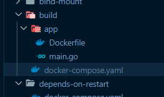

# Tutorial Docker Compose

<details>
    <summary>Agenda</summary>
    <ul>
        <li>Pengenalan Docker Compose</li>
        <li>Configuration File</li>
        <li>Services</li>
        <li>Project</li>
        <li>Environment Variable</li>
        <li>Volume</li>
        <li>Network</li>
        <li>Dan lain-lain</li>
    </ul>
</details>

## Pengenalan Docker Compose
### Pengenalan Docker Compose
- Docker Compose adalah tool yang digunakan untuk mendefinisikan dan menjalankan multiple Docker Container secara sekaligus
- Dengan menggunakan Docker Compose, kita bisa menggunakan fiile YAML untuk melakukan konfigurasi Docker Container nya
- Lalu dengan sebuah perintah, kita bisa membuat semua Docker Container dan menjalankannya sekaligus dari file konfigurasi tersebut
- Dengan begitu, kita tidak perlu lagi mengetikan perintah docker create secara manual ketika ingin membuat Docker Container

### Fitur Docker Compose
- Memiliki multiple isolated environment dalam satu docker host / server, atau dibilang project. Hal ini memungkinkan kita bisa membuat banyak sekali jenis environment untuk Docker Compose. Secara default nama project akan menggunakan nama folder konfigurasi
- Hanya membuat container yang berubah. Docker Compose bisa mendeteksi container mana yang harus dibuat dan tidak perlu dibuat ulang dari perubaha file konfigurasi

### Kapan Menggunakan Docker Compose
- **Membuat Development Environment**. Ketika kita develop aplikasi, kita sering butuh tool-tool berbeda untuk tiap project. Kita bisa gunakan Docker Compose untuk melakukan setup nya
- **Automated Testing**. Kadang ketika kita membuat automation testing, banyak sekali hal yang harus kita jalankan secara manual. Docker Compose bisa membantu kita untuk otomatisasi proses setup nya
- **Deployment**. Docker Compose juga bisa digunakan untuk kasus deployment aplikasi kita. Jadi kita tidak perlu lakukan start manual aplikasi kita di server, cukup jalankan menggunakan Docker Compose

## Menginstall Docker Compose
### Menginstall Docker Compose
- Dulu, aplikasi Docker Compose terpisah dengan aplikasi Docker. 
- Dulu, kita perlu menggunakan perintah docker-compose untuk menggunakan Docker Compose
- Namun di Docker versi terbaru, Docker Compose sudah tersedia secara otomatis di dalam Docker nya
- Dan untuk menggunakan Docker Compose, kita bisa gunakan perintah :
docker compose

### Kode : Dcoker Compose
```bash
ASUS@DESKTOP-KA2I153 MINGW64 /d/Programs/pzn/belajar-docker/tutorial-docker-compose
$ docker compose version
Docker Compose version v2.19.1
```

## Configuration File
### Configuration File
- Docker Compose menyimpan konfigurasi nya dalam bentuk file YAML : https://yaml.org/ 
- File YAML mirip JSON, namun lebih sederhana
- Biasanya file konfigurasinya disimpan dalam file bernama docker-compose.yaml
- Seperti yang dibahas di awal, nama project secara default akan menggunakan nama folder lokasi docker-compose.yaml tersebut berada

### Versi Konfigurasi
- Saat video ini dibuat, sekarang konfigurasi Docker Compose masih menggunakan versi 3.x
- Kita bisa lihat versi terbaru di halaman ini :
https://docs.docker.com/compose/compose-file/compose-file-v3/ 
- Ingat ini adalah versi konfigurasi file, bukan versi aplikasi Docker Compose

### Kode : Docker Compose File
```
docker-compose.yaml
```

## Yaml
### Yaml
- Yaml adalah sebuah jenis file yang biasa digunakan untuk menyimpan konfigurasi
- Yaml mirip seperti JSON, hanya saja tidak menggunakan kurung kurawal
- Yaml akan memiliki attribute dan value
- https://yaml.org/ 

### Kode : Yaml Attribute
`user.yaml`:
```yaml
firstName: Muhammad
middleName: Arfani
lastName: Asra
```
`user.json`:
```json
{
    "firstName": "Muhammad",
    "middleName": "Arfani",
    "lastName": "Asra"
}
```
### Kode : Yaml Array
`user.yaml`:
```yaml
firstName: Muhammad
middleName: Arfani
lastName: Asra
hobbies:
    - Coding
    - Reading
    - Gaming
```
`user.json`:
```json
{
    "firstName": "Muhammad",
    "middleName": "Arfani",
    "lastName": "Asra",
    "hobbies": [
        "Coding",
        "Reading",
        "Gaming"
    ]
}
```
### Kode : Yaml Nested Object
`user.yaml`:
```yaml
firstName: Muhammad
middleName: Arfani
lastName: Asra
hobbies:
    - Coding
    - Reading
    - Gaming
address:
    street: Jl. Kaliurang KM 14
    city: Yogyakarta
    country: Indonesia
```
`user.json`:
```json
{
    "firstName": "Muhammad",
    "middleName": "Arfani",
    "lastName": "Asra",
    "hobbies": [
        "Coding",
        "Reading",
        "Gaming"
    ],
    "address": {
        "street": "Jl. Kaliurang KM 14",
        "city": "Yogyakarta",
        "country": "Indonesia"
    }
}
```

### Kode : Yaml Array Nested Object
`user.yaml`:
```yaml
firstName: Muhammad
middleName: Arfani
lastName: Asra
hobbies:
    - Coding
    - Reading
    - Gaming
address:
    street: Jl. Kaliurang KM 14
    city: Yogyakarta
    country: Indonesia
wallet:
    - type: cah
      amount: 100000
    - type: debit
      amount: 500000
```
`user.json`:
```json
{
    "firstName": "Muhammad",
    "middleName": "Arfani",
    "lastName": "Asra",
    "hobbies": [
        "Coding",
        "Reading",
        "Gaming"
    ],
    "address": {
        "street": "Jl. Kaliurang KM 14",
        "city": "Yogyakarta",
        "country": "Indonesia"
    },
    "wallet": [
        {
            "type": "cash",
            "amount": 100000
        },
        {
            "type": "debit",
            "amount": 500000
        }
    ]
}
```

### JSON to Yaml
- https://www.json2yaml.com/

## Membuat Container
### Membuat Konfigurasi Container
- Sebelumnya untuk membuat container, kita selalu menggunakan perintah docker create
- Namun sekarang kita bisa buat container hanya menggunakan configuration file di Docker Compose
- Pada file yaml, kita bisa tambahkan bagian services untuk menentukan container-nya
- Dalam service tersebut, kita bisa tentukan container name dan image untuk docker container yang akan kita buat

### Kode : Membuat Container
```yaml
version: "3.8"

services:
    nginx-example:
        container_name: nginx-example
        image: nginx:latest
```
### Membuat Container
- Setelah membuat konfigurasi file, Container tidak langsung jadi, kita harus membuatnya dengan menggunakan Docker Compose, yaitu dengan perintah:
```bash
docker compose create # jalankan perintah ini di folder .yaml
```
### Kode : Membuat Container
```bash
ASUS@DESKTOP-KA2I153 MINGW64 /d/Programs/pzn/belajar-docker/tutorial-docker-compose/example
$ docker compose create
[+] Creating 2/2
 ✔ Network example_default  Created                                                  0.4s
 ✔ Container nginx-example  Created                                                  0.7s

ASUS@DESKTOP-KA2I153 MINGW64 /d/Programs/pzn/belajar-docker/tutorial-docker-compose/example
$ docker compose create
[+] Creating 1/1
 ✔ Container nginx-example2  Created                                                 0.4s

# docker compose tidak membuat container yang sama dua kali
```

## Menjalankan Container
### Menjalankan Container
- Setelah membuat Container, Container tidak akan berjalan otomatis
- Kita harus menjalankannya secara manual, bisa menggunakan perintah `docker container start`, atau bisa menggunakan Docker Compose
- Untuk menggunakan Docker Compose, kita bisa gunakan perintah `docker compose start`
### Kode : Menjalankan Container
```bash
ASUS@DESKTOP-KA2I153 MINGW64 /d/Programs/pzn/belajar-docker/tutorial-docker-compose/example
$ docker compose start
[+] Running 2/2
 ✔ Container nginx-example2  Started                                                 3.0s
 ✔ Container nginx-example   Started                                                 3.0s
```
## Melihat Container
### Melihat Container
- Biasanya, saat kita ingin melihat Container, kita biasanya gunakan perintah docker container ls
- Namun menggunakan perintah itu, akan melihatkan semua container, baik itu yang dibuat oleh Docker Compose, atau dibuat manual
- Jika kita ingin melihat status Container yang hanya terdapat di konfigurasi file Docker Compose, kita bisa gunakan perintah :
`docker compose ps`

### Kode : Melihat Container
```bash
ASUS@DESKTOP-KA2I153 MINGW64 /d/Programs/pzn/belajar-docker/tutorial-docker-compose/example
$ docker compose ps
NAME                IMAGE               COMMAND                  SERVICE             CREATED             STATUS              PORTS
nginx-example       nginx:latest        "/docker-entrypoint.…"   nginx-example       6 minutes ago       Up 30 seconds       80/tcp
nginx-example2      nginx:latest        "/docker-entrypoint.…"   nginx-example2      2 minutes ago       Up 30 seconds       80/tcp

# Yang ditampilkan hanya docker container yang ada di dalam configuration file (.yaml)
```

## Menghentikan Container
### Menghentikan Container
- Untuk menghentikan Container, kita bisa menggunakan perintah :
`docker compose stop`
- Menghentikan Container hanya men-stop Container, tidak akan menghapus Container nya

### Kode : Menghentikan Container
```bash
ASUS@DESKTOP-KA2I153 MINGW64 /d/Programs/pzn/belajar-docker/tutorial-docker-compose/example
$ docker compose stop
[+] Stopping 2/2
 ✔ Container nginx-example2  Stopped                                                 1.0s
 ✔ Container nginx-example   Stopped                                                 0.8s
```

## Menghapus Container
### Menghapus Container
- Jika kita sudah tidak butuh lagi container yang terdapat di file konfigurasi, kita bisa menghapusnya
- Kita bisa hapus secara manual menggunakan perintah `docker container rm`, atau menggunakan Docker Compose
- Untuk menghapus container menggunakan Docker Compose, kita bisa gunakan perintah :
`docker compose down`
- Secara otomatis semua Container dan Network dan Volume yang digunakan oleh Container tersebut akan dihapus

### Kode : Menghapus Container
```bash
ASUS@DESKTOP-KA2I153 MINGW64 /d/Programs/pzn/belajar-docker/tutorial-docker-compose/example
$ docker compose down
[+] Running 3/3
 ✔ Container nginx-example2  Removed                                                 0.1s
 ✔ Container nginx-example   Removed                                                 0.1s
 ✔ Network example_default   Removed                                                 0.3s
```
## Project Name
### Project Name
- Seperti yang sudah dijelaskan di awal, saat kita menggunakan Docker Compose, informasi konfigurasi Docker Compose akan disimpan dalam project
- Secara default nama project-nya adalah nama folder lokasi file docker-compose.yaml
- Untuk melihat daftar project yang sedang berjalan, kita bisa gunakan perintah :
`docker compose ls`

### Kode : Project Name
```bash
ASUS@DESKTOP-KA2I153 MINGW64 /d/Programs/pzn/belajar-docker/tutorial-docker-compose/example
$ docker compose ls
NAME                STATUS              CONFIG FILES
example             running(2)          D:\Programs\pzn\belajar-docker\tutorial-docker-compose\example\docker-compose.yaml
```
## Service
### Service
- Dalam konfigurasi Docker Compose, container disimpan dalam konfigurasi bernama services
- Kita bisa menambahkan satu atau lebih services dalam konfigurasi file nya
- https://docs.docker.com/compose/compose-file/compose-file-v3/#service-configuration-reference

### Kode : Service
`docker-compose.yaml`
```yaml
version: "3.9"

services:           # Ini adalah services
    nginx-example:
        image: nginx:latest
        container_name: nginx-example
    mongodb-example:
        image: mongo:latest
        container_name: mongodb-example
```

### Kode : Menjalankan Container
```bash
docker compose create
```
```bash
docker compose start
```

## Komentar
### Komentar
- Salah satu keunggulan menggunakan Yaml dari pada JSON adalah, di Yaml kita bisa menambahkan komentar dengan diawali karakter #
- Di JSON kita tidak bisa menambahkan komentar
- Komentar secara otomatis akan dihiraukan oleh Docker Compose

### Kode : Komentar
```yaml
services:

    # This is example nginx
    nginx-example:
        image: nginx:latest
        container_name: nginx-example
    
    # This is example mongodb
    mongodb-example:
        image: mongo:latest
        container_name: mongodb-example
```
## Port
### Port
- Saat membuat Container, kita bisa mengekspose port di Container keluar menggunakan Port Forwarding
- Kita juga bisa melakukan hal tersebut di konfigurasi file Docker Compose dengan menggunakan attribute ports
- Attribute ports berisi array object port
- https://docs.docker.com/compose/compose-file/compose-file-v3/#ports 

### Short Syntax
- Saat menentukan port, kita bisa gunakan dua cara, pertama adalah short syntax, yang berisi port `HOST:CONTAINER`
- Misal `"8080:80"`, artinya kita akan menggunakan port 8080 di Host untuk di forward ke port 80 di Container
 
### Long Syntax
- Sedangkan untuk long syntax, kita bisa buat dalam bentuk object yang berisi :
- `target`: Port di dalam container
- `published`: Port yang digunakan di host
- `protocol`: Protocol port (tcp atau udp)
- `mode`: host untuk port di tiap Node, atau ingress untuk swarm mode. - Karena kita tidak menggunakan docker swarm, jadi kita cukup gunakan nilai host

### Kode : Port
```yaml
services:
    nginx-port1:
        image: nginx:latest
        container_name: nginx_port1
        ports:
            - protocol: tcp
              published: 8080
              target: 80
    nginx-port2:
        image: nginx:latest
        container_name: nginx-port2
        ports:
            - "8081:80"
```
### Kode : Menjalankan container
```bash
ASUS@DESKTOP-KA2I153 MINGW64 /d/Programs/pzn/belajar-docker/tutorial-docker-compose/ports
$ docker compose create
[+] Creating 3/3
 ✔ Network ports_default  Created                                                    0.1s
 ✔ Container nginx-port2  Created                                                    0.3s
 ✔ Container nginx-port1  Created                                                    0.3s

ASUS@DESKTOP-KA2I153 MINGW64 /d/Programs/pzn/belajar-docker/tutorial-docker-compose/ports
$ docker compose start
[+] Running 2/2
 ✔ Container nginx-port2  Started                                                    1.6s
 ✔ Container nginx-port1  Started                                                    1.6s

ASUS@DESKTOP-KA2I153 MINGW64 /d/Programs/pzn/belajar-docker/tutorial-docker-compose/ports
$ docker compose ps
NAME                IMAGE               COMMAND                  SERVICE             CREATED             STATUS              PORTS
nginx-port1         nginx:latest        "/docker-entrypoint.…"   nginx-port1         12 seconds ago      Up 3 seconds        0.0.0.0:8080->80/tcp
nginx-port2         nginx:latest        "/docker-entrypoint.…"   nginx-port2         12 seconds ago      Up 3 seconds        0.0.0.0:8081->80/tcp

ASUS@DESKTOP-KA2I153 MINGW64 /d/Programs/pzn/belajar-docker/tutorial-docker-compose/ports
$ curl localhost:8080
<!DOCTYPE html>
<html>
<head>
<title>Welcome to nginx!</title>
<style>
html { color-scheme: light dark; }
body { width: 35em; margin: 0 auto;
font-family: Tahoma, Verdana, Arial, sans-serif; }
</style>
</head>
<body>
<h1>Welcome to nginx!</h1>
<p>If you see this page, the nginx web server is successfully installed and
working. Further configuration is required.</p>

<p>For online documentation and support please refer to
<a href="http://nginx.org/">nginx.org</a>.<br/>
Commercial support is available at
<a href="http://nginx.com/">nginx.com</a>.</p>

<p><em>Thank you for using nginx.</em></p>
</body>
</html>

ASUS@DESKTOP-KA2I153 MINGW64 /d/Programs/pzn/belajar-docker/tutorial-docker-compose/ports
$ curl localhost:8081
<!DOCTYPE html>
<html>
<head>
<title>Welcome to nginx!</title>
<style>
html { color-scheme: light dark; }
body { width: 35em; margin: 0 auto;
font-family: Tahoma, Verdana, Arial, sans-serif; }
</style>
</head>
<body>
<h1>Welcome to nginx!</h1>
<p>If you see this page, the nginx web server is successfully installed and
working. Further configuration is required.</p>

<p>For online documentation and support please refer to
<a href="http://nginx.org/">nginx.org</a>.<br/>
Commercial support is available at
<a href="http://nginx.com/">nginx.com</a>.</p>

<p><em>Thank you for using nginx.</em></p>
</body>
</html>
```

## Environment Variable
### Environment Variable
- Saat membuat container, kita juga menambahkan environment variable untuk digunakan di dalam container
- Saat menggunakan konfigurasi file Docker Compose, kita bisa tambahkan environment variable dengan menggunakan attribute environment

### Kdde : Environment Variable
```yaml
services:
    mongodb-example:
        image: mongo:latest
        container_name: mongodb-example
        ports:
            - "27017:27017"
        environment:
            MONGO_INITDB_ROOT_USERNAME: arfani
            MONGO_INITDB_ROOT_PASSWORD: arfani
            MONGO_INITDB_DATABASE: admin
```
### Kode : Menjalankan Container
```bash
ASUS@DESKTOP-KA2I153 MINGW64 /d/Programs/pzn/belajar-docker/tutorial-docker-compose/environments
$ docker compose create
[+] Creating 2/2
 ✔ Network environments_default  Created                                             0.1s
 ✔ Container mongodb-example     Created                                             0.4s

ASUS@DESKTOP-KA2I153 MINGW64 /d/Programs/pzn/belajar-docker/tutorial-docker-compose/environments
$ docker compose start
[+] Running 1/1
 ✔ Container mongodb-example  Started                                                1.3s
```

## Bind Mount
### Bind Mount
- Untuk melakukan bind mount, kita juga bisa lakukan di konfigurasi file Docker Compose
- Kita bisa gunakan attribute volumes di services
- Kita bisa tambahkan satu atau lebih bind mount jika kita mau
- https://docs.docker.com/compose/compose-file/compose-file-v3/#volumes 

### Short Syntax
- Untuk Bind Mount, kita bisa gunakan short sytax dan long syntax
- Untuk short syntax, kita bisa gunakan nilai `SOURCE:TARGET:MODE`, dimana `SOURCE` adalah lokasi di host, dan `TARGET` adalah lokasi di container
- `MODE` adalah mode bind mount, `ro` untul readonly, `rw` untuk read write (default)
- `SOURCE` bisa menggunakan relative path dengan diawali `.` (titik), atau absolute path

### Kode : Bind Mount Short Syntax
```yaml
services:
    mongodb1:
        image: mongo:latest
        container_name: mongodb1
        ports:
            - "27017:27017"
        environment:
            MONGO_INITDB_ROOT_USERNAME: arfani
            MONGO_INITDB_ROOT_PASSWORD: arfani
            MONGO_INITDB_DATABASE: admin
        volumes:
            - "./data-mongo1:/data/db"
```

### Long Syntax
- Untuk menggunakan long syntax, kita bisa buat dalam bentuk nested object di volumes dengan attribute
- `type`: tipe mounth, volume atau bind. Volume akan dibahas di materi selanjutnya
- `source`: sumber path di host atau nama volume
- `target`: target path di container
- `read_only`: flag readonly atau tidak, default nya `false`

### Kode : Bind Mount Long Syntax
```yaml
services:
    mongodb2:
        image: mongo:latest
        container_name: mongodb2
        ports:
            - "27018:27017"
        environment:
            MONGO_INITDB_ROOT_USERNAME: arfani
            MONGO_INITDB_ROOT_PASSWORD: arfani
            MONGO_INITDB_DATABASE: admin
        volumes:
            - type: bind
              source: "./data-mongo2"
              target: "/data/db"
              read_only: false
```

## Volume
### Volume
- Docker Compose juga tidak hanya bisa digunakan untuk membuat container, tapi bisa juga digunakan untuk membuat volume
- Kita bisa menggunakan attribute volumes pada konfigurasi file
- https://docs.docker.com/compose/compose-file/compose-file-v3/#volume-configuration-reference

### Kode : Volume
`docker-compose.yaml`
```yaml
version: "3.9"

volumes:
    mongo-data1:
        name: mongo-data1
    mongo-data2:
        name: mongo-data2
```
### Menggunakan Volume
- Untuk menggunakan Volume, kita gunakan seperti menggunakan bind mount, dengan ketentuan :
- Pada short sytax, kita bisa ganti `SOURCE` dengan nama volume
- Pada long syntax, kita bisa ganti type menjadi volume, dan source menjadi nama volume

### Kode : Menggunakan Volume Short Syntax
```yaml
mongodb1:
    image: mongo:latest
    container_name: mongodb1
    ports:
        - "27017:27017"
    environment:
        MONGO_INITDB_ROOT_USERNAME: arfani
        MONGO_INITDB_ROOT_PASSWORD: arfani
        MONGO_INITDB_DATABASE: admin
    volumes:
        - "mongo-data1:/data/db"
```
### Kode : Menggunakan Volume Long Syntax
```yaml
mongodb2:
    image: mongo:latest
    container_name: mongodb2
    ports:
        - "27018:27017"
    environment:
        MONGO_INITDB_ROOT_USERNAME: arfani
        MONGO_INITDB_ROOT_PASSWORD: arfani
        MONGO_INITDB_DATABASE: admin
    volumes:
        - type: volume
          source: mongo-data2
          target: "/data/db"
          read_only: false
```

### Kode : Docker Container
```bash
ASUS@DESKTOP-KA2I153 MINGW64 /d/Programs/pzn/belajar-docker/tutorial-docker-compose/volumes
$ docker compose create
[+] Creating 5/5
 ✔ Network volumes_default  Created                                                  0.2s
 ✔ Volume "mongo-data1"     Created                                                  0.0s
 ✔ Volume "mongo-data2"     Created                                                  0.0s
 ✔ Container mongodb1       Created                                                  0.4s
 ✔ Container mongodb2       Created                                                  0.4s

ASUS@DESKTOP-KA2I153 MINGW64 /d/Programs/pzn/belajar-docker/tutorial-docker-compose/volumes
$ docker compose start
[+] Running 2/2
 ✔ Container mongodb1  Started                                                       2.0s
 ✔ Container mongodb2  Started                                                       2.0s

ASUS@DESKTOP-KA2I153 MINGW64 /d/Programs/pzn/belajar-docker/tutorial-docker-compose/volumes
$ docker volume ls
DRIVER    VOLUME NAME
local     0fcd7489d68285c92d66458bf46dc19329334f2fb9896a5a0676c8135f891ebc
local     00d53d74f00bd14a46dd40395584832f9b8c92d1a981b61ca14934d657bf5271
local     1d23df0d6107b4517f3007cb8e7f82047ec75d195a5ba126a975b3f3b4669f33
local     2a6820914a6e56835c1183630715d1b08cc5e95ecd1d8f4e9c57699e8756dad2
local     3db64d0dc3f924368813c1f4474c0cead9e3e24ac7d91a618f0d0d17797e06e1
local     4f4797736fb4f7a27f7f65faf4e77fd3be21984c83f37940fead1c979c934dc6
local     5adaa1159ce8bf51cdb3bbad62eec2702841558af726be989c6a34e90952cf78
local     7a5e011795acb7fe64a66b2b103f76837805356bf38e2d7ea5c0a9c452bd4cf5
local     7db5d313ef8cbdcb0b8d7a2986e0e99cb90e88a48557866beceb00f7ef497268
local     08a06fa1543ba35e63cca33e8d61f35bb3166d60d2e065e4372a906cafb01932
local     9b36f2ee4233dcfde16296e168f4f1cf4c962a35c6ca436857ec24302cfa2801
local     9c99e0c2010f28ba7f3c06f222f13ee2b6e566134d610ae43223e26eb8e026aa
local     11e32e9be6e841950a6540b80290e3dada325950260362846b7480b6b3f5defd
local     21c4d8e15e6bcf6993467c5a232e26513d08a6dbb2bb91ea4ea9ade51180fea6
local     31d461a53f9bf3819ca14f89627a897d38ee31b40af5bdc66e2b2485ddb563d9
local     86a1b594be6afe5506fa1dbe8c53e8645b0b5839328fd9aa941adaae2abe9bed
local     87a97ea1e57a4fbd5c9c83a2f08723792f84c7b4097fe44f6dcac960e5fde798
local     91aa1fcc798872b07d7410624c93839297508718bcc4d814f613183a2609ba28
local     92fa946441cd972e99ed5f8b142e063d9eea9e27bc3d10f1500a66e3bf426c7d
local     99dc46e3fb107493189d76fd0cb11369ad12895c51abdf93aad34b0c138a9f15
local     740bb592680ab35837480efdc8638068a1126a5d7990370f0685b3ae9e30abe6
local     804f3a85c6b04c96d75dbab38fafd8cb93432dd7044b05ab1e838dac66d94359
local     971eb4dfeb5de851dce0dafc2bcadda6da8bde135a4ce8f7d2d92ad624d3b4d7
local     3740fba4c0221a072a0f46fae53011ab9a8c5e0c15189296c6cfc7f7547ba42f
local     84591bc118e753ac6b6c182519e1fb3e8f3de34c82b3594e898e8b66438e3fb6
local     a6a888c539d3346f44273c49f8d77847afae0e408d78881039cd030abe12d626
local     a433-microservices_app-db
local     adminjs-example-app_mongo_db
local     adminjs-example-app_mongo_db_example_app
local     adminjs-example-app_mysql_db
local     adminjs-example-app_mysql_db_example_app
local     adminjs-example-app_postgres_db
local     adminjs-example-app_postgres_db_example_app
local     bb10b039b8fcddc441a045ac7d6436fd4993a6585275b7b83db76b7b27597de2
local     d556edebde490c875e89f0bade1aae3eb2371bfaaa6b7e773e38282583bc1a88
local     feb5693c63329f00a5b91df8934ccaa0605acb8fe4f5b8746aa0943a764f7825
local     jenkins-data
local     jenkins-docker-certs
local     minikube
local     mongo-data1
local     mongo-data2
local     mongodata
local     mongorestore
```

### Menghapus Volume
- Saat kita menggunakan perintah docker compose down, yang dihapus hanyalan Container dan Network saja
- Volume tidak akan dihapus, hal ini agar jangan sampai kita tidak sengaja menghapus volume
- Jika ingin menghapus volume, kita bisa lakukan manual dengan perintah `docker volume rm nama-volume`

## Network
### Network
- Selain membuat Container dan Volume, kita juga bisa menggunakan Docker Compose untuk membuat Network secara otomatis
### Default Network
- Saat kita menjalankan file menggunakan Docker Compose, secara default semua container akan dihubungkan dalam sebuah Network bernama nama-project_default
- Jadi sebenarnya kita tidak perlu membuat Network secara manual
- Silahkan inspect container yang sudah berjalan menggunakan Docker Compose, lalu lihat pada bagian Network

### Kode : Default Network
```bash
docker container inspect nginx-example
---
            "Networks": {
                "example_default": {
                    "IPAMConfig": null,
                    "Links": null,
                    "Aliases": [
                        "nginx-example",
                        "nginx-example",
                        "d11c279ae8b6"
                    ],
                    "NetworkID": "540b22f62a8624ba63b24efccf167b0f51b8c601d6b45fec16bd87a23eed29e6",
                    "EndpointID": "5f4a42d533adc23e9a639a4aeee011041e82e6098a7a891dbd76850c1b888dae",
                    "Gateway": "172.29.0.1",
                    "IPAddress": "172.29.0.2",
                    "IPPrefixLen": 16,
                    "IPv6Gateway": "",
                    "GlobalIPv6Address": "",
                    "GlobalIPv6PrefixLen": 0,
                    "MacAddress": "02:42:ac:1d:00:02",
                    "DriverOpts": null
                }
            }
```
### Membuat Network
- Tapi jika kita ingin membuat Network secara manual, kita juga bisa menggunakan Docker Compose
- Kita bisa buat satu atau lebih Network menggunakan attribute networks, dimana kita perlu tentukan :
- name: Nama network
- driver: Driver network seperti bridge, host atau none

### Kode : Membuat Network
docker-compose.yaml:
```yaml
version: "3.9"

networks:
    network_example:
        name: network_example
        driver: bridge
```
### Menggunakan Network
- Setelah membuat Network, jika kita ingin menggunakan Network tersebut di Container
- Kita bisa menggunakan attribute networks, dan sebutkan satu atau lebih Network yang ingin kita gunakan

### Kode : Menggunakan Network
```yaml
mongodb-example:
    image: mongo:latest
    container_name: mongodb-example
    ports:
        - "27017:27017"
    environment:
        MONGO_INITDB_ROOT_USERNAME: arfani
        MONGO_INITDB_ROOT_PASSWORD: arfani
        MONGO_INITDB_DATABASE: admin
    networks:
        - network_example
```
```bash
docker container inspect mongodb-example
---
            "Networks": {
                "network_example": {
                    "IPAMConfig": null,
                    "Links": null,
                    "Aliases": [
                        "mongodb-example",
                        "mongodb-example",
                        "ab3fd85817f5"
                    ],
```
Network juga dihapus jika menjalankan docker compose down
```bash
ASUS@DESKTOP-KA2I153 MINGW64 /d/Programs/pzn/belajar-docker/tutorial-docker-compose/networks
$ docker compose down
[+] Running 2/2
 ✔ Container mongodb-example  Removed                                                0.7s
 ✔ Network network_example    Removed                                                0.8s
```

## Depends On
### Depends On
- Saat membuat file Docker Compose yang berisi banyak Container
- Kadang kita membuat Container yang butuh Container lain sebelum berjalan
- Atau sederhananya, kita ingin ada urutan Container berjalan
- Secara default, Docker Compose akan menjalankan semua Container secara bersamaan, tanpa ada urutan pasti
- Kita bisa membuat urutan menjalankan Container dengan menggunakan attribute depends_on
- Kita bisa sebutkan pada Container, bahwa Container ini hanya bisa berjalan, kalo Container yang lain sudah berjalan
- Kita bisa sebutkan satu atau lebih Container lainnya pada attribute `depends_on`

### Kode : Depends On
```yaml
mongodb-express-example:
   image: mongo-express:latest
   container_name: mongodb-express-example
   depends_on:
     - mongodb-example
   ports:
     - "8081:8081"
   environment:
    ME_CONFIG_MONGODB_ADMINUSERNAME: : arfani
    ME_CONFIG_MONGODB_ADMINPASSWORD: : arfani
    ME_CONFIG_MONGODB_SERVER: mongodb-example
   networks:
     - network_example
```

### Kode : Docker Container
```bash
ASUS@DESKTOP-KA2I153 MINGW64 /d/Programs/pzn/belajar-docker/tutorial-docker-compose/depends-on
$ docker compose create
[+] Creating 3/3
 ✔ Network network_example            Created                                        0.2s
 ✔ Container mongodb-example          Created                                        0.5s
 ✔ Container mongodb-express-example  Created                                        0.3s

ASUS@DESKTOP-KA2I153 MINGW64 /d/Programs/pzn/belajar-docker/tutorial-docker-compose/depends-on
$ docker compose start
[+] Running 2/2
 ✔ Container mongodb-example          Started                                        2.0s
 ✔ Container mongodb-express-example  Started                                        0.8s

ASUS@DESKTOP-KA2I153 MINGW64 /d/Programs/pzn/belajar-docker/tutorial-docker-compose/depends-on
$ docker compose ps
NAME                      IMAGE                  COMMAND                  SERVICE
          CREATED             STATUS              PORTS
mongodb-example           mongo:latest           "docker-entrypoint.s…"   mongodb-example           32 seconds ago      Up 9 seconds        0.0.0.0:27017->27017/tcp
mongodb-express-example   mongo-express:latest   "/sbin/tini -- /dock…"   mongodb-express-example   32 seconds ago      Up 8 seconds        0.0.0.0:8081->8081/tcp
```

## Restart
### Restart
- Secara default, saat Container mati, maka Docker tidak akan menjalankan lagi Container nya
- Kita harus menjalankan lagi Container nya secara manual
- Kita bisa memaksa sebuah container untuk selalu melakukan restart jika misal terjadi masalah pada Container nya
- Kita bisa tambahkan attribute restart, dengan beberapa value :
- `no`: default nya tidak pernah restart
- `always`: selalu restart jika container berhenti, tapi jika di hentikan manual, dia akan restart ketiak pertama kali docker restart
- `on-failure`: restart jika container error dengan indikasi error ketika exit
- `unless-stopped`: selalu restart container, kecuali ketika dihentikan manual

### Kode : Restart
```yaml
mongodb-express-example:
   image: mongo-express:latest
   container_name: mongodb-express-example
   restart: always
   depends_on:
     - mongodb-example
   ports:
    - "8081:8081"
   environment:
    ME_CONFIG_MONGODB_ADMINUSERNAME: arfani
    ME_CONFIG_MONGODB_ADMINPASSWORD: arfani
    ME_CONFIG_MONGODB_SERVER: mongodb-example
   networks:
     - network_example
```
### Monitor Docker Events
- Untuk melihat kejadian apa saja yang terjadi di Docker secara realtime, kita bisa menggunakan perintah :
docker events
- https://docs.docker.com/engine/reference/commandline/events/ 
- Contohnya kita bisa memonitor kejadian yang terjadi pada sebuah contanier dengan perintah :
`docker events --filter ‘container=nama’`

## Resource Limit
### Resource Limit
- Kita juga bisa menggunakan file konfigurasi Docker Compose untuk mengatur Resource Limit untuk CPU dan Memory dari tiap Container yang akan kita buat
- Kita bisa menggunakan attribute deploy, lalu didalamnya menggunakan attribute resources
- Di dalam attribute resources kita bisa tentukan limit dan reservations
- reservation adalah resource yang dijamin bisa digunakan oleh container
- limit adalah limit maksimal untuk resource yang diberikan ke container, namun ingat bisa saja limit ini rebutan dengan container lain

### Kode : Resource Limit
```yaml
nginx-example:
    image: nginx:latest
    container_name: nginx-example
    ports:
        - "8080:80"
    deploy:
        resources:
            reservations:
                cpus: "0.25"
                memory: 50M
        limits:
            cpus: "0.5"
            memory: 100M
```
### Kode : docker container stats
```bash
CONTAINER ID   NAME             CPU %     MEM USAGE / LIMIT     MEM %     NET I/O       BLOCK I/O   PIDS
3ae18b4a4a39   nginx-port1      0.00%     7.457MiB / 100MiB     7.46%     1.25kB / 0B   0B / 0B     9
d11c279ae8b6   nginx-example    0.00%     9.828MiB / 3.689GiB   0.26%     1.6kB / 0B    0B / 0B     9
ce796f156037   nginx-example2   0.00%     10.77MiB / 3.689GiB   0.28%     1.6kB / 0B    0B / 0B     9
```

## Dockerfile
### Dockerfile
- Sebelumnya kita selalu membuat Container dari Image yang sudah ada
- Docker Compose juga bisa digunakan untuk membuat Container dari Dockerfile yang kita buat
- Hal ini mempermudah kita sehingga tidak perlu membuat Image nya terlebih dahulu secara manual, semua bisa dilakukan otomatis oleh Docker Compose

### Membuat Dockerfile
- Sekarang kita akan buat contoh Dockerfile
- File main.go : 
  https://github.com/ProgrammerZamanNow/belajar-docker-dockerfile/blob/main/env/main.go 
- File Dockerfile :
  https://github.com/ProgrammerZamanNow/belajar-docker-dockerfile/blob/main/env/Dockerfile 

### Build
- Ketika kita ingin membuat Container dari Dockerfile, kita tidak menggunakan attribute image lagi di service nya
- Kita harus menggunakan attribute build, dimana terdapat attribute :
- `context`: berisi path ke file Dockerfile
- `dockerfile`: nama file Dockerfile, bisa diganti jika mau
- `args`: argument yang dibutuhkan ketika melakukan docker build
- https://docs.docker.com/compose/compose-file/compose-file-v3/#build

### Image Name
- Secara default, Docker Compose akan membuat Image dengan nama random ketika melakukan build Dockerfile
- Jika kita ingin menentukan namanya, kita bisa tambahkan attribute image pada service, secara otomatis Docker Compose akan membuat image dengan nama sesuai dengan itu

### Kode : Struktur Folder
<figure>
    
    <figcaption>Struktur Folder Build</figcaption>
</figure>

### Kode : Build
```yaml
app:
   container_name: app
   build:
     context: "./app"
     dockerfile: Dockerfile
   image: "app-golang:1.6.0"
   environment:
     - "APP_PORT=8080"
   ports:
     - "8080:8080"
```

### Build Dockerfile
- Ketika kita menggunakan perintah docker compose start, secara otomatis Docker Compose akan melakukan build terlebih dahulu jika Image nya belum terbuat
- Tapi jika kita hanya ingin melakukan build Image saja, tanpa membuat Container, kita juga bisa menggunakan perintah : `docker compose build`

### Menghapus Image
- Hasil Image dari Docker Compose tidak akan dihapus ketika melakukan perintah docker image down
- Jadi untuk menghapusnya kita harus hapus manual menggunakan perintah `docker image rm nama-image:tag`

### Build Ulang
- Perlu diingat, ketika kita mengubah kode program, lalu kita coba stop dan start ulang container menggunakan Docker Compose, bukan berarti kode program terbaru akan berjalan
- Hal ini karena Image versi baru otomatis terbuat, sehingga jika kita kita ingin menggunakan Image versi baru, kita harus hapus dulu Container nya, lalu buat ulang dengan Image baru

## Health Check
### Health Check
- Kita pernah bahas tentang Container Health Check di materi Docker Dockerfile
- Secara default Container yang dibuat, baik itu secara manual ataupun menggunakan Docker Compose, pasti akan selalu menggunakan Health Check yang dibuat di Dockerfile
- Namun, jika kita ingin mengubah Health Check tersebut, itu juga bisa kita lakukan
- Kita bisa ubah di file konfigurasi Docker Compose pada attribute healthcheck di services

### Health Check Attribute
- Health Check memiliki banyak attribute, seperti
- `test`: berisikan cara melakukan test health check
- `interval`: interval melakukan health check
- `timeout`: timeout melakukan health check
- `retries`: total retry ketika gagal
- `start_period`: waktu mulai melakukan health check
- Hampir mirip dengan ketika kita membuat Health Check di Dockerfile

### Dockerfile
- Gunakan file main.go : https://github.com/ProgrammerZamanNow/belajar-docker-dockerfile/blob/main/health/main.go 
- Gunakan Dockerfile : https://github.com/ProgrammerZamanNow/belajar-docker-dockerfile/blob/main/health/Dockerfile dan hapus bagian HEALTHCHECK nya
### Kode : Health Check
```yaml
container_name: app
build:
    context: "./app"
    dockerfile: Dockerfile
image: "app-golang:1.0.0"
environment:
    - "APP_PORT=8080"
ports:
    - "8080:8080"
healthcheck:
    test: ["CMD","curl","-f","http://localhost:8080/health"]
    interval: 5s
    timeout: 5s
    retries: 3
    start_period: 5s
```

### Disable Health Check
- Jika kita tidak mau ada health check, kita juga bisa menonaktifkan nya
- Secara otomatis health check bawaan dari Docker Image nya pun tidak akan diaktifkan
- Cukup di attribute healthcheck, tambahkan attribute disabled: true

## Extend Service
### Masalah Banyak File Konfigurasi
- Saat membuat aplikasi menggunakan Docker, kadang kita ingin menjalankan aplikasi tersebut ke beberapa server
- Baik itu di local laptop, di server development, atau server production
- Kadang ada kalanya beberapa hal berbeda, misal konfigurasi misalnya
- Pada kasus ini, mau tidak mau kita harus membuat banyak file konfigurasi Docker Compose, misal untuk di local, di development dan di production

### Extend Service
- Docker Compose memiliki fitur bernama extend service, dimana kita bisa melakukan merge beberapa file konfigurasi sekaligus
- Dengan begitu, kita bisa membuat file konfigurasi umum, dan spesial untuk setiap jenis environment misalnya
- Saat menjalankan Docker Compose, kita bisa gunakan perintah -f namafile.yaml jika ingin menggunakan nama file yang bukan `docker-compose.yaml`

### Contoh Program
- Kode main.go : https://gist.github.com/khannedy/b20b0ef60d2febafe2acda690fff4a57 
- Kode Dockerfile : https://gist.github.com/khannedy/60d4a23b7f744d12d2d84c63952ae744

### Kode : Konfigurasi Utama
```yaml
version: "3.9"

services:
    app:
        container_name: app
        build:
            context: "./app"
            dockerfile: Dockerfile
        image: "app-golang:1.0.0"
        environment:
            - "APP_PORT=8080"
            - "MODE=local"
        ports:
            - "8080:8080"
```
### Kode : Konfigurasi Dev dan Prod
`dev.yaml`:
```yaml
version: "3.9"

services:
    app:
        environment:
            - "MODE=dev"
```
`prod.yaml`:
```yaml
version: "3.9"

services:
    app:
        environment:
            - "MODE=prod"
```

### Kode : Extend Service
```bash
ASUS@DESKTOP-KA2I153 MINGW64 /d/Programs/pzn/belajar-docker/tutorial-docker-compose/extend-service
$ docker compose build
[+] Building 5.8s (9/9) FINISHED
 => [app internal] load build definition from Dockerfile                        0.0s
 => => transferring dockerfile: 182B                                            0.0s
 => [app internal] load .dockerignore                                           0.0s
 => => transferring context: 2B                                                 0.0s
 => [app internal] load metadata for docker.io/library/golang:1.18-alpine       4.4s
 => [app auth] library/golang:pull token for registry-1.docker.io               0.0s
 => CACHED [app 1/3] FROM docker.io/library/golang:1.18-alpine@sha256:77f25981  0.0s
 => [app internal] load build context                                           0.0s
 => => transferring context: 415B                                               0.0s
 => [app 2/3] RUN mkdir app                                                     0.9s
 => [app 3/3] COPY main.go app                                                  0.2s
 => [app] exporting to image                                                    0.1s
 => => exporting layers                                                         0.1s
 => => writing image sha256:666ea6db3af6e787a34e831f736ac94aca16a7072364f0f45f  0.0s
 => => naming to docker.io/library/app-golang:1.0.0                             0.0s

ASUS@DESKTOP-KA2I153 MINGW64 /d/Programs/pzn/belajar-docker/tutorial-docker-compose/extend-service
$ docker compose create
[+] Creating 2/2
 ✔ Network extend-service_default  Created                                      0.1s
 ✔ Container app                   Created                                      0.2s

ASUS@DESKTOP-KA2I153 MINGW64 /d/Programs/pzn/belajar-docker/tutorial-docker-compose/extend-service
$ docker compose start
[+] Running 1/1
 ✔ Container app  Started                                                       0.8s

ASUS@DESKTOP-KA2I153 MINGW64 /d/Programs/pzn/belajar-docker/tutorial-docker-compose/extend-service
$ curl localhost:8080
Hello local
ASUS@DESKTOP-KA2I153 MINGW64 /d/Programs/pzn/belajar-docker/tutorial-docker-compose/extend-service
$ docker compose down
[+] Running 2/2
 ✔ Container app                   Removed                                      1.2s
 ✔ Network extend-service_default  Removed                                      0.4s

ASUS@DESKTOP-KA2I153 MINGW64 /d/Programs/pzn/belajar-docker/tutorial-docker-compose/extend-service
$ docker compose -f prod.yaml create
[+] Creating 2/2
 ✔ Network extend-service_default  Created                                      0.1s
 ✔ Container app                   Created                                      0.2s

ASUS@DESKTOP-KA2I153 MINGW64 /d/Programs/pzn/belajar-docker/tutorial-docker-compose/extend-service
$ docker compose -f prod.yaml start
[+] Running 1/1
 ✔ Container app  Started                                                       1.6s

ASUS@DESKTOP-KA2I153 MINGW64 /d/Programs/pzn/belajar-docker/tutorial-docker-compose/extend-service
$ curl localhost:8080
Hello prod
ASUS@DESKTOP-KA2I153 MINGW64 /d/Programs/pzn/belajar-docker/tutorial-docker-compose/extend-service
$ docker compose down
[+] Running 2/2
 ✔ Container app                   Removed                                      0.4s
 ✔ Network extend-service_default  Removed                                      0.2s

ASUS@DESKTOP-KA2I153 MINGW64 /d/Programs/pzn/belajar-docker/tutorial-docker-compose/extend-service
$ docker compose -f dev.yaml create
[+] Creating 2/2
 ✔ Network extend-service_default  Created                                      0.1s
 ✔ Container app                   Created                                      0.1s

ASUS@DESKTOP-KA2I153 MINGW64 /d/Programs/pzn/belajar-docker/tutorial-docker-compose/extend-service
$ docker compose -f dev.yaml start
[+] Running 1/1
 ✔ Container app  Started                                                       0.5s

ASUS@DESKTOP-KA2I153 MINGW64 /d/Programs/pzn/belajar-docker/tutorial-docker-compose/extend-service
$ curl localhost:8080
Hello dev
```
Running docker-composer with prod.yaml:
```bash
ASUS@DESKTOP-KA2I153 MINGW64 /d/Programs/pzn/belajar-docker/tutorial-docker-compose/extend-service
$ docker compose -f docker-compose.yaml -f prod.yaml create
[+] Creating 2/2
 ✔ Network extend-service_default  Created                                      0.1s
 ✔ Container app                   Created                                      0.2s

ASUS@DESKTOP-KA2I153 MINGW64 /d/Programs/pzn/belajar-docker/tutorial-docker-compose/extend-service
$ docker compose -f docker-compose.yaml -f prod.yaml start
[+] Running 1/1
 ✔ Container app  Started                                                       1.0s

ASUS@DESKTOP-KA2I153 MINGW64 /d/Programs/pzn/belajar-docker/tutorial-docker-compose/extend-service
$ curl localhost:8080
Hello prod
```
Running docker-composer with dev.yaml:
```bash

ASUS@DESKTOP-KA2I153 MINGW64 /d/Programs/pzn/belajar-docker/tutorial-docker-compose/extend-service
$ docker compose -f docker-compose.yaml -f dev.yaml create
[+] Creating 2/2
 ✔ Network extend-service_default  Created                                      0.1s
 ✔ Container app                   Created                                      0.1s

ASUS@DESKTOP-KA2I153 MINGW64 /d/Programs/pzn/belajar-docker/tutorial-docker-compose/extend-service
$ docker compose -f docker-compose.yaml -f dev.yaml start
[+] Running 1/1
 ✔ Container app  Started                                                       0.5s

ASUS@DESKTOP-KA2I153 MINGW64 /d/Programs/pzn/belajar-docker/tutorial-docker-compose/extend-service
$ curl localhost:8080
Hello dev
```

## Materi Selanjutnya
### Bisa Mulai Belajar
- Integrasikan teknologi yang digunakan dengan Docker
- Belajar Kubernetes