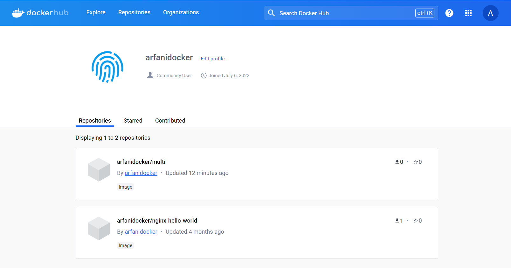

# Tutorial Docker Dockerfile

<details>
    <summary>Agenda</summary>
    <ul>
        <li>Pengenalan Dockerfile</li>
        <li>Dockerfile Format</li>
        <li>From Instruction</li>
        <li>Label Instruction</li>
        <li>Expose Instruction</li>
        <li>Environment Variable Instruction</li>
        <li>Entrypoint Instruction</li>
        <li>Volume Instruction</li>
        <li>Dan lain-lain</li>
    </ul>
    <ul>    
        <li>00:00:00 - Pendahuluan</li>
        <li>00:01:39 - Pengenalan Dockerfile</li>
        <li>00:06:07 - Dockerfile Format</li>
        <li>00:09:37 - From Instruction</li>
        <li>00:18:14 - Run Instruction</li>
        <li>00:28:29 - Command Instruction</li>
        <li>00:36:32 - Label Instruction</li>
        <li>00:41:22 - Add Instruction</li>
        <li>00:51:16 - Copy Instruction</li>
        <li>00:56:05 - Dockerignore File</li>
        <li>01:02:46 - Expose Instruction</li>
        <li>01:12:30 - Environment Variable Instruction</li>
        <li>01:22:51 - Volume Instruction</li>
        <li>01:35:05 - Working Directory Instruction</li>
        <li>01:44:05 - User Instruction</li>
        <li>01:51:06 - Argument Instruction</li>
        <li>02:04:24 - Health Check Instructioon</li>
        <li>02:17:39 - Entrypoint Instruction</li>
        <li>02:25:32 - Multi Stage Build</li>
        <li>02:41:34 - Docker Hub Registry</li>
        <li>02:48:11 - Digital Ocean Container Registry</li>
        <li>03:03:45 - Materi Selanjutnya</li>
    </ul>
</details>

## Pengenalan Dockerfile

### Pengenalan Dockerfile

-   Pada kelas Docker Dasar, kita sudah banyak belajar bagaimana cara kerja Docker, dari menggunakan Docker Image, sampai membuat Docker Container
-   Sekarang bagaimana jika kita ingin membuat Docker Image sendiri?
-   Pembuatan Docker Image bisa dilakukan dengan menggunakan instruksi yang kita simpan di dalam file Dockerfile

### Dockerfile

-   Dockerfile adalah file text yang berisi semua perintah yang bisa kita gunakan untuk membuat sebuah Docker Image
-   Anggap saja semua instruksi untuk, menjalankan aplikasi kita, kita simpan di dalam Dockerfile, nanti Dockerfile tersebut akan dieksekusi sebagai perintah untuk membuat Docker Image

### Docker Build

-   Untuk membuat Docker Image dari Dockerfile, kita bisa menggunakan perintah docker build.
-   Saat membuat Docker Image dengan docker build, nama image secara otomatis akan dibuat random, dan biasanya kita ingin menambahkan nama/tag pada image nya, kita bisa mengubahnya dengan menambahkan perintah `-t`
-   Misal berikut adalah contoh cara menggunakan docker build :

```bash
docker build -t khannedy/app:1.0.0  folder-dockerfile
docker build -t khannedy/app:1.0.0 -t khannedy/app:latest folder-dockerfile
```

## Dockerfile Format

### Dockerfile Format

-   Seperti namanya, Dockerfile biasanya dibuat dalam sebuah file dengan nama Dockerfile, tidak memiliki extension apapun
-   Walaupun sebenarnya bisa saja kita membuat dengan nama lain, namu direkomendasikan menggunakan nama Dockerfile

### Instruction Format

-   Secara sederhana berikut adalah format untuk file Dockerfile :

```bash
# Komentar
INSTRUCTION arguments
```

-   \# digunakan untuk menambah komentar, kode dalam baris tersebut secara otomatis dianggap komentar
-   INSTRUCTION adalah perintah yang digunakan di Dockerfile, ada banyak perintah yang tersedia, dan penulisan perintahnya case insensitive, sehingga kita bisa gunakan huruf besar atau kecil. Namun rekomendasinya adalah menggunakan UPPPER CASE
-   Arguments adalah data argument untuk INSTRUCTION, yang menyesuaikan dengan jenis INSTRUCTION yang digunakan

## From Instruction

### From Instruction

-   Saat kita membuat Docker Image, biasanya perintah pertama adalah melakukan build stage dengan instruksi FROM
-   FROM digunakan untuk membuat build stage dari image yang kita tentukan
-   Biasanya, jarang sekali kita akan membuat Docker Image dari scratch (kosongan), biasanya kita akan membuat Docker Image dari Docker Image lain yang sudah ada
-   Untuk menggunakan FROM, kita bisa gunakan perintah :
    FROM image:version

### Kode : FROM Instruction

```dockerfile
FROM alpine:3
```

### Kode : Docker Build

```bash
docker build -t arfanidocker/simple simple
---
[+] Building 6.8s (6/6) FINISHED                                                                                                                  docker:default
 => [internal] load build definition from dockerfile                                                                                                        0.1s
 => => transferring dockerfile: 50B                                                                                                                         0.0s
 => [internal] load .dockerignore                                                                                                                           0.0s
 => => transferring context: 2B                                                                                                                             0.0s
 => [internal] load metadata for docker.io/library/alpine:3                                                                                                 6.2s
 => [auth] library/alpine:pull token for registry-1.docker.io                                                                                               0.0s
 => [1/1] FROM docker.io/library/alpine:3@sha256:51b67269f354137895d43f3b3d810bfacd3945438e94dc5ac55fdac340352f48                                           0.3s
 => => resolve docker.io/library/alpine:3@sha256:51b67269f354137895d43f3b3d810bfacd3945438e94dc5ac55fdac340352f48                                           0.2s
 => => sha256:51b67269f354137895d43f3b3d810bfacd3945438e94dc5ac55fdac340352f48 1.64kB / 1.64kB                                                              0.0s
 => => sha256:13b7e62e8df80264dbb747995705a986aa530415763a6c58f84a3ca8af9a5bcd 528B / 528B                                                                  0.0s
 => => sha256:f8c20f8bbcb684055b4fea470fdd169c86e87786940b3262335b12ec3adef418 1.47kB / 1.47kB                                                              0.0s
 => exporting to image                                                                                                                                      0.0s
 => => exporting layers                                                                                                                                     0.0s
 => => writing image sha256:26fc80ffe8cc273858f455668aed8676cd9593966be3dee4d53f0647e054e923                                                                0.0s
 => => naming to docker.io/arfanidocker/from                                                                                                                0.0s

What's Next?
  View summary of image vulnerabilities and recommendations → docker scout quickview
```

## Run Instruction

### Run Instruction
- RUN adalah sebuah instruksi untuk mengeksekusi perintah di dalam image pada saat build stage. 
- Hasil perintah RUN akan di commit dalam perubahan image tersebut, jadi perintah RUN akan dieksekusi pada saat proses docker build saja, setelah menjadi Docker Image, perintah tersebut tidak akan dijalankan lagi. 
- Jadi ketika kita menjalankan Docker Container dari Image tersebut, maka perintah RUN tidak akan dijalankan lagi.

### Run Instruction Format
- Perintah RUN memiliki 2 format:
```dockerfile
RUN command
RUN ["executable","argument","..."]
```

### Kode : Run Instruction
```dockerfile
FROM alpine:3

RUN mkdir hello
RUN echo "Hello World" > "hello/world.txt"
RUN cat "hello/world.txt"
```

### Display Output
- Secara default, di docker terbaru tidak akan menampilkan tulisan detail dari build-nya
- Jika kita ingin menampilkan detailnya, kita bisa gunakan perintah `--progress=plain`
- Selain itu juga docker build juga melakukan cache, jika kita ingin mengulangi lagi tanpa menggunakan cache, kita bisa gunakan perintah `--no-cache`

## Command Instruction
### Command Instruction
- CMD atau Command, merupakan instruksi yang digunakan ketika Docker Container berjalan
- CMD tidak akan dijalankan ketika proses build, namun dijalankan ketika Docker Container berjalan
- Dalam Dockerfile, kita tidak bisa menambah lebih dari satu instruksi CMD, jika kita tambahkan lebih dari satu instruksi CMD, maka yang akan digunakan untuk menjalankan Docker Container adalah instruksi CMD yang terakhir

### Command Instruction Format
- Perintah CMD memiliki beberapa format :
`CMD command param param`
`CMD [“executable”, “param”, “param”]`
`CMD [“param”, “param”]`, akan menggunakan executable ENTRY POINT, yang akan dibahas di chapter terpisah

### Kode : Command Instruction
```dockerfile
FROM alpine:3

RUN mkdir hello
RUN echo "Hello World" > "hello/world.txt"

CMD cat "hello/world.txt"
```
## Label Instruction
### Label Instruction
- Instruksi LABEL merupakan instruksi yang digunakan untuk menambahkan metadata ke dalam Docker Image yang kita buat
- Metadata adalah informasi tambahan, misal seperti nama aplikasi, pembuat, website, perusahaan, lisensi dan lain-lain
- Metadata hanya berguna sebagai informasi saja, tidak akan digunakan ketika kita menjalankan Docker Container

### Label Instruction Format
- Berikut adalah format instruksi LABEL
```dockerfile
LABEL <key>=<value>
LABEL <key1>=<value1><key2>=<value2>...
```

### Kode : Label Instruction
```dockerfile
FROM alpine:3

LABEL author="Muhammad Arfani Asra"
LABEL company="Programmer Zaman Now" website="https://www.programmerzamannow.com"

RUN mkdir hello
RUN echo "Hello World" > "hello/world.txt"

CMD cat "hello/world.txt"
```

### Kode : Inspect Docker Image
```bash
docker image inspect arfanidocker/label
```
```bash
            "Labels": {
                "author": "Muhammad Arfani Asra",
                "company": "Programmer Zaman Now",
                "website": "https://www.programmerzamannow.com/"
            }
```

## Add Instruction
### Add Instruction
- ADD adalah instruksi yang dapat digunakan untuk menambahkan file dari source ke dalam folder destination di Docker Image
- Perintah ADD bisa mendeteksi apakah sebuah file source merupakan file kompres seperti tar.gz, gzip, dan lain-lain. Jika mendeteksi file source adalah berupa file kompress, maka secara otomatis file tersebut akan di extract dalam folder destination
- Perintah ADD juga bisa mendukung banyak penambahan file sekaligus
- Penambahan banyak file sekaligus di instruksi ADD menggunakan Pattern di Go-Lang : https://pkg.go.dev/path/filepath#Match 

### Add Instruction Format
- Instruksi ADD memiliki format sebagai berikut :
- ADD source destination
Contoh :
```dockerfile
ADD world.txt hello # menambah file world.txt ke folder hello
ADD *.txt hello # menambah semua file .txt ke folder hello
```

### Kode : ADD Instruction
```dockerfile
FROM alpine:3

RUN mkdir hello
ADD text/*.txt hello

CMD cat "hello/world.txt"
```

## Copy Instruction
### Copy Instruction
- COPY adalah instruksi yang dapat digunakan untuk menambahkan file dari source ke dalam folder destination di Docker Image
- Lantas apa bedanya dengan instruksi ADD kalo begitu?
- COPY hanya melakukan copy file saja, sedangkan ADD selain melakukan copy, dia bisa mendownload source dari URL dan secara otomatis melakukan extract file kompres
- Namun best practice nya, sebisa mungkin menggunakan COPY, jika memang butuh melakukan extract file kompres, gunakan perintah RUN dan jalankan aplikasi untuk extract file kompres tersebut

### Copy Instruction Format
- Instruksi COPY memiliki format sebagai berikut :
- COPY source destination
Contoh :
```dockerfile
COPY world.txt hello # menambah file world.txt ke folder hello
COPY *.txt hello # menambah semua file .txt ke folder hello
```

### Kode : COPY Instruction
```dockerfile
FROM alpine:3

RUN mkdir hello
COPY text/*.txt hello

CMD cat "hello/world.txt"
```

## .dockerignore file
### .dockerignore file
- Saat kita melakukan ADD atau COPY dari file source, pertama Docker akan membaca file yang bernama .dockerignore
- File .dockerignore ini seperti file .gitignore, dimana kita bisa menyebutkan file-file apa saja yang ingin kita ignore (hiraukan)
- Artinya jika ada file yang kita sebut di dalam file .dockerignore, secara otomatis file tersebut tidak aka di ADD atau di COPY
- File .dockerignore juga mendukung ignore folder atau menggunakan regular expression

> cek di workspace untuk melihat .dockerignore

## Expose Instruction
### Expose Instruction
- EXPOSE adalah instruksi untuk memberitahu bahwa container akan listen port pada nomor dan protocol tertentu
- Instruksi EXPOSE tidak akan mempublish port apapun sebenarnya, Instruksi EXPOSE hanya digunakan sebagai dokumentasi untuk memberitahu yang membuat Docker Container, bahwa Docker Image ini akan menggunakan port tertentu ketika dijalankan menjadi Docker Container

### Expose Instruction Format
- Berikut adalah format untuk instruksi EXPOSE :
- `EXPOSE port # default nya menggunakan TCP`
- `EXPORT port/tcp`
- `EXPORT port/udp`

### Kode : Hello World Go-Lang Web
- https://gist.github.com/khannedy/166be48cabb637b5beefc4e7998f2c7e 
- Simpan dalam file main.go

### Kode : Docker Image Inspect
```bash
docker image inspect arfanidocker/expose
```
```bash
"ExposedPorts": {
                "8080/tcp": {}
            },
```

## Environment Variable Instruction
### Environment Variable Instruction
- ENV adalah instruksi yang digunakan untuk mengubah environment variable, baik itu ketika tahapan build atau ketika jalan dalam Docker Container
- ENV yang sudah di definisikan di dalam Dockerfile bisa digunakan kembali dengan menggunakan sintaks `${NAMA_ENV}`
- Environment Variable yang dibuat menggunakan instruksi ENV disimpan di dalam Docker Image dan bisa dilihat menggunakan perintah docker image inspect
- Selain itu, environment variable juga bisa diganti nilainya ketika pembuatan Docker Container dengan perintah docker container create `--env key=value`

### Environment Variable Instruction Format
- Berikut adalah format untuk instruksi ENV:
```dockerfile
ENV key=value
ENV key1=value1 key2=value2 ...
```
### Kode : Hello World Go-Lang Web dengan Port
- https://gist.github.com/khannedy/e8574fdd9bebfb433a256e7e89f1d5ca 
- Simpan dalam file main.go

### Kode : ENV Instruction
```dockerfile
FROM golang:1.18-alpine
ENV APP_PORT=8080

RUN mkdir app
COPY main.go app

EXPOSE ${APP_PORT}
CMD go run app/main.go
```

## Volume Instruction
### Volume Instruction
- VOLUME merupakan instruksi yang digunakan untuk membuat volume secara otomatis ketika kita membuat Docker Container
- Semua file yang terdapat di volume secara otomatis akan otomatis di copy ke Docker Volume, walaupun kita tidak membuat Docker Volume ketika membuat Docker Container nya
- Ini sangat cocok pada kasus ketika aplikasi kita misal menyimpan data di dalam file, sehingga data bisa secara otomatis aman berada di Docker Volume

### Volume Instruction Format
- Berikut adalah format untuk instruksi VOLUME :
```dockerfile
VOLUME /lokasi/folder
VOLUME /lokasi/folder1/lokasi/folder2...
VOLUME ["/lokasi/folder1","/lokasi/folder2","..."]
```
### Golang Web dengan Write File
- https://gist.github.com/khannedy/d788b386297caf04b39640bec43f3131
- Simpan dalam file main.go

### Kode : Docker Image Inspect
```bash
docker image inspect arfanidocker/volume
```
```bash
            "Volumes": {
                "/logs": {}
            },
```
### Kode : Docker Container
```bash
dokcer container logs volume
---
PS D:\Programs\pzn\belajar-docker\tutorial-docker-dockerfile> docker container logs volume
Run app in port : 8080
DONE Write File : /logs/.txt
DONE Write File : /logs/favicon.ico.txt
DONE Write File : /logs/arfani.txt
DONE Write File : /logs/favicon.ico.txt
```
### Kode : Docker Container Inspect
```bash
docker container inspect volume
---
        "Mounts": [
            {
                "Type": "volume",
                "Name": "feb5693c63329f00a5b91df8934ccaa0605acb8fe4f5b8746aa0943a764f7825",
                "Source": "/var/lib/docker/volumes/feb5693c63329f00a5b91df8934ccaa0605acb8fe4f5b8746aa0943a764f7825/_data",
                "Destination": "/logs",
                "Driver": "local",
                "Mode": "",
                "RW": true,
                "Propagation": ""
            }
        ],
```
### Kode : Docker Volume
```bash
PS D:\Programs\pzn\belajar-docker\tutorial-docker-dockerfile> docker volume ls
---
DRIVER    VOLUME NAME
...
local     92fa946441cd972e99ed5f8b142e063d9eea9e27bc3d10f1500a66e3bf426c7d
local     971eb4dfeb5de851dce0dafc2bcadda6da8bde135a4ce8f7d2d92ad624d3b4d7
local     3740fba4c0221a072a0f46fae53011ab9a8c5e0c15189296c6cfc7f7547ba42f
local     84591bc118e753ac6b6c182519e1fb3e8f3de34c82b3594e898e8b66438e3fb6
local     a433-microservices_app-db
local     adminjs-example-app_mongo_db
local     adminjs-example-app_mongo_db_example_app
local     adminjs-example-app_mysql_db
local     adminjs-example-app_mysql_db_example_app
local     adminjs-example-app_postgres_db
local     adminjs-example-app_postgres_db_example_app
local     bb10b039b8fcddc441a045ac7d6436fd4993a6585275b7b83db76b7b27597de2
local     feb5693c63329f00a5b91df8934ccaa0605acb8fe4f5b8746aa0943a764f7825      # nama volume yang sama pada inspect
local     jenkins-data
local     jenkins-docker-certs
...
```

## Working Directory Instruction
### Working Directory Instruction
- WORKDIR adalah instruksi untuk menentukan direktori / folder untuk menjalankan instruksi RUN, CMD, ENTRYPOINT, COPY dan ADD
- Jika WORKDIR tidak ada, secara otomatis direktorinya akan dibuat, dan selanjutnya setelah kita tentukan lokasi WORKDIR nya, direktori tersebut dijadikan tempat menjalankan instruksi selanjutnya
- Jika lokasi WORKDIR adalah relative path, maka secara otomatis dia akan masuk ke direktori dari WORKDIR sebelumnya
- WORKDIR juga bisa digunakan sebagai path untuk lokasi pertama kali ketika kita masuk ke dalam Docker Container

### Working DIrectory Instruction Format
- Berikut adalah format untuk instruksi WORKDIR :
```dockerfile
WORKDIR /app # artinya working directory nya adalah /app
WORKDIR docker # sekarang working directory nya adalah /app/docker
WORKDIR /home/app # sekarang working directory nya adalah /home/app
```

### Golang Web Hello World
- https://gist.github.com/khannedy/9262c7784a9ef65ced9dac712822a853
- Simpan dalam file main.go

### Kode : Working Directory Instruction
```dockerfile
FROM golang:1.18-alpine

WORKDIR /app
COPY main.go /app

EXPOSE 8080
CMD go run main.go
```
### Kode : Docker Container
```bash
PS D:\Programs\pzn\belajar-docker\tutorial-docker-dockerfile> docker container exec -i -t workdir /bin/sh
/app # pwd
/app
/app #
```

## User Instruction
### User Instruction
- USER adalah instruksi yang digunakan untuk mengubah user atau user group ketika Docker Image dijalankan
- Secara default, Docker akan menggunaka user root, namun pada beberapa kasus, mungkin ada aplikai yang tidak ingin jaan dalam user root, maka kita bisa mengubah user nya menggunakan instruksi USER

### User Instruction Format
- Berikut adalah format untuk instruksi USER:
- USER <user> # mengubah user
- USER <user>:<group> # mengubah user dan user group

### Kode : User Instruction
```dockerfile
FROM golang:1.18-alpine

RUN mkdir /app

RUN addgroup -S pzngroup
RUN adduser -S -D -h /app pznuser pzngroup
RUN chown -R pzn user:pzngroup /app
USER pznuser

COPY main.go /app

EXPOSE 8080
CMD go run /app/main.go
```

### Kode : Docker Container
```bash
PS D:\Programs\pzn\belajar-docker\tutorial-docker-dockerfile> docker container exec -i -t user /bin/sh
/go $ whoami
pznuser
/go $ exit
```

## Argument Instruction
### Argument Instruction
- ARG merupakan instruksi yang digunakan untuk mendefinisikan variable yang bisa digunakan oleh pengguna untuk dikirim ketika melakukan proses docker build menggunakan perintah `--build-arg key=value`
- ARG hanya digunakan pada saat proses build time, artinya ketika berjalan dalam Docker Container, ARG tidak akan digunakan, berbeda dengan ENV yang digunakan ketika berjalan dalam Docker Container
- Cara mengakses variable dari ARG sama seperti mengakses variable dari ENV, menggunakan `${variable_name}`

### Argumen Instruction Format
- Berikut adalah format untuk instruksi ARG:
```dockerfile
ARG key # membuat argument variable
ARG key=defaultvalue # membuat argument variable dengan default value jika tidak diisi
```
### Kode : Argument Instruction
```dockerfile
FROM golang:1.18-alpine

ARG app=main

RUN mkdir app
COPY main.go app
RUN mv app/main.go app/${app}.go

EXPOSE 8080

CMD go run app/${app}.go
```

### Kode : Docker Container
```bash
PS D:\Programs\pzn\belajar-docker\tutorial-docker-dockerfile> docker container logs arg
stat app/.go: no such file or directory
```

### Kenapa Error?
- Hal ini dikarenakan ARG hanya bisa diakses pada waktu build time, sedangkan CMD itu dijalankan pada saat runtime
- Jadi jika kita ingin menggunakan ARG pada CMD, maka kita perlu memasukkan data ARG tersebut ke ENV
```bash
            "Cmd": [
                "/bin/sh",
                "-c",
                "go run app/${app}.go"
            ],
```

### Kode : Argument dan Environment Instruction
```dockerfile
ARG app=main

RUN mkdir app
COPY main.go app
RUN mv app/main.go app/${app}.go

EXPOSE 8080

ENV app=${app}
CMD go run app/${app}.go
```

### Hasil
```bash
PS D:\Programs\pzn\belajar-docker\tutorial-docker-dockerfile> docker container exec -i -t arg /bin/sh
/go # cd app
/go/app # ls -l
total 4
-rwxr-xr-x    1 root     root           239 Jan  9 02:38 pzn.go
/go/app # exit
```

## Health Check Instruction
### Health Check Instruction
- HEALTHCHECK adalah instruksi yang digunakan untuk memberi tahu Docker bagaimana untuk mengecek apakah Container masih berjalan dengan baik atau tidak
- Jika terdapat HEALTHCHECK, secara otomatis Container akan memili status health, dari awalnya bernilai starting, jika sukses maka bernilai healthy, jika gagal akan bernilai unhealty

### Health Check Instruction Format
- Berikut adalah format untuk instruksi HEALTHCHECK :
```dockerfile
HEALTHCHECK NONE # artinya disabled health check
HEALTHCHECK [OPTIONS] CMD command
``` 
- OPTIONS :
```dockerfile
--interval=DURATION (default: 30s)
--timeout=DURATION (default: 30s)
--start-period=DURATION (default: 0s)
--retries=N (default: 3)
```

### Simple Golang Web dengan Health Check
- https://gist.github.com/khannedy/08d52d1d9b7b41b34535df85509417b4
- Simpan dalam file main.go

### Kode : Health Check Instruction
```dockerfile
FROM golang:1.18-alpine

RUN apk --no-cache add curl
RUN mdkir app
COPY main.go app

EXPOSE 8080

HEALTHCHECK --interval=5s --start-period=5s CMD curl -f http://localhost:8080/health
CMD go run app/main.go
```
### Kode : Docker Container
```bash
PS D:\Programs\pzn\belajar-docker\tutorial-docker-dockerfile> docker container ls
CONTAINER ID   IMAGE                 COMMAND                  CREATED          STATUS                   PORTS                    NAMES
2ad1cd5196a7   arfanidocker/health   "/bin/sh -c 'go run …"   23 minutes ago   Up 8 seconds (healthy)   0.0.0.0:8080->8080/tcp   health
```
```bash
PS D:\Programs\pzn\belajar-docker\tutorial-docker-dockerfile> docker container ls
CONTAINER ID   IMAGE                 COMMAND                  CREATED          STATUS                      PORTS                    NAMES
2ad1cd5196a7   arfanidocker/health   "/bin/sh -c 'go run …"   23 minutes ago   Up 48 seconds (unhealthy)   0.0.0.0:8080->8080/tcp   health
```
```bash
docker container inspect health
---
            "Health": {
                "Status": "unhealthy",
                "FailingStreak": 11,
                "Log": [
                    {
                        "Start": "2024-01-09T08:56:28.460234618Z",
                        "End": "2024-01-09T08:56:28.523583319Z",
                        "ExitCode": 22,
                        "Output": "  % Total    % Received % Xferd  Average Speed   Time    Time     Time  Current\n                                 Dload  Upload   Total   Spent    Left  Speed\n\r  0     0    0     0    0     0      0      0 --:--:-- --:--:-- --:--:--     0\r  0     2    0     0    0     0      0      0 --:--:-- --:--:-- --:--:--     0\ncurl: (22) The requested URL returned error: 500\n"
                    },
                    {
                        "Start": "2024-01-09T08:56:33.531862451Z",
                        "End": "2024-01-09T08:56:33.611500419Z",
                        "ExitCode": 22,
                        "Output": "  % Total    % Received % Xferd  Average Speed   Time    Time     Time  Current\n                                 Dload  Upload   Total   Spent    Left  Speed\n\r  0     0    0     0    0     0      0      0 --:--:-- --:--:-- --:--:--     0\r  0     2    0     0    0     0      0      0 --:--:-- --:--:-- --:--:--     0\ncurl: (22) The requested URL returned error: 500\n"
                    },
                    {
                        "Start": "2024-01-09T08:56:38.621449581Z",
                        "End": "2024-01-09T08:56:38.747403152Z",
                        "ExitCode": 22,
                        "Output": "  % Total    % Received % Xferd  Average Speed   Time    Time     Time  Current\n                                 Dload  Upload   Total   Spent    Left  Speed\n\r  0     0    0     0    0     0      0      0 --:--:-- --:--:-- --:--:--     0\r  0     2    0     0    0     0      0      0 --:--:-- --:--:-- --:--:--     0\ncurl: (22) The requested URL returned error: 500\n"
                    },
                    {
                        "Start": "2024-01-09T08:56:43.760594297Z",
                        "End": "2024-01-09T08:56:43.849953178Z",
                        "ExitCode": 22,
                        "Output": "  % Total    % Received % Xferd  Average Speed   Time    Time     Time  Current\n                                 Dload  Upload   Total   Spent    Left  Speed\n\r  0     0    0     0    0     0      0      0 --:--:-- --:--:-- --:--:--     0\r  0     2    0     0    0     0      0      0 --:--:-- --:--:-- --:--:--     0\ncurl: (22) The requested URL returned error: 500\n"
                    },
                    {
                        "Start": "2024-01-09T08:56:48.858515297Z",
                        "End": "2024-01-09T08:56:48.932168158Z",
                        "ExitCode": 22,
                        "Output": "  % Total    % Received % Xferd  Average Speed   Time    Time     Time  Current\n                                 Dload  Upload   Total   Spent    Left  Speed\n\r  0     0    0     0    0     0      0      0 --:--:-- --:--:-- --:--:--     0\r  0     2    0     0    0     0      0      0 --:--:-- --:--:-- --:--:--     0\ncurl: (22) The requested URL returned error: 500\n"
                    }
                ]
            }
        },
```

## Entrypoint Instruction

### Entrypoint Instruction
- ENTRYPOINT adalah instruksi untuk menentukan executable file yang akan dijalankan oleh container
- Biasanya ENTRYPOINT itu erat kaitannya dengan instruksi CMD
- Saat kita membuat instruksi CMD tanpa executable file, secara otomatis CMD akan menggunakan ENTRYPOINT

### Entrypoiunt Instruction Format
- Berikut adalah format untuk instruksi ENTRYPOINT:
```bash
ENTRYPOINT [“executable”,“param1”,“param2”]
ENTRYPOINT executable param1 param2
```
- Saat menggunakan CMD [“param1”, “param2”], maka param tersebut akan dikirim ke ENTRYPOINT

### Kode : Entrypoint Instruction
```dockerfile
FROM golang:1.18-alpine

RUN mkdir /app/
COPY main.go /app/

EXPOSE 8080
ENTRYPOINT ["go", "run"]
CMD ["/app/main.go"]
```
### Kode : Docker Image Inspect
```bash
docker image inspect arfanidocker/entrypoint 
```
```bash
            "Image": "",
            "Volumes": null,
            "WorkingDir": "/go",
            "Entrypoint": [
                "go",
                "run"
            ],
            "OnBuild": null,
            "Labels": null
        },
```

## Multi Stage Build

### Masalah Dengan Image Size
- Saat kita membuat Dockerfile dari base image yang besar, secara otomatis ukuran Image nya pun akan menjadi besar juga
- Oleh karena itu, usahakan selalu gunakan base image yang memang kita butuhkan saja, jangan terlalu banyak menginstall fitur di Image padahal tidak kita gunakan

### Contoh Solusi Dengan Image Size Besar
- Sebelumnya kita menggunakan bahasa pemrograman Go-Lang untuk membuat web sederhana.
- Sebenarnya, Go-Lang memiliki fitur untuk melakukan kompilasi kode program Go-Lang menjadi binary file, sehingga tidak membutuhkan Image Go-Lang lagi
- Kita bisa melakukan proses kompilasi di laptop kita, lalu file binary nya yang kita simpan di Image, dan cukup gunakan base image Linux Alpine misal nya
- Namun pada kasus Go-Lang, kita di rekomendasikan melakukan kompilasi file binary di sistem operasi yang sama, pada kasus ini saya menggunakan Mac, sedangkan ingin menggunakan Image Alpine, jadi tidak bisa saya lakukan

### Multi Stage Build
- Docker memiliki fitur Multi Stage Build, dimana dalam Dockerfile, kita bisa membuat beberapa Build Stage atau tahapan build
- Seperti kita tahu, bahwa di awal build, biasanya kita menggunakan instruksi `FROM`, dan di dalam Dockerfile, kita bisa menggunakan beberapa instruksi `FROM`
- Setiap Instruksi `FROM`, artinya itu adalah build stage
- Hal build stage terakhir adalah build stage yang akan dijadikan sebagai Image
- Artinya, kita bisa memanfaatkan Docker build stage ini untuk melakukan proses kompilasi kode program Go-Lang kita

### Kode : Dokcer Image & Container
```bash
PS D:\Programs\pzn\belajar-docker\tutorial-docker-dockerfile> docker image ls | Select-String "arfanidocker"

arfanidocker/multi                                        latest
                                             75e94865fd68   16 seconds ago      13.7MB
arfanidocker/entrypoint                                   latest
                                             3eb93cfabc51   37 minutes ago      330MB
arfanidocker/health                                       latest
                                             df779a28fb36   About an hour ago   332MB
arfanidocker/arg                                          latest
                                             f0040bd56ea9   7 hours ago         330MB
arfanidocker/user                                         latest
                                             9551e62aed86   7 hours ago         330MB
arfanidocker/workdir                                      latest
                                             1a6bdefb34d0   13 hours ago        330MB
arfanidocker/volume                                       latest
```

## Docker Hub Registry

### Docker Hub Registry
- Setelah kita selesai membuat Image, selanjutnya hal yang biasa d ilakukan adalah mengupload Image tersebut ke Docker Registry
- Salah satu Docker Registry yang gratis contohnya adalah Docker Hub
- https://hub.docker.com/ 

### Docker Hub Access Token
- Digunakan untuk login ke Docker Hub

### Kode : Docker Push
```bash
PS D:\Programs\pzn\belajar-docker\tutorial-docker-dockerfile> docker push arfanidocker/multi
Using default tag: latest
The push refers to repository [docker.io/arfanidocker/multi]
2f0a689c4a52: Pushed
e1f45ffe9f05: Pushed
5af4f8f59b76: Mounted from library/alpine
latest: digest: sha256:2fcae75a3490d6318091dcea81a077db5a18453db74bb83e4998ec2e9ccfc853 size: 945
```

### Hasil : Docker Hub
<figure>
    
    <figcaption>Image berhasil di push ke Docker Hub</figcaption>
</figure>

## Digital Ocean Container Registry

### Digital Ocean Container Registry
- Digital Ocean adalah salah satu cloud provider yang populer, dan memiliki fitur Docker Registry bernama Container Registry
- Terdapat Free Version untuk ukuran sampai 500MB yang bisa kita gunakan
- https://www.digitalocean.com/products/container-registry 
- Silahkan buat Container Registry terlebih dahulu

### Docker Config
- Berbeda dengan Docker Hub yang kita diperlukan melakukan login ketika ingin melakukan push ke Registry
- Di Digital Ocean, kita akan menggunakan Docker Config untuk mengirim Image ke Digital Ocean Container Registry
- Ini lebih mudah karena kita bisa dengan gampang push Image dari manapun selama menggunakan config file yang sama

### Konfigurasi Docker Config
- Secara default, Docker akan membaca config yang terdapat di `$HOME/.docker`
- Di dalamnya terdapat file `config.json` yang berisi konfigurasi credential yang sudah kita gunakan ketika login ke Docker Hub
- Agar tidak mengganggu, khusus untuk Digital Ocean, kita akan buat folder terpisah, misal `.docker-digital-ocean`
- Selanjunya file creadential yang sudah di download, silahkan ganti namanya menjadi config.json dan simpan di folder `.docker-digital-ocean` tersebut

### Docker Push
- Jika kita menggunakan perintah docker push, secara default itu akan melakukan push ke Container Registry yang teregistrasi di `$HOME/.docker`
- Karena kita menggunakan lokasi yang berbeda untuk Digital Ocean, jadi ketika melakukan push, kita perlu mengubah default config nya menggunaka perintah :
`docker --config /lokasi/folder/config/ push image` 

### Kode : Docker Push ke Digital Ocean


## Materi Selanjutnya

### Materi Selanjutnya
- Docker Compose

