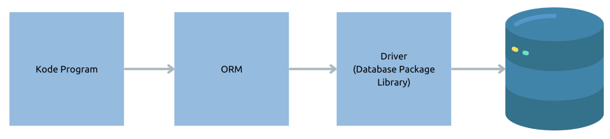
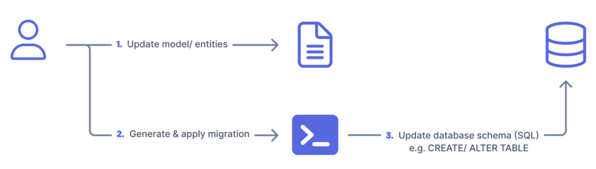
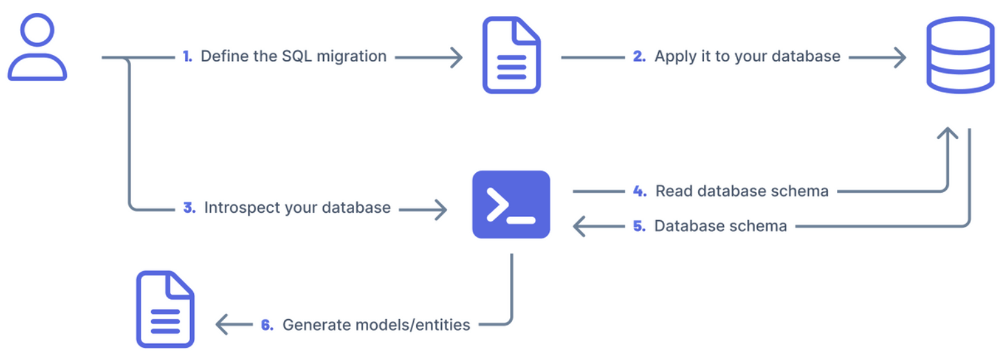

# Belajar NodeJS Database & Prisma ORM

## Pengenalan NodeJS Database

### NodeJS Standard Library

- Tidak seperti teknologi lain seperti PHP, Java, dan lain-lain yang menyediakan standard library untuk database
- Di NodeJS Standard Library sayangnya tidak menyediakan fitur untuk database
- Oleh karena itu, untuk menggunakan database kita harus menambahkan dependency lain, tergantung database nya

### Database Package

- Ada banyak database package library yang bisa kita gunakan, tergantung databasenya
- Hal ini juga menjadi masalah, karena akhirnya tidak database, kita harus menggunakan package library yang berbeda, dan cara menggunakannya pun berbeda-beda
- MySQL : https://www.npmjs.com/package/mysql2
- PostgreSQL : https://www.npmjs.com/package/pg
- Oracle : https://www.npmjs.com/package/oracledb
- Dan lain-lain

### Masalah dengan Database Package Library

- Karena menggunakan database package library terlalu spesific dengan library yang digunakan, akhirnya kebanyakan programmer NodeJS menggunakan library ORM untuk memanipulasi data di database
- Oleh karena itu, di kelas ini pun, kita tidak akan menggunakan database package library secara langsung, kita akan menggunakan library ORM untuk memanipulasi data di database nya
- Detail ORM akan kita bahas di materi selanjutnya

## Pengenalan Object Relational Mapping

### Pengenalan ORM

- ORM (Object Relational Mapping) adalah teknik dalam pemrograman, dimana kita melakukan pemetaan data di database dalam konsep relational object
- Oleh karena itu, ORM sering banyak digunakan di database dengan jenis relational, seperti MySQL, PostgreSQL, Oracle, dan sejenisnya
- Konsep ORM sendiri adalah membuat representasi object di aplikasi yang merepresentasikan data (table) di database, sehingga ketika melakukan manipulasi data (table) di database, seakan-akan kita melakukan manipulasi object di pemrograman

### Diagram Cara Kerja ORM

  

### Contoh Library ORM di NodeJS

- Sequelize: https://sequelize.org/
- TypeORM: https://typeorm.io/
- Prisma: https://www.prisma.io/

### Prisma

- Di kelas ini, kita akan menggunakan Prisma sebagai ORM nya
- Di awal kelas, kita akan belajar menggunakan RAW SQL (tanpa fitur ORM)
- Selanjutnya, kita akan belajar menggunakan ORM di Prisma

## Pengenalan Prisma

### Pengenalan Prisma

- Prisma adalah salah satu ORM di NodeJS yang populer
- Prisma memiliki banyak fitur untuk mempermudah kita mengelola data di database, dari mulai migration, schema, dan juga type safe
- Prisma sendiri selain bisa digunakan ketika kita menggunakan JavaScript, Prisma juga terintegrasi dengan baik dengan TypeScript
- Prisma adalah library yang Free dan OpenSource
- https://www.prisma.io/

### Prisma Component

Prisma memiliki banyak komponen yang bisa digunakan, seperti

- Prisma Schema, untuk memetakan schema data di database dengan di aplikasi
- Prisma Client, sebagai client untuk ORM
- Prisma Migrate, sebagai database migration untuk mengelola versi schema di database
- Prisma CLI, aplikasi berbasis terminal untuk mengelola project prisma
- Prisma Studio, aplikasi berbasis UI untuk mengelola data di database kita secara mudah
- Introspection, untuk membuat Prisma Schema secara otomatis dari table di database yang sudah ada, cocok untuk migrasi dari aplikasi yang sudah jadi ke Prisma

## Membuat Project

### Membuat Project

- `npm init`
- Ubah `type` menjadi `module` di `package.json`

### Menambah Library Jest untuk Unit Test

- `npm install --save-dev jest @types/jest`

### Menambah Library Babel

- `npm install --save-dev babel-jest @babel/preset-env`
- https://babeljs.io/setup#installation

## Menginstall Prisma

### Menginstall Prisma

- Untuk menginstall prisma, kita bisa menggunakan perintah: `npm install prisma --save-dev`
- Selanjutnya, kita tidak bisa langsung menggunakan prisma, kita perlu melakukan pengaturan terlebih dahulu menggunakan Prisma CLI yang terdapat di perintah: `npx prisma`

### Membuat Project Prisma

- Untuk membuat project prisma pertama kali, kita perlu menggunakan perintah: `npx prisma init`
- Secara otoamtis prisma akan membuat file: `.env` yang berisi konfigurasi environment variable
- `prisma/schema.prisma`, yang berisikan schema pemetaan dengan database

## Database Connection

### Database Connection

- Secara default, saat membuat project prisma, prisma akan menggunakan koneksi database PostgreSQL
- Karena di kelas ini kita akan menggunakan MySQL, jadi kita akan ubah konfigurasinya ke MySQL
- Prisma menggunakan konsep database url untuk membuat koneksi ke databasenya, dan formatnya bisa kita lihat tergantung jenis database nya disini: https://www.prisma.io/docs/concepts/database-connectors

## Generate

### Generate

- Prisma memiliki fitur type safe (beberapa IDE bisa melakukan auto complete), hal ini dikarenakan prisma akan melakukan generae kode dari schema yang kita buat
- Setiap kita melakukan perubahan kode di file schema prisma, kita harus melakukan perintah: `npx prisma generate`
- Hal ini agar kode perubahan di schema akan dibuat dalam bentuk kode JavaScript

### Membuat Table

- Karena prisma meminta minimal terdapat model schema, maka kita akan membuat table contoh terlebih dahulu
- Detail untuk model di schema, akan kita bahas di materi tersendiri

## Prisma Client

### Prisma Client

- Prisma Client merupakan komponen utama di Prisma untuk fitur ORM nya, dimana kita import dari package `@prisma/client`
- Ingat, Prisma Client digenerate setelah proses sebelumnya yang kita bahas, jika kita belum generate kode Prisma nya, maka Prisma Client tidak bisa dibuat
- Prisma Client akan secara otomatis membaca data dari environment variable file `.env` dan juga informasi koneksi database dari prisma schema file

### Jumlah Object Prisma Client

- Saat membuat aplikasi, Prisma Client itu hanya dibuat sekali saja, jadi bukan berarti tiap kita mau memanipulasi data di database, kita harus buat Prisma Client
- Oleh karena itu, sebaiknya kita buat file berisi variable object Prisma Client , dan jika membutuhkannya, cukup ambil dari variable tersebut

### Konfigurasi Prisma Client

- Saat membuat Prisma Client juga, kita bisa melakukan pengaturan Log untuk Prisma Client
- https://www.prisma.io/docs/reference/api-reference/prisma-client-reference
- Jika Prisma Client cukup dibuat satu kali, lantas bagaimana jika aplikasi kita banyak yang membutuhkan koneksi ke database? Prisma Client sudah mengatur jumlah koneksi dalam pool (tempat menyimpan koneksi)
- Kita juga bisa mengatur jumlah koneksi dan timeout pada konfigurasi database url kita
- https://www.prisma.io/docs/concepts/database-connectors

## Tag Function

### Tag Function

- Sebelum kita lanjut materi prisma, kita perlu paham dulu tentang Tag Function di JavaScript
- Tag Function adalah sebuah fitur yang sebenarnya jarang digunakan, namun di Prisma, hal ini digunakan untuk mempermudah kita mengirim perintah SQL ke database menggunakan Prisma Client
- Sebelumnya kita sudah tahu tentang fitur String Template di JavaScript, dimana kita bisa menangkap data dari variable di String
- Tag Function adalah fitur seperti String Template yang bisa dilakukan ketika kita memanggil function

### Kode: Tag Function
```
function tagFunction(array, ...args) {
  console.log(array);
  console.log(args);
}
```

### Tag Function Parameter

- Sederhananya, Tag Function adalah mengubah data String Template menjadi parameter yang dipecah dalam dua array
- Array pertama menjadi data String nya, dan Array kedua menjadi data parameter nya
- Misal untuk data `Hello ${name}!, how are you?`, dimana misal $name adalah Eko, akan diubah menjadi :
- Array 1 : `[“Hello ”, “!, how are you?”]`
- Array 2 : `[“Eko”]`

## Execute SQL

### Execute SQL

- Prisma Client memiliki method bernama `$executeRaw()`, yang bisa digunakan untuk mengirim data SQL untuk memanipulasi data, seperti `INSERT`, `UPDATE` atau `DELETE`
- Return value dari `$executeRaw()` adalah `Promise<Number>` yang berisi jumlah data yang terkena impact dari operasi SQL yang kita lakukan
- `$executeRaw()` menggunakan Tag Function untuk membuat SQL nya, dan ini sudah aman dari SQL Injection, sehingga kita tidak perlu takut orang mengirim data yang berbahaya yang bisa membuat kode SQL kita rusak

## Query SQL

### Query SQL

- Prisma Client memiliki method bernama `$queryRaw()`, yang bisa digunakan untuk mengirim SQL query untuk mengambil data menggunakan `SELECT`
- Return value dari `$queryRaw()` adalah `Promise<Array>` yang berisinikan data hasil query nya
- `$queryRaw()` menggunakan Tag Function untuk membuat SQL nya, dan ini sudah aman dari SQL Injection juga

## Prisma ORM

### Prisma ORM

- Menggunakan Prisma sebenarnya akan sangat jarang kita menggunakan Raw SQL seperti pada materi-materi sebelumnya
- Oleh karena itu, mulai sekarang kita akan fokus membahas fitur ORM di Prisma nya

## Model

### Model

- Saat membuat table di database, maka kita perlu membuat model di Prisma, hal ini agar kode untuk memanipulasi data model tersebut di generate oleh Prisma CLI sehingga bisa digunakan menggunakan Prisma Client
- Untuk membuat model, kita bisa membuat model file prisma schema
- Nama model akan menjadi nama table di database, jika kita ingin mengubahnya, kita bisa gunakan `@@map(“namatable”)`
- Kolom yang boleh `null`, kita perlu tandai dengan `?` (tanda tanya)
- Untuk kolom Primary Key, perlu kita tandai dengan `@id`
- Setelah mengubah model, jangan lupa untuk generate Prisma Client menggunakan perintah : `npx prisma generate`

## CRUD

### CRUD

- Setelah membuat generate code dari Model, secara otomatis kita bisa melakukan operasi CRUD (Create, Read, Update, dan Delete) menggunakan Prisma Client
- Prisma Client otomatis memiliki field dengan nama model yang kita buat dalam lowercase, misal saat sebelumnya kita menggunakan nama model Customer, maka akan dibuat field PrismaClient.customer yang merupakan Prisma Model Query
- https://www.prisma.io/docs/reference/api-reference/prisma-client-reference#model-queries

## Transaction

### Transaction

- Kita tahu bahwa di database terdapat fitur transaction
- Di Prisma Client, kita bisa menggunakan method `$transaction()` untuk melakukan transaksi
- Terdapat dua mekanisme untuk melakukan transaksi di Prisma Client:
  1. Sequential Transaction, dimana kita kirim semua operasi Prisma Client sebagai array, atau
  2. Interactive Transaction, dimana kita bisa menggunakan callback function yang berisi kode transaksi nya

## CRUD Many

### CRUD Many

- Sebelumnya, kita sudah bahas tentang CRUD menggunakan Prisma Client
- Namun hanya untuk satu data
- Prisma Client juga mendukung untuk melakukan CRUD untuk lebih dari satu data, kita bisa menggunakan method dengan suffix Many

### Update Many

- Update Many di Prisma Client bukan dengan mengirim banyak data, lalu data tersebut di update satu per satu
- Update Many di Prisma Client itu adalah operasi update, yang bisa berdampak ke banyak data
- Lantas apa bedanya dengan update single? bedanya untuk update single, Prisma akan melakukan query terlebih dahulu, untuk memastikan bahwa cuma ada 1 data yang tersedia, dan untuk query nya pun hanya bisa di primary key atau unique colom
- Sedangkan di Update Many, kita bisa update dengan query pada kolom apapun, karena bisa berdampak ke banyak data

### Delete Many

- Delete Many juga sama dengan Update Many, diana kita bisa melakukan operasi Delete yang bisa berdampak ke banyak data
- Dan bedanya dengan Delete Single adalah sama seperti Update Single, Prisma Client akan melakukan select terlebih dahulu untuk memastikan bahwa yang dihapus adalah salah satu data

## Paging

### Paging

- Method `findMany()` di Prisma Client juga mendukung paging menggunakan parameter skip dan take
- Take adalah jumlah maksimal data yang diambil
- Skip adalah julah data yang akan di skip diawal

## Sorting

### Sorting

- Method `findMany()` juga memiliki parameter `orderBy` untuk mengurutkan datanya
- Kita bisa tentukan apakh akan diurutkan berdasarkan asc atau desc

## Select Fields

### Select Fields

- Saat menggunakan Prisma Client, hampir semua operasi CRUD dan juga `findMany()` akan melakukan select ke semua field / kolom
- Lantas bagaimana jika kita ingin membatasi field/kolom yang di select? Kita bisa tambahkan option select ketika melakukan operasi CRUD atau `findMany()`

## Count

### Count

- Prisma Client memiliki method untuk melakukan query aggregate count dengan method `count()`
- Cara penggunaannya mirip dengan method `findMany()`

## Aggregate

### Aggregate

- Kita tahu bahwa function aggregate di database tidak hanya count, lantas bagaimana dengan jenis function aggregate lainnya?
- Prisma Client menyediakan method bernama `aggregate()` yang bisa digunakan untuk melakukan query aggregate

### Function Aggregate

- Berikut adalah beberapa function aggregate yang didukung oleh Prisma Client:
  1. `_count`
  2. `_min`
  3. `_max`
  4. `_sum`
  5. `_avg`
- Lantas bagaiman dengan function aggregate lainnya? Maka kita harus lakukan manual menggunakan Raw SQL

### Group By

- Saat menggunakan function aggregate, kadang kita butuh melakukan GROUP BY
- Pada kasus ini, kita bisa menggunakan function `groupBy()`, tidak menggunakan function `aggregate()` lagi

### Having

- Pada method `groupBy()` juga terdapat attribute having yang bisa digunakan untuk kondisi HAVING pada SQL query yang akan kita lakukan

## Where Condition dan Operator

### Where Condition dan Operator

- Sampai saat ini, kita hanya selalu melakukan operasi equals (=) ketika melakukan query ke database
- Prisma Client mendukung banyak sekali where condition dan operator, yang bisa kita gunakan agar bisa membuat query secara flexible
- Semua condition dan operator yang didukung bisa dilihat di halaman dokumentasinya
- https://www.prisma.io/docs/reference/api-reference/prisma-client-reference#filter-conditions-and-operators

## Prisma Schema

### Prisma Schema

- Sebelumnya kita sudah membuat model di Prisma Schema, sekarang kita akan bahas lebih detail tentang Prisma Schema
- Prisma Schema berisikan informasi tentang database yang digunakan oleh Prisma Client, dari mulai koneksi sampai model data
- Hal ini digunakan untuk men-generate kode Prisma Client
- Semua detail referensi Prisma Schema bisa kita baca disini :
- https://www.prisma.io/docs/reference/api-reference/prisma-schema-reference

### Model

- Saat kita membuat model di Prisma Schema, kita harus memiliki sebuah field/column yang unique
- Biasanya berupa primary key
- Dan untuk model field, biasanya merepresentasikan nama kolom di tabel di database
- https://www.prisma.io/docs/reference/api-reference/prisma-schema-reference#model

### Tipe Data

- Setiap kita menambahkan field di Model, kita harus menentukan tipe data yang akan digunakan
- Tambahkan `?` (tanda tanya) pada tipe data tersebut, jika tipe data tersebut bisa bernilai null
- Ada banyak sekali tipe data yang didukung oleh Prisma Schema, kita bisa melihatnya di halaman dokumentasi nya
- https://www.prisma.io/docs/reference/api-reference/prisma-schema-reference#model-field-scalar-types

### Model Attribute

- Saat kita membuat model, kadang ada informasi tambahan yang perlu kita beritahu ke Prisma Schema
- Contoh sebelumnya misal kita ingin membuat nama model berbeda dengan nama table, maka kita gunakan `@@map()`
- Masih banyak model attribute yang bisa kita gunakan, kita bisa lihat di dokumentasinya
- https://www.prisma.io/docs/reference/api-reference/prisma-schema-reference#attributes

### Enum

- Di database MySQL dan PostgreSQL, kita bisa membuat tipe data Enum
- Kita juga bisa memberi tahu tentang enum di Prisma Schema
- Kita bisa membuat enum seperti pada dokumentasinya: https://www.prisma.io/docs/reference/api-reference/prisma-schema-reference#enum

## Auto Increment

### Auto Increment

- Beberapa database biasanya mendukung auto increment pada Primary Key, seperti MySQL dan PostgreSQL
- Kita bisa memberitahu Prisma Schema bahwa field tersebut adalah auto increment, sehingga kita tidak wajib memasukkan datanya ketika menggunakan Prisma Client
- Kita cukup gunakan attribute `@default()` dan pilih jenis auto increment yang tersedia di dokumentasi: https://www.prisma.io/docs/reference/api-reference/prisma-schema-reference#attribute-functions

## One to One Relationship

### One to One Relationship

- Ketika kita membuat table dengan relasi one to one, kita juga perlu memberitahunya di Prisma Schema
- Hal ini agar urusan join bisa dilakukan secara otomatis oleh Prisma Client
- Untuk membuat relasi one to one, kita bisa menggunakan `@relation`, dan itu ditempatkan di model yang melakukan join column nya

### Relation Operator

- Ketika kita mau melakukan Read data untuk relasi, kita bisa gunakan relation operator
- Namun kita harus cek jenis relasi, contoh beberapa operator hanya bisa untuk relasi To Many misalnya
- https://www.prisma.io/docs/reference/api-reference/prisma-client-reference#relation-filters

## One to Many Relationship

### One to Many Relationship

- Relasi one to many sebenarnya mirip dengan one to one, yang membedakan adalah di table yang memiliki join column, tidak terdapat aturan unique, sehingga bisa lebih dari satu kali
- Contoh kasus misal Customer dengan Comment, dimana Customer bisa membuat banyak data Comment
- Sehingga dari Customer ke Comment adalah relasi One to Many, sedangkan kebalikannya adalah relasi Many to One
- Untuk menambah informasi One to Many, sama seperti One to One, menggunakan `@relation()`, namun tipe datanya perlu ditambahkan [] sebagai penanda bahwa itu array/list

## Many to Many Relationship

### Many to Many Relationship

- Jenis relasi terakhir yang paling kompleks adalah Many to Many
- Untuk Many to Many, kita juga bisa lakukan di Prisma Schema
- Seperti yang sudah kita ketahui, relasi Many to Many Relationship membutuhkan table penghubung, sehingga kita perlu membuat table penghubung terlebih dahulu
- Sekarang kita akan coba buat relasi dari Customer ke Product, misal kita akan buat fitur Likes, dimana satu product bisa di like oleh banyak customer, dan satu customer bisa like banyak product

### Implicit Many to Many Relationship

- Sebelumnya saat membuat relasi Many to Many, kita menyebutkan model untuk table penghubungnya, atau dibilang explicit many to many
- Prisma juga memiliki fitur implicit many to many, dimana kita tidak perlu menyebutkan model penghubungnya
- Namun untuk fitur implicit many to many, ada aturannya
- Nama table harus `_` diikuti nama relasi, dan nama kolom harus A dan B, dimana A adalah kolom model pertama, dan B adalah kolom model kedua, diurutkan secara asc nama model nya
- Misal kita akan coba buat relasi lagi many to many dari Customer ke Product untuk fitur Loves

## Prisma Migrate

### Prisma Migrate

- Sampai sekarang, kita selalu membuat table secara manual
- Prisma sendiri memiliki fitur Prisma Migrate, dimana kita bsia membuat database migration untuk membuat schema database menggunakan Prisma
- Keuntungan menggunakan Prisma Migrate adalah, kita tidak perlu mengeksekusi perintah SQL untuk membuat schema database secara manual lagi

### Mental Model

Sebelum kita buat migration, kita perlu tahu dua jenis mental model dalam Prisma Migrate

- **Model/Entity-first migration**, yaitu dimana programmer biasa membuat Model terlebih dahulu, lalu Prisma Migrate akan membuatkan perintah SQL DDL nya. Cara ini biasanya digunakan ketika membuat aplikasi baru atau melakukan perubahan baru
- **Database-first migration**, yaitu dimana programmer biasa membuat SQL DDL nya terlebih dahulu, lalu menggunakan Prisma Migrate untuk melakukan introspect database untuk membuat model sesuai dengan database. Cara ini biasanya dilakukan ketika menggunakan Prisma untuk database yang sudah ada

### Model/Entity-first migration

  

### Database-first migration

  

## Model-first Migration

### Model-first Migration

- Sebelumnya, kita selalu membuat table secara manual, sekarang kita akan coba buat database baru, dan coba lakukan Model-first migration, dimana kita sudah selesai membuat semua model di Prisma Schema nya
- Untuk menjalankan Model-first migration, kita bisa gunakan perintah :
  `npx prisma migrate dev --create-only --name nama_migration`
- Secara otomatis akan dibuatkan file SQL DDL dari model di folder migrations
- Kita bisa review atau edit terlebih dahulu jika mau, dan dan pastikan jika ada yang perlu diubah, tidak hanya di SQL DDL, kita juga perlu ubah di Model nya
- Setelah selesai, kita bisa jalankan migration menggunakan perintah :
  `npx prisma migrate dev`

### Tipe Data di Database

- Kadang beberapa jenis tipe data perlu disesuaikan dengan yang ada di database
- Oleh karena itu, kadang kita perlu update model nya agar sesuai dengan tipe data yang sesuai di database
- Kita bisa gunakan attribute di model menggunakan @db
- Misal saat kita gunakan String, tipe data di database bisa saja bukan VARCHAR, oleh karena itu kita perlu beritahu di model Prisma nya

### Migration Selanjutnya

- Selanjutnya, setiap melakukan perubahan model, kita perlu membuat migration baru
- Secara otomatis, perubahan tersebut akan dibuat SQL DDL nya oleh Prisma Migrate

### Migration Information

- Prisma Migrate melakukan maintain versi file migrasi yang sudah dieksekusi secara otomatis menggunakan table \_prisma_migrations
- Setiap file migration yang sudah dieksekusi, maka kita tidak boleh mengubahnya lagi, hal ini dikarenakan file migration yang sudah dieksekusi tidak akan pernah dijalankan lagi, jadi percuma saja mengubah file migration lama
- Selain itu, informasi checksum file migration disimpan di table \_prisma_migrations, jadi jika sampai kita ubah, maka akan terjadi error karena checksum nya akan berubah

## Database-first Migration

### Database-first Migration

- Database-first Migration adalah kebalikan dari Model-first Migration
- Ini biasanya dilakukan ketika database nya sudah ada, dan kita ingin menggunakan Prisma untuk mengelola database nya
- Untuk membuat model dari schema database yang sudah ada, kita bisa gunakan perintah : `npx prisma db pull`
- Selanjutnya, kita bisa review perubahan di Schema nya, dan ubah jika dibutuhkan

### Contoh

- Sekarang misal kita akan hapus semua isi model di Prisma Schema
- Lalu kita akan lakukan perintah untuk pull schema db menggunakan: `npx prisma db pull`

## Prisma Studio

### Prisma Studio

- Prisma Studio adalah fitur yang bisa kita gunakan untuk menjalankan web visual untuk memanipulasi data di database berdasarkan Prisma Schema
- Ini sangat cocok dalam proses development ketika kita ingin mudah melihat atau mengubah data di database, tanpa harus menggunakan perintah SQL
- Kita bisa jalankan Prisma Studio dengan perintah : `npx prisma studio`
- Secara otomatis akan menjalankan web di localhost port 5555

## Materi Selanjutnya

### Materi Selanjutnya

- NodeJS Validation
- NodeJS RESTful API
- Dan lain-lain
