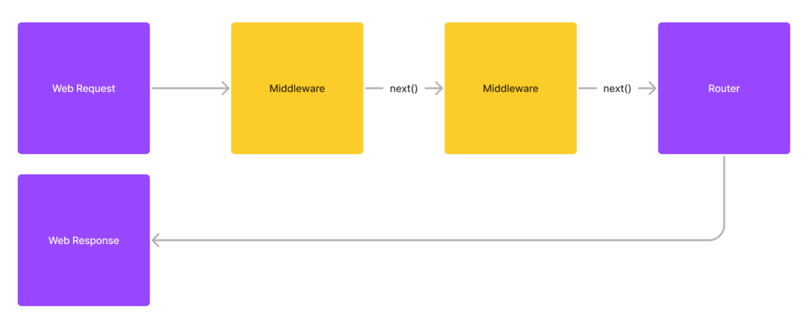
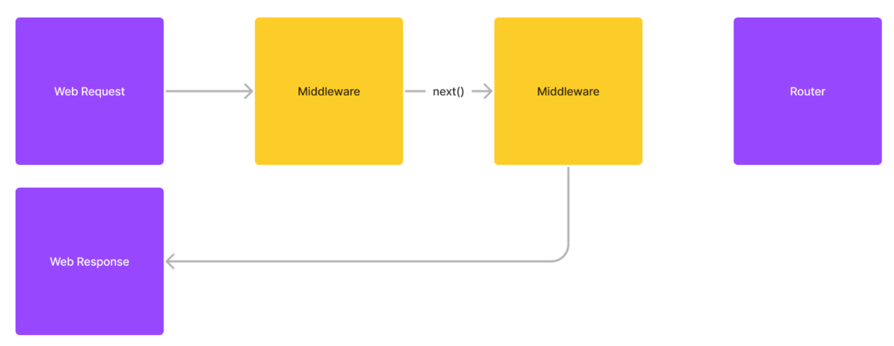

# Belajar NodeJS ExpressJS

    
Agenda

    <ol>
        <li>Pengenalan ExpressJS</li>
        <li>App</li>
        <li>Route</li>
        <li>Template</li>
        <li>Dan lain-lain</li>
    </ol>

## Pengenalan ExpressJS

### Pengenalan ExpressJS

- ExpressJS adalah salah satu Web Framework OpenSource paling populer di NodeJS
- ExpressJS pertama kali dibuat tahun 2010, dan karena sangat populer, - ExpressJS sekarang sudah menjadi hal yang wajib dikuasai ketika kita akan membuat Web menggunakan NodeJS
- https://expressjs.com/
- https://www.npmjs.com/package/express
- https://github.com/expressjs/express

### Minimalist

- ExpressJS sangat minimalist, tidak memiliki banyak fitur seperti Web Framework di bahasa pemrograman lain seperti Laravel, Ruby on Rails atau Django
- Karena sangat minimalist, biasanya ExpressJS akan diintegrasikan dengan banyak library NodeJS lainnya
- Oleh karena itu, programmer bisa bebas memilih Library NodeJS yang ingin dia integrasikan dengan ExpressJS

## Application

### Application

- Saat kita membuat web menggunakan ExpressJS, kuta akan membuat object Application
- Application adalah object utama dalam library ExpressJS
- https://expressjs.com/en/4x/api.html#app

### Application

- Application secara default tidak berjalan jika kita ingin mmenjalankan Application nya, kita perlu menggunakan method `listen(port)`
- Dimana port adalah nomor yang ingin kita gunakan untuk menjalankan web nya
- Pastikan port yang kita pilih tidak bentrok dengan aplikasi lain
- https://expressjs.com/en/4x/api.html#app.listen

## Basic Routing

### Routing

- Saat kita membuat web, biasanya kita akan membuat banyak sekali URL Path
- Routing merupakan teknik yang digunakan untuk meneruskan request dari URL Path ke callback yang kita tuju
- Routing di ExpressJS bisa menggunakan object Application, dan menggunakan method sesuai dengan nama HTTP Method nya

### Routing Method

|                             |                     |
| --------------------------- | ------------------- |
| app.connect(path, callback) | HTTP Method CONNECT |
| app.get(path, callback)     | HTTP Method GET     |
| app.post(path, callback)    | HTTP Method POST    |
| app.put(path, callback)     | HTTP Method PUT     |
| app.delete(path, callback)  | HTTP Method DELETE  |
| app.options(path, callback) | HTTP Method OPTIONS |
| app.trace(path, callback)   | HTTP Method TRACE   |
| app.head(path, callback)    | HTTP Method HEAD    |
| app.patch(path, callback)   | HTTP Method PATCH   |
| app.all(path, callback)     | Semua HTTP Method   |

## Unit Test

### Bagaimana Melakukan Unite Test ExpressJS?

- Salah satu yang sulit ketika membuat aplikasi web yang harus berjalan yaitu melakukan automation test
- Jika melakukan manual test, terlihat mudah tinggal kita buka melalui web browser
- Namun dalam pekerjaan sehari-hari, lambat laun, hal ini akan menyulitkan kita ketika harus melakukan manual test jika terdapat perubahan di aplikasi kita
- Oleh karena itu, sangat direkomendasikan menggunakan unit test, walaupun aplikasinya dalam bentuk web

### Supertest

- Supertest adalah salah satu library yang bisa digunakan untuk membantu melakukan pengetesan web ExpressJS
- Dengan Supertest, kita bisa lebih mudah membuat unit testnya, dibanding melakukan secara manual
- https://www.npmjs.com/package/supertest

## Request

### Request

- Saat kita membuat callback di router, parameter pertama adalah object Request, yang secara otomatis diisi oleh ExpressJS
- Object Request akan berisikan informasi tentang HTTP Request yang masuk ke callback tersebut
- Ada banyak sekali informasi HTTP Request yang bisa kita ambil dari object Request, seperti Query Param, Header, Body dan lain-lain
- https://expressjs.com/en/4x/api.html#req

## Request URL

### Request URL

- Untuk mendapatkan URL saat ini, kita bisa menggunakan object Request untuk mendapatkan informasinya
- `req.originalUrl`, untuk mendapat url secara full beserta query param nya
- `req.path`, untuk mendapatkan path url tanpa query param
- `req.hostname`, untuk mendapatkan nama host atau domain dari web kita
- `req.protocol`, untuk mendapatkan protocol dari url web
- `req.secure`, untuk mengecek apakah url web nya https atau bukan
- `req.subdomains`, untuk mendapatkan array subdomain dari url web kita

## Request Query Param

### Request Query Param

- Request juga bisa digunakan untuk mengambil data query parameter
- Secara otomatis, semua query parameter akan disimpan dalam bentuk object di `req.query`
- https://expressjs.com/en/4x/api.html#req.query

## Request Header

### Request Header

- Object Request juga bisa kita gunakan untuk mendapatkan informasi dari HTTP Header dari Request
- Kita bisa menggunakan method `req.get(name)` atau `req.header(name)` untuk mendapatkan header berdasarkan name, khusus untuk HTTP Header, name nya adalah case insensitive
- https://expressjs.com/en/4x/api.html#req.get

## Response

### Response

- Pada Callback Routing ExpressJS, terdapat parameter kedua yaitu response
- Response merupakan object representasi dari HTTP Response
- Kita bisa mengubah data HTTP Response melalui object Response tersebut
- https://expressjs.com/en/4x/api.html#res

## Response Status

### Response Status

- Saat kita ingin mengubah HTTP Status dari HTTP Response yang kita buat, kita bisa menggunakan method `res.status(code)`
- https://expressjs.com/en/4x/api.html#res.status

## Response Header

### Response Header

- Kita juga bisa mengubah HTTP Response Header dengan menggunakan method `res.set(name, value)` atau `res.header(name, value)`
- Atau jika ingin langsung beberapa name, kita bisa masukkan dalam bentuk object ke dalam parameter name nya
- https://expressjs.com/en/4x/api.html#res.set

## Response Body

### Response Body

- Untuk mengubah Response Body, kita bisa menggunakan method `res.send(body)`
- Dimana parameter body bisa kita kirim dalam bentuk buffer atau string, baik itu text, html, json dan lain-lain
- https://expressjs.com/en/4x/api.html#res.send

## Redirect

### Redirect

- Seperti yang pernah dijelaskan di kelas HTTP, untuk melakukan Redirect dari sebuah web ke halaman lain, kita hanya cukup menggunakan HTTP Header Location
- Di ExpressJS, kita bisa lakukan manual dengan menggunakan HTTP Header Location, atau bisa dengan bantuan method res.redirect(to)
- https://expressjs.com/en/4x/api.html#res.redirect

## Middleware

### Middleware

- Middleware adalah function yang bisa digunakan untuk mengakses request object, response object dan next function dalam alur hidup aplikasi ExpressJS
- Jika Middleware memanggil next function, artinya function Middleware selanjutnya atau Router akan dieksekusi

### Diagram: Middleware (1)

  

### Fungsi Middleware

Ada banyak sekali kegunaan dari Middleware, seperti

- Eksekusi kode sebelum router di eksekusi
- Mengubah Request atau Response object sebelum router di eksekusi
- Mengakhiri response tanpa harus mengeksekusi router
- Dan lain-lain

### Diagram: Middleware (2)

  

### Spesifikasi Middleware

- Untuk membuat middleware, kita cukup membuat function dengan 3 parameter, request, response dan next
- request adalah request object
- response adalah response object
- next adalah next function, bisa middleware selanjutnya atau router

### Manipulasi Request

- Karena Request itu adalah JavaScript Object
- Jadi jika kita mau, kita juga bisa memanipulasi Request Object di Middleware
- Misal mengubah attribute atau menambah attribute baru, agar bisa digunakan di Middleware selanjutnya, atau di Router

## Route Path

### Route Path

- Sebelumnya pada materi Basic Routing, kita belajar bagaimana cara melakukan routing dengan HTTP Method sesuai yang kita mau
- Sekarang kita akan bahas lebih detail tentang Route Path nya.
- Sebelumnya, route path yang kita gunakan tidak dinamis. ExpressJS mendukung route path yang dinamis, dengan cara menggunakan route path string patterns atau regex

### Path to Regex

- ExpressJS menggunakan library Path to Regex untuk melakukan routing berupa regex
- Kita bisa lihat detail cara melakukan regex nya pada halaman dokumentasi library nya
- https://www.npmjs.com/package/path-to-regexp
- Untuk melakukan pengetesan, kita bisa menggunakan website http://forbeslindesay.github.io/express-route-tester/

## Route Parameter

### Route Parameter

- Saat kita membuat aplikasi Web API atau RESTful API, kadang kita sering menyimpan parameter dalam URL Path, misal /products/{idProduct}, atau /categories/{idCategory}, dan lain-lain
- ExpressJS mendukung penambahan parameter dalam route path, dengan menggunakan prefix : (titik dua)
- Semua data parameter itu bisa kita tambahkan regex jika kita mau, misal /products/:id(\\d+), artinya kita menambah parameter id, dimana id tersebut harus digit
- Data route parameter secara otomatis bisa kita ambil sebagai attribute di req.params
- https://expressjs.com/en/4x/api.html#req.params

## Route Function

### Route Function

- Kadang ada kasus ketika kita membuat route path yang sama untuk beberapa tipe HTTP Method
- Pada kasus ini, kita bisa memanfaatkan route(path) function sehingga tidak perlu mendeklarasikan nama path sama untuk beberapa route
- https://expressjs.com/en/4x/api.html#app.route

## Router

### Router

- Saat kita membuat Application ExpressJS, secara default sudah terdapat object Router nya
- Namun, kita bisa membuat object Router sendiri jika kita mau, hal ini sangat cocok jika kita ingin melakukan grouping Router, lalu misal kita bisa menambahkan Router tersebut ke Application seperti Middleware
- Ini sangat cocok ketika kita ingin membuat fitur modular yang bisa mengaktifkan atau menonaktifkan router secara dinamis misalnya
- Dengan object Router, kita bisa memiliki Middleware dan Routing secara independen
- https://expressjs.com/en/4x/api.html#express.router
- https://expressjs.com/en/4x/api.html#router

## Type of Middleware

### Type of Middleware

Di ExpressJS, terdapat beberapa jenis Middleware

- ExpressJS, terdapat beberapa jenis Middleware
- Application-level middleware
- Router-level middleware
- Error-handling middleware
- Built-in middleware
- Third-party middleware

### Application-Level Middleware

- Yaitu middleware yang digunakan di object Application, sebelumnya kita sudah menggunakan Application-Level Middleware, dengan cara menggunakan function app.use(middleware)
- Saat kita menggunakan Application-Level Middleware, maka secara otomatis Middleware tersebut akan dipanggil di semua route
- Jika kita mau menggunakan Middleware hanya untuk di route path tertentu, kita bisa tambahkan route pattern ketika menggunakan app.use(), misal app.use(“/products/\*”, middleware)
- https://expressjs.com/en/4x/api.html#app.use

### Router-Level Middleware

- Yaitu middleware yang ditambahkan pada object Router yang kita buat menggunakan express.Router()
- Middleware ini secara otomatis akan dipanggil ketika request masuk ke router ini
- Sama seperti dengan Application-Level Middleware, jika kita ingin middleware nya hanya dipanggil para route path tertentu, kita bisa juga tambahkan route pattern ketika menggunakan middleware nya menggunakan router.use(path, middleware)
- https://expressjs.com/en/4x/api.html#router.use

### Error-Handling Middleware

- Yaitu middleware yang akan dipanggil ketika terjadi error di aplikasi kita (throw Error)
- Cara penggunaannya mirip dengan Application-Level Middleware, yang membedakan adalah function callback nya memiliki empat parameter, yaitu error, request, response dan next
- Object error akan secara otomatis terisi oleh data Error yang terjadi di aplikasi kita
- Middleware ini, sangat cocok ketika kita ingin menampilkan tampilan yang berbeda ketika terjadi error di aplikasi kita

### Built-in Middleware

- ExpressJS banyak sekali menggunakan Middleware untuk melakukan pemrosesan request dan response, termasuk terdapat Built-in Middleware, yaitu middleware yang sudah terdapat secara otomatis di ExpressJS
- `express.json()`, yaitu middleware yang melakukan parsing request body menjadi JavaScript object
- `express.text()`, yaitu middleware yang melakukan parsing request body menjadi string
- `express.raw()`, yaitu middleware yang melakukan parsing request body menjadi Buffer
- `express.urlencoded()`, yaitu middleware yang melakukan parsing request body form menjadi object
- `express.static()`, yaitu middleware yang digunakan untuk melayani file static

### Third-Party Middleware

- Yaitu middleware buatan orang lain yang kita gunakan
- Untuk menggunakannya, kita perlu menambah dependency middleware nya terlebih dahulu

## Request Body

### Request Body

- Sebelumnya kita belum membahas tentang HTTP Request Body
- Di ExpressJS, Secara default HTTP Request Body tidak bisa diambil datanya oleh Router Callback, hal ini dikarenakan, jenis data Request Body bisa berbeda-beda, tergantung tipe data yang dikirim
- Oleh karena itu, di dalam ExpressJS, terdapat Built-in Middleware, yang digunakan untuk membaca Request Body, lalu melakukan konversi ke tipe data yang diinginkan

### Built-in Middleware

| Middleware             | Keterangan                                                            |
| ---------------------- | --------------------------------------------------------------------- |
| `express.json()`       | Membaca request body menjadi bentuk JSON (JavaScript Object Notation) |
| `express.text()`       | Membaca request body menjadi bentuk string                            |
| `express.raw()`        | Membaca request body menjadi bentuk buffer                            |
| `express.urlencoded()` | Membaca request body menjadi bentuk Form (JavaScript Object)          |

## Cookie

### Cookie

- Dalam HTTP, salah satu fitur yang biasa digunakan untuk pertukaran data dari Server dan Client adalah Cookie
- Banyak yang menggunakan Cookie sebagai Session misalnya
- Sayangnya, secara default, ExpressJS tidak mendukung Cookie, tapi jangan khawatir, kita bisa menggunakan Third-Party Middleware untuk mendukung Cookie ini

### Cookie Parser

- Cookie Parser adalah salah satu Third-Party Middleware yang bisa kita gunakan untuk mendukung fitur Cookie, dimana dengan Cookie Parser, kita secara otomatis menyimpan data ke Cookie, atau mengambil data ke Cookie
- https://www.npmjs.com/package/cookie-parser

### Membaca Cookie

- Setelah kita memasang Cookie Parser Middleware, kita bisa secara otomatis membaca Cookie yang dikirim dari Client melalui req.cookies
- https://expressjs.com/en/4x/api.html#req.cookies

### Menulis Cookie

- Sedangkan untuk menulis Cookie, kita bisa tambahkan di response, dengan method res.cookie(key, value, setting)
- https://expressjs.com/en/4x/api.html#res.cookie
- Dan untuk menghapus Cookie, kita bisa gunakan res.clearCookie(key, setting)
- https://expressjs.com/en/4x/api.html#res.clearCookie

## Signed Cookie

### Signed Cookie

- Salah satu kelemahan ketika kita menyimpan data di Cookie adalah, Cookie bisa dimodifikasi oleh Client, misal kita bisa modifikasi Cookie di Browser kita
- Salah satu cara untuk menjaga agar Cookie tidak dimodifikasi adalah, kita menambahkan Signature pada Cookie kita
- Setiap nilai Cookie akan ada Signature, dimana ketika nilai Cookie diubah, otomatis Signature tidak akan sama lagi, dan secara otomatis value Cookie tidak dianggap valid lagi
- Fitur ini sudah ada di Cookie Parser dengan nama Signed Cookie
- Kita wajib menyebutkan Cookie mana yang ingin di Signed, ketika kita membuat Cookie di response
- Selain itu, kita juga perlu memasukkan Secret Key untuk digunakan ketika proses pembuatan Signature, pastikan Secret Key nya aman dan tidak mudah ditebak

### Membaca Signed Cookie

- Jika kita membuat Cookie sebagai Signed Cookie, maka untuk membacanya, jangan menggunakan req.cookies, melainkan harus menggunakan req.signedCookies
- https://expressjs.com/en/4x/api.html#req.signedCookies

## Response Body lainnya

### Response Body

- Sebelumnya, kita sudah mencoba beberapa jenis Response Body di ExpressJS
- Kita bisa menggunakan res.send(data) untuk mengirim response berupa text misal nya, atau sebelumnya, kita sudah menggunakan res.json(object) untuk mengirim data dalam bentuk JSON
- Sebenarnya masih banyak jenis Response Body yang didukung oleh ExpressJS

### Response Body Method

|Response Body Method|Keterangan|
|-|-|
|`res.send(data)`|Response berupa raw data|
|`res.download(path, filename, option)`|Response berupa file download|
|`res.json(body)`|Response berupa JSON|
|`res.redirect(url)`|Response redirect url|
|`res.send(path, option)`|Response berupa file|

## Error Handling

### Jika Terjadi Error

- Apa yang terjadi jika misal terjadi Error di aplikasi kita? Secara otomatis Error tersebut akan ditangkap oleh ExpressJS
- Lalu detail error nya akan ditampilkan di response-nya secara otomatis
- Kadang, ada kasus kita ingin mengubah cara menampilkan error, atau bahkan kita memang berharap terjadi error, misal Validation Error
- Pada kasus seperti ini, untungnya ExpressJS memiliki fitur Error-Handling Middleware, dimana kita bisa membuat Middleware dan akan dieksekusi ketika terjadi error
- Berbeda dengan Middleware biasanya, pada Error-Handling Middleware, diperlukan empat parameter, dimana diawali dengan parameter error nya

## Static File

### Static File

- Saat membuat Web, kadang kita ingin menampilkan static file seperti html, css, javascript, gambar, atau file lainnya
- Jika kita harus membuat route untuk setiap file, maka akan menyulitkan.
- Untungnya, terdapat middleware yang bisa kita gunakan untuk menyediakan static file.
- Middleware ini secara otomatis akan mencari file, jika file ada, maka akan dikembalikan file tersebut, jika tidak ada, maka akan dilanjutkan ke middleware atau route selanjutnya
- Kita bisa menggunakan Middleware express.static()
- http://expressjs.com/en/4x/api.html#express.static

### Prefix Path

- Kadang-kadang, kita ingin memberi prefix path pada static file, misal /static/filenya
- Pada kasus itu, maka kita bisa tambahkan route pada middleware nya, misal : `app.use(‘/static’, express.static(...))`

## Template Engine

### Template Engine

- Saat membuat web menggunakan ExpressJS, maka jika kita membuat string HTML lalu kita kirim menggunakan response, maka hal itu sangat menyulitkan
- Biasanya, untuk mempermudah itu, kita bisa menggunakan Template Engine
- Template Engine adalah library yang digunakan untuk membuat template lalu mempermudah kita ketika ingin menampilkan data di template nya
- Biasanya template nya dalam bentuk HTML, dan data nya bisa kita ubah sesuai dengan data yang ingin kita tampilkan di HTML tersebut

### Template Engine Library

- ExpressJS Sendiri tidak memiliki fitur Template Engine, oleh karena itu kita perlu menggunakan library lain untuk menggunakan Template Engine
- Ada banyak sekali library Template Engine di NodeJS, misal
  1. Mustache : https://github.com/janl/mustache.js/
  2. Pug : https://github.com/pugjs/pug
  3. EJS : https://github.com/mde/ejs
  4. Marko : https://github.com/marko-js/marko
  5. Dan lain-lain

### Mustache Express

- Pada kelas ini, kita akan menggunakan Mustache sebagai template engine
- Hal ini dikarenakan Mustache merupakan template engine yang sangat mudah digunakan
- Kita tidak akan menginstall Mustache secara manual, kita akan menggunakan bantuan library Mustache Express
- https://www.npmjs.com/package/mustache-express

### Mustache

- Pelajari lebih lanjut tentang kode template Mustache
- https://github.com/janl/mustache.js

## File Upload

### File Upload

- Sebelumnya kita belum membahas bagaimana jika Request Body yang dikirim adalah File Upload atau Multipart Form Data?
- Sayangnya, secara default di ExpressJS, tidak ada fitur untuk membaca File Upload
- Tapi kita bisa menggunakan Third-Party Middleware lain untuk membaca File Upload
- https://github.com/richardgirges/express-fileupload

## Not Found Handler

### Not Found Handler

- Saat user melakukan request ke URL yang tidak tersedia, maka secara default ExpressJS akan mengembalikan halaman 404
- Kadang ada kasus dimana kita ingin membuat halaman 404 sendiri
- Pada kasus ini, kita bisa menambahkan middleware di posisi paling akhir
- Middleware tersebut akan dipanggil jika memang tidak terdapat route yang tersedia untuk route path yang diakses

## Materi Selanjutnya

### Materi Selanjutnya

- NodeJS Mustache
- NodeJS Database
- Dan lain-lain
