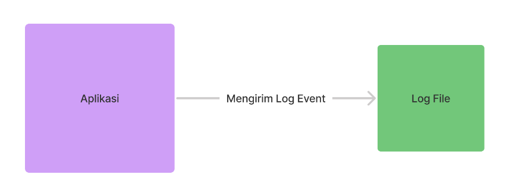
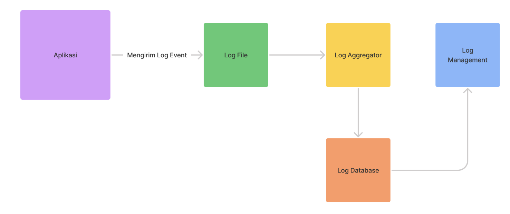
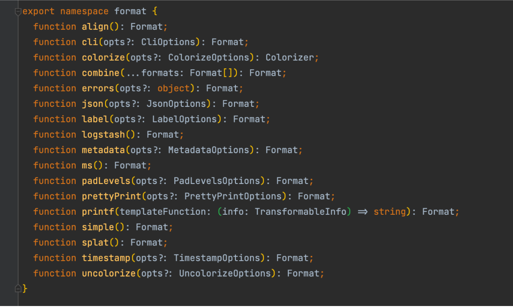

# Belajar NodeJS Logging

<details>
    <summary>Agenda</summary>
    <ol>
        <li>Pengenalan Logging</li>
        <li>Logging Library</li>
        <li>Logger</li>
        <li>Transport</li>
        <li>Format</li>
        <li>Dan lain-lain</li>
    </ol>
</details>

## Pengenalan Logging

### Pengenalan Logging
- Log file adalah file yang berisikan informasi kejadian dari sebuah sistem
- Biasanya dalam log file, terdapat informasi waktu kejadian dan pesan kejadian
- Logging adalah aksi menambah informasi log ke log file
- Logging sudah menjadi standard industri untuk menampilkan informasi yang terjadi di aplikasi yang kita buat
- Logging bukan hanya untuk menampilkan informasi, kadang digunakan untuk proses debugging ketika terjadi masalah di aplikasi kita

### Diagram Logging
  

### Ekosistem Logging
  

## Logging Library

### NodeJS Logging
- NodeJS sendiri sebenarnya memilih fitur untuk melakukan logging dengan object console
- Namun saat ini, kebanyakan programmer hanya menggunakan fitur ini pada kasus-kasus yang sederhana
- Hal ini dikarenakan penggunaannya yang kurang flexible dan minim fitur
https://nodejs.org/api/console.html 

### Logging Library
Diluar NodeJS Logging, banyak sekali library yang bisa kita gunakan untuk logging, seperti :
- Winston https://www.npmjs.com/package/winston 
- Bunyan https://www.npmjs.com/package/bunyan 
- Pino https://www.npmjs.com/package/pino 
- Loglevel https://www.npmjs.com/package/loglevel 
- NPMLog https://www.npmjs.com/package/npmlog 

### Winston
- Pada kelas ini kita akan menggunakan Winston
- Winston merupakan logging library yang sangat populer di kalangan programmer NodeJS
- https://www.npmjs.com/package/winston
- https://github.com/winstonjs/winston

## Logger

### Logger
- Logger adalah sebuah object di Winston, yang digunakan untuk melakukan logging
- Untuk membuat object Logger, kita bisa menggunakan function createLogger() yang terdapat di package/module winston

## Console Transport

### Console Transport
- Saat membuat Logger, secara default Logger tidak akan menggunakan Transport
- Apa itu Transport? Transport adalah destinasi atau target yang digunakan untuk mengirim log
- Ada banyak sekali Transport, salah satunya yang paling sederhana adalah Console
- Console merupakan Transport yang digunakan untuk mengirim data log ke console/stdout

### Level
- Dalam logging, terdapat istilah yang bernama Level, Level biasanya digunakan sebagai informasi seberapa penting log tersebut
- Level dimulai dari paling rendah ke paling tinggi, semakin tinggi Level nya, artinya semakin penting informasi log tersebut
- Untuk menambahkan Level ketika melakukan log, kita bisa ubah attribute level menjadi level yang kita inginkan

## Logging Level

### Winston Level
|Winston Level|
|-|
|error|
|warn|
|info|
|http|
|verbose|
|debug|
|silly|

*Semakin keatas semakin penting (atas)*

### Kenapa Beberapa Level Tidak Muncul?
- Secara default, saat kita membuat Logger, Logger hanya akan menampilkan log dengan level info atau level diatasnya
- Jika kita ingin mengubah log level mana yang ingin kita tampilkan, maka kita perlu ubah konfigurasi level ketika kita membuat logger, dengan menggunakan level minimal yang ingin kita tampilan

### Shortcut Function
- Logger juga memiliki function yang bisa digunakan untuk melakukan logging, sehingga kita tidak perlu menggunakan function log dan object dengan attribute level lagi
- Kita bisa langsung menggunakan function dengan nama sesuai dengan level nya, misal ```logger.info(message)```, ```logger.warn(message)```, dan lain-lain

## Format

### Format
- Format adalah object yang digunakan untuk melakukan formatting data log sebelum dikirim ke Transport
- Saat kita membuat Logger, secara default, Logger akan menggunakan JSON Format, artinya data akan dikirim dalam bentuk JSON
- Winston juga menyediakan banyak format selain JSON

### Membuat Format Sendiri
- Winston juga menyediakan format printf, yang bisa digunakan untuk membuat format sendiri

## Combine Format

### Combine Format
- Winston memiliki fitur bernama Combine Format, dimana kita bisa melakukan kombinasi beberapa Format sekaligus
- Ini cocok untuk menambah informasi tambahan ke log data, misal data timestamp, data jarak waktu antar log, dan lain-lain
- Kita bisa menggunakan Combine Format di Winston untuk menggabungkan beberapa Format

### Daftar Format di Winston
  

## File Transport

### File Transport
- Sebelumnya kita hanya menggunakan Console Transport, selain Console Transport, di Winston juga terdapat File Transport
- Dari namanya kita sudah tahu, bahwa Transport ini akan menyimpan data log ke file
- Kita bisa menambahkan langsung beberapa Transport dalam satu Logger object

## Transport Level

### Transport Level
- Beberapa Transport memiliki pengaturan Level sendiri
- Saat sebuah Transport memiliki pengaturan Level, secara otomatis Transport hanya akan menerima log dengan level tersebut atau yang lebih tinggi
- Hal ini sangat cocok misal ketika kita ingin memisahkan beberapa level log di transport yang berbeda

## Rotate File

### Default Transport File
- Secara default, winston Transport File hanya akan menyimpan semua log di dalam satu file
- Hal ini akan sangat berbahaya ketika aplikasi berjalan dalam jangka waktu lama, sehingga menyebabkan ukuran file akan semakin membesar

### Default Transport File
- Untungnya, Winston sendiri membuat package terpisah untuk membantu ini, yaitu Daily Rotate File
- https://www.npmjs.com/package/winston-daily-rotate-file

## Membuat Transport

### Membuat Transport
- Kadang pada kasus tertentu, mungkin kita ingin membuat Transport sendiri, misal ketika ada log error, kita ingin mengirim data log tersebut ke database, atau ke chat, atau email, dan lain-lain
- Jika tidak ada Transport yang tersedia secara default oleh Winston, kita bisa mencari Transport yang open source yang disediakan di komunitas, atau bisa saja kita membuat Transport sendiri secara manual jika kita mau
- Untuk membuat Transport, kita cukup membuat class turunan dari package winston-transport

### Transport Lainnya
- Winston juga menyediakan Transport lain, misalnya :
  - Redis Transport : https://github.com/winstonjs/winston-redis 
  - Syslog Transport :  https://github.com/winstonjs/winston-syslog 
  - CouchDB Transport : https://github.com/winstonjs/winston-couchdb 
  - Loggy Transport : https://github.com/winstonjs/winston-loggly 
- Atau Transport yang disediakan oleh komunitas :
  - Slack Transport : https://github.com/TheAppleFreak/winston-slack-webhook-transport 
  - Telegram Transport : https://github.com/ivanmarban/winston-telegram 

## Exceptions

### Exceptions
- Saat kita membuat program NodeJS, kadang kita lupa menangkap Exception
- Hal ini bisa berbahaya karena nanti kita tidak bisa melakukan debug Exception dengan baik, sehingga tidak bisa kita investigasi selanjutnya

### Handle Exception
- Winston memiliki fitur secara otomatis yang bisa digunakan untuk menangkap Exception yang belum ter-handle
- Kita bisa lakukan pengaturan ini di Logger, yang secara otomatis exception akan dikirim ke semua Transport
- Atau kita bisa lakukan pengaturan ini di Transport

## Rejections

### Rejections
- Selain kasus Exception yang tidak terhandle, kadang sering ada kasus di NodeJS kita sering lupa meng-handle Promise Rejection

### Handle Promise Rejections
- Winston juga memiliki fitur yang bisa kita gunakan untuk menangkap semua Promise yang reject secara otomatis
- Jadi kita bisa melihat detail error Rejections tersebut
- Sama seperti Exceptions, kita bisa atur ini di Logger atau di Transport

## Materi Selanjutnya

### Materi Selanjutnya
- Express JS
- NodeJS Database
- Dan lain-lain