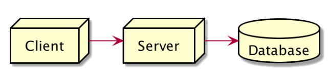
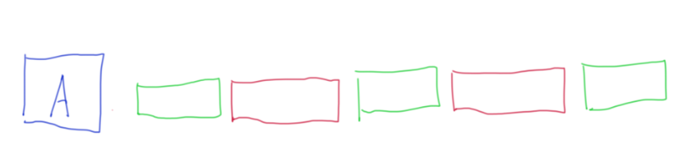
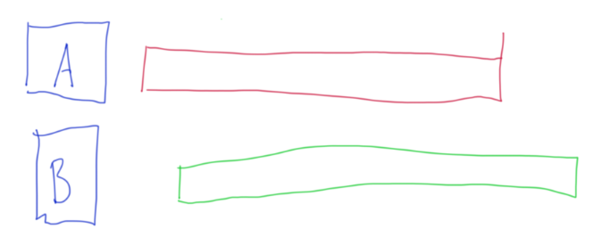
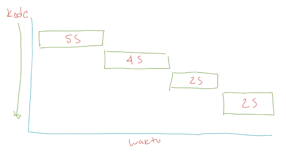
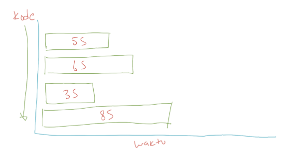
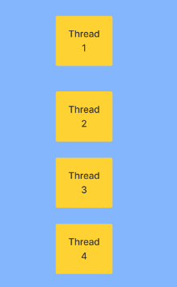
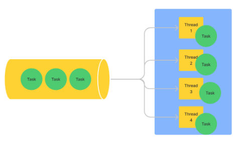
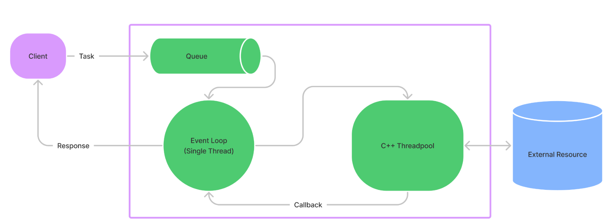
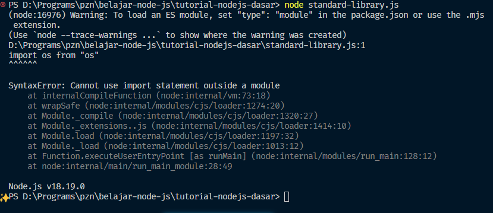

# Tutorial NodeJS Dasar

<details>
    <summary>Agenda</summary>
    <ol>
        <li>Pengenalan NodeJS</li>
        <li>Pengenalan Concurrency</li>
        <li>NodeJS Architecture</li>
        <li>Menginstall NodeJS</li>
        <li>NodeJS REPL</li>
        <li>Standard Library</li>
        <li>Dan lain-lain</li>
    </ol>
    Sumber: <a href="https://docs.google.com/presentation/d/1id-hTsg5_StMTk_6nPD6m1Nxid_eGiPwD1otUfZM1LE/edit#slide=id.p">NodeJS Dasar</a>
</details>

## Pengenalan NodeJS
### Pengenalan NodeJS
* NodeJS diperkenalkan pertama kali oleh Ryan Dahl pada tahun 2009
* NodeJS merupakan teknologi yang bisa digunakan untuk menjalankan kode JavaScript diluar Web Browser
* NodeJS dibuat dari V8 Engine, yaitu Engine untuk Google Chrome
* NodeJS merupakan project yang Free dan OpenSource
* https://nodejs.org/ 

### Kenapa NodeJS?
* NodeJS mempopulerkan paradigma JavaScript Everywhere, dimana dengan menggunakan NodeJS, kita bisa membuat aplikasi berbasis server side dengan bahasa pemrograman JavaScript
* Hal ini membuat kita hanya butuh belajar bahasa pemrograman JavaScript untuk membuat aplikasi web misalnya, sehingga tidak butuh belajar bahasa pemrograman lain seperti PHP atau Java untuk server side web nya
* Saat ini NodeJS sangat populer dan banyak sekali digunakan di perusahaan teknologi, terutama untuk membantu pengembangan Web Frontend

### Yang Tidak Bisa Dilakukan di NodeJS
* Pada kelas JavaScript, kita sudah membahas banyak sekali fitur JavaScript yang berjalan di Browser
* Karena NodeJS tidak berjalan di Browser, jadi tidak semua fitur JavaScript bisa dilakukan di NodeJS
* Fitur seperti Document Object Model dan banyak Web API tidak bisa dilakukan di NodeJS, hal ini karena DOM dan beberapa Web API berjalan membutuhkan Browser

### Web Application
* Web Application adalah aplikasi yang berjalan di Server dan ditampilkan di Browser Client
* Saat kita membuat Web Application, biasanya akan dibagi menjadi 3 bagian, Client, Server dan Database
  
  

### Client, Server, Database
**Client**
- Client merupakan user interface atau bagian frontend dari web application, yang digunakan oleh pengguna web application
- Client digunakan untuk berinteraksi dengan Server, baik itu mengirim data atau menerima data
- Frontend biasanya dibuat menggunakan HTML, CSS dan JavaScript

**Server**
- Server bertanggung jawab untuk menerima request dari Client, mengerjakan request yang dikirim dan membalas request berupa response ke Client
- Server bertugas sebagai backend untuk web application, dimana semua logic aplikasi akan dilakukan di Server
- Biasanya Server dibuat menggunakan PHP, Pythton, Java, .NET dan banyak bahasa pemrograman lainnya
- Dengan adanya NodeJS, sekarang kita bisa membuat Server menggunakan JavaScript

**Database**
- Database adalah tempat untuk menyimpan data web application
- Data disimpan dan diambil oleh Server. 
- Client tidak bisa langsung mengambil atau menyimpan data ke Database secara langsung, oleh karena itu perlu penengah untuk melakukannya, yaitu Server
- Database biasanya menggunakan aplikasi sistem basis data seperti misalnya MySQL, PostgreSQL, MongoDB dan lain-lain

## Concurrency dan Parallel
## Sejarah
- Dahulu, komputer hanya menjalankan sebuah program pada satu waktu
- Karena hanya bisa menjalankan satu program pada satu waktu, hal ini tidak efisien dan memakan waktu lama karena hanya bisa mengerjakan satu tugas pada satu waktu
- Semakin kesini, sistem operasi untuk komputer semakin berkembang, sekarang sistem operasi bisa menjalankan program secara bersamaan dalam proses yang berbeda-beda, terisolasi dan saling independen antar program

### Thread
- Program biasanya berjalan dalam sebuah proses, dan proses akan memiliki resource yang independen dengan proses lain
- Sekarang, sistem operasi tidak hanya bisa menjalankan multiple proses, namun dalam proses kita bisa menjalankan banyak pekerjaan sekaligus, atau bisa dibilang proses ringan atau lebih dikenal dengan nama Thread
- Thread membuat proses aplikasi bisa berjalan tidak harus selalu sequential, kita bisa membuat proses aplikasi berjalan menjadi asynchronous atau parallel

### Concurrency vs Paralles
- Kadang banyak yang bingung dengan concurrency dan parallel, sebenarnya kita tidak perlu terlalu memusingkan hal ini
- Karena saat ini, kita pasti akan menggunakan keduanya ketika membuat aplikasi
- Concurrency artinya mengerjakan beberapa pekerjaan satu persatu
- Parallel artiya mengerjakan beberapa pekerjaan sekaligus pada satu waktu

    
    

### Contoh Concurrency dan Parallel
- Browser adalah aplikasi yang concurrent dan parallel
- Browser akan melakukan proses concurrent ketika membuka web, browser akan melakukan http request, lalu mendownload semua file web (html, css, js) lalu merender dalam bentuk tampilan web
- Browser akan melakukan proses parallel, ketika kita membuka beberapa tab web, dan juga sambil download beberapa file, dan menonton video dari web streaming 

### Synchronous dan Asynchronous
- Saat membuat aplikasi yang concurrent atau parallel, kadang kita sering menemui istilah synchronous dan asynchronous
- Tidak perlu bingung dengan istilah tersebut, secara sederhana
- Synchronous adalah ketika kode program kita berjalan secara sequential, dan semua tahapan ditunggu sampai prosesnya selesai baru akan dieksekusi ke tahapan selanjutnya
- Sedangkan, Asynchronous artinya ketika kode program kita berjalan dan kita tidak perlu menunggu eksekusi kode tersebut selesai, kita bisa lanjutkan ke tahapan kode program selanjutnya

    
    

## Threadpool Web Model

### Threadpool
- Pada materi sebelumnya sudah dijelaskan bahwa thread adalah proses ringan yang biasa dibuat saat membuat aplikasi
- Walaupun bisa dibilang ringan, namun jika terlalu banyak membuat thread, maka tetap akan memberatkan sistem operasi kita
- Oleh karena itu, biasanya kita akan menggunakan threadpool untuk melakukan management thread
- Threadpool merupakan tempat dimana kita menyimpan thread, ketika kita butuh kita akan ambil dari threadpool, ketika sudah selesai, kita akan kembalikan thread nya ke threadpool
- Dengan threadpool, kita bisa memanfaatkan thread yang sama berkali-kali, tanpa harus membuat thread baru terus menerus

    

### Threadpool Queue
- Apa yang terjadi ketika semua thread sedang bekerja? Bagaimana jika kita ingin meminta thread ke threadpool untuk mengerjakan sesuatu?
- Jika semua thread penuh, kita tidak bisa meminta lagi thread ke threadpool. Kita harus menunggu sampai ada thread yang tidak sibuk
- Dimana kita harus menunggu sampai ada thread tersedia untuk digunakan?
- Biasanya threadpool memiliki tempat untuk menyimpan tugas yang belum dikerjakan oleh thread di tempat bernama queue (antrian)
- Ketika kita mengirim perintah ke threadpool, perintah tersebut akan dikirim ke queue, lalu perintah-perintah itu akan dieksekusi satu per satu oleh thread yang tersedia di threadpool
  
  

### Threadpool Web Model
- Dahulu pembuatan web application sangat populer menggunakan threadpool model
- Setiap request yang masuk ke web server akan diproses oleh satu buah thread
- Dengan demikian ketika banyak request masuk, semua bisa diproses secara paralel karena akan ditangani oleh thread masing-masing
- Namun threadpool model ini memiliki kekurangan, ketika thread sedang sibuk semua, secara otomatis request selanjutnya harus menunggu sampai ada thread yang selesai melakukan tugas sebelumnya
- Contoh web server yang menggunakan threadpool model, seperti Apache HTTPD, Apache Tomcat, dan lain-lain

## Blocking dan Non-Blocking
### Blocking
- Saat kita membuat kode program, secara default kode program akan berjalan secara blocking atau synchronous
- Artinya kita harus menunggu sebuah kode selesai sebelum kode selanjutnya dieksekusi
- Contoh ketika kita membuat kode program untuk membaca file, jika kode kita blocking, maka kita harus menunggu program selesai membaca file, baru kita bisa melanjutkan kode program selanjutnya

### Non-Blocking
- Non-Blocking berbeda dengan Blocking, kode program Non-Blocking akan dieksekusi tanpa harus menunggu kode program tersebut selesai
- Non-Blocking akan dijalankan secara asynchronous
- Ketika memanggil kode Non-Blocking, biasanya kita perlu mengirimkan callback untuk dipanggil oleh kode Non-Blocking tersebut ketika kodenya susah selesai
- Contoh-contoh Non-Blocking sudah kita bahas di kelas JavaScript Async, seperti AJAX, Fetch API, dan lain-lain
Di NodeJS, hampir semua fiturnya mendukung kode Non-Blocking

## NodeJS Architecture
### NodeJS Architecture
  

### Event-Loop
- Event-Loop merupakan single thread proses yang digunakan untuk mengeksekusi kode Non-Blocking
- Karena Event-Loop hanya menggunakan single thread, maka kita harus berhati-hati ketika membuat blocking code, karena bisa memperlambat proses eksekusi kode kita
- Event-Loop sendiri sebenarnya tugasnya hanya menerima dan mengirim eksekusi kode ke C++ Threadpool, oleh karena itu selalu usahakan menggunakan kode nonblocking agar proses blocking-nya dikerjakan di C++ threadpool
- Event-Loop akan menerima response dari C++ threadpool yang di kirim via callback

### C++ Threadpool
- NodeJS Menggunakan C++ Threadpool untuk workernya, yaitu threadpool untuk melakukan pekerjaan
- Libuv adalah library yang digunakan di NodeJS, dimana secara default libuv menggunakan 4 thread di dalam threadpool nya, hal ini menjadikan kita bisa melakukan 4 pekerjaan blocking sekaligus dalam satu waktu.
- Jika terlalu banyak pekerjaan blocking, kita bisa mengubah jumlah thread di libuv dengan pengaturan environment variable UV_THREADPOOL_SIZE 
- http://docs.libuv.org/en/v1.x/threadpool.html 

## Menginstall NodeJS
### Menginstall NodeJS Manual
- Download versi NodeJS LTS (Long Term Support)
- https://nodejs.org/en/download/ 

### Menginstall NodeJS dengan Package Manager
- https://github.com/nvm-sh/nvm 
- https://community.chocolatey.org/packages/nodejs 
- https://formulae.brew.sh/formula/node 

### Setting PATH NodeJS
- Setelah menginstall NodeJS, disarankan melakukan setting PATH NodeJS pada sistem operasi kita
- Hal ini agar mudah ketika kita mengakses program NodeJS menggunakan terminal / command prompt

### Mengecek NodeJS
```node --version```

### Menjalankan Kode JavaScript
- Karena NodeJS tidak memerlukan Web Browser, jadi kita bisa langsung menjalankan program JavaScript kita menggunakan aplikasi NodeJS lewat terminal / command promt, dengan perintah :
```node namafile.js```

## NodeJS REPL
### REPL (Read Eval Print Loop)
- REPL singkatan dari Read Eval Print Loop
- Yaitu mekanisme dimana program bisa membaca langsung kode program yang diketikkan, lalu mengeksekusinya, menampilkan hasilnya, lalu mengulangi dari awal lagi
- NodeJS mendukung REPL, sehingga lebih mudah ketika belajar
- Namun tetap, saya menyarankan menyimpan kode program di file JavaScript, agar lebih mudah diubah ketika terjadi masalah
- Untuk menggunakan NodeJS REPL, cukup jalankan aplikasi node saja
```node```

## NodeJS Standard Library
### Standard Library
- Saat kita belajar JavaScript, di Web Browser, terdapat fitur-fitur yang bernama Web API
- https://developer.mozilla.org/en-US/docs/Web/API 
- Kebanyakan fitur Web API hanya berjalan di Web Browser, sehingga tidak bisa jalan di NodeJS
- NodeJS sendiri hanya menggunakan bahasa pemrogaman JavaScript nya, namun tidak mengadopsi fitur Web API nya, karena itu hanya berjalan di Web Browser
- NodeJS sendiri memiliki standard library yang bisa kita gunakan untuk mempermudah pembuatan aplikasi
- https://nodejs.org/dist/latest-v16.x/docs/api/ 

### Modules
- Standard Library yang terdapat di NodeJS bisa kita gunakan seperti layaknya JavaScript Modules
- Jika belum mengerti tentang JavaScript Modules, silahkan pelajari kelas saya tentang JavaScript Modules
- Karena NodeJS menggunakan Modules, jika kita ingin menggunakan Modules, kita juga perlu memberi tahu bahwa file JavaScript kita menggunakan Modules, caranya dengan mengubah nama file dari .js menjadi .mjs

    Ini yang terjadi jika ekstensi file bukan .mjs:
    

### Kode: Contoh Standard Library
```
import os from "os"

console.info(os.platform())
console.info(os.cpus())
```

### Require Function
- Awal ketika NodeJS rilis, fitur JavaScript Modules belum rilis, namun sekarang JavaScript sudah banyak menggunakan JavaScript Modules
- NodeJS pun awalnya tidak menggunakan JavaScript Modules, namun sekarang NodeJS sudah bisa menggunakan JavaScript Modules, dan sangat direkomendasikan menggunakannya
- Namun awal sebelum Modules, NodeJS menggunakan function require() untuk melakukan import file 
- Di materi ini saya sengaja bahas, agar tidak bingung ketika kita melihat tutorial yang masih menggunakan function require

### Kode: Function Require
```
const os = require("os")

console.info(os.platform())
console.table(os.cpus())
```

## Global Async di Module
### Global Async
- Saat kita belajar JavaScript, untuk menggunakan Async Await, biasanya kita perlu membuat terlebih dahulu function yang kita tandai sebagai async
- Saat kita menggunakan Module, secara default, global code adalah Async, oleh karena itu kita bisa menggunakan Async Await 
- Kecuali jika kita membuat function, maka function tersebut harus kita tandai sebagai Async jika ingin menggunakan Async Await

### Kode: JavaScript
async.js
```
function samplePromise() {
    return Promise.resolve("Eko")
}

const data = await samplePromise()  // error
console.info(data)
```

### Kode: JavaScript Module
async.mjs
```
function samplePromise() {
    return Promise.resolve("Eko")
}

const data = await samplePromise()  // error
console.info(data)
```

## OS
### OS
- OS merupakan standard library yang bisa digunakan untuk mendapatkan informasi tentang sistem operasi yang digunakan
- https://nodejs.org/dist/latest-v16.x/docs/api/os.html 

### Kode: OS
os.mjs
```
import os from "os"

console.info(os.platform())
console.info(os.arch())
console.table(os.cpus())
console.info(os.uptime())
console.info(os.totalmem())
console.info(os.freemem())
console.table(os.networkInterfaces())
```

### Path
- Path merupakan standard library yang bisa kita gunakan untuk bekerja dengan lokasi file dan directory / folder
- https://nodejs.org/dist/latest-v16.x/docs/api/path.html 

### Kode: Path
path.mjs
```
import path from "path"

const file = "/Users/khannedy/contoh.html"

console.info(path.sep)
console.info(path.dirname(file))
console.info(path.basename(file))
console.info(path.extname(file))
console.info(path.parse(file))
```

### File System
- File System merupakan standard library yang bisa digunakan untuk memanipulasi file system
- Dalam File System, terdapat 3 jenis library
  1. Pertama library yang bersifat blocking atau synchronous
  2. Kedua library yang bersifat non-blocking atau asynchronous menggunakan callback
  3. Ketika library yang bersifat non-blocking atau asynchronous tapi menggunakan promise
- https://nodejs.org/dist/latest-v16.x/docs/api/fs.html 

### Kode: File System
file-system.mjs
```
import fs from "fs"

const buffer = fs.readFileSync("file-system.mjs")

console.info(buffer.toString())

fs.writeFileSync("temp.txt", "Hello World")
```

## Debugger
### Debugger
- NodeJS memiliki fitur debugger, dimana kita bisa mengikuti tahapan eksekusi program di NodeJS
- Hal ini sangat cocok ketika kita melakukan proses debugging, mencari sebab masalah yang terjadi di aplikasi kita
- https://nodejs.org/dist/latest-v16.x/docs/api/debugger.html 

### Breakpoint
- Dalam debugging, terdapat istilah breakpoint, yaitu lokasi dimana kita ingin menghentikan sementara eksekusi kode program
- Biasanya ini dilakukan untuk mengawasi data-data di sekitar lokasi berhentinya tersebut
- Untuk menambahkan breakpoint, kita bisa menggunakan kata kunci: debugger

### Menjalankan Mode Debug
- Jika kita menjalankan file JavaScript hanya dengan menggunakan perintah ```node namafile.js```, maka secara default dia tidak akan jalan dalam mode debug
- Agar jalan dalam mode debug, kita harus menambahkan perintah inspect: ```node inspect namafile.js```

### Perintah Debugger
Saat masuk ke mode debug, ada beberapa perintah yang bisa kita gunakan dalam melakukan debugging
- cont, c: Continue execution
- next, n: Step next
- step, s: Step in
- out, o: Step out
- pause: Pause running code

### Kode: Debugger
debugger.mjs
```
function sayHello(name) {
    debugger
    return `Hello ${name}`
}

const firstName = "Eko"

console.info(sayHello(firstName))
```

## DNS
### DNS
- DNS merupakan standard library yang bisa digunakan untuk bekerja dengan DNS (domain name server)
- https://nodejs.org/dist/latest-v16.x/docs/api/dns.html 

### Kode: DNS
dns.mjs
```
import dns from "dns"

function callback(error, ip) {
    console.info(ip)
}

dns.lookup("www.programmerzamannow.com", callback)
```

## Events
### Events
- Events adalah standard library di NodeJS yang bisa digunakan sebagai implementasi Event Listener
- Di dalam Events, terdapat sebuah class bernama EventEmitter yang bisa digunakan untuk menampung data listener per jenis event.
- Lalu kita bisa melakukan emmit untuk mentrigger jenis event dan mengirim data ke event tersebut
- https://nodejs.org/dist/latest-v16.x/docs/api/events.html 

### Kode : Events
```
import {EventEmitter} from "events"

const emitter = new EventEmitter();
emitter.addListener("hello", (name) => {
    console.info(`Hello ${name}`);
});
emitter.addListener("hello", (name) => {
    console.info(`Halo ${name}`);
});

emitter.emit("hello", "Arfani")
```

## Globals
### Globals
- Di dalam NodeJS, terdapat library berupa variable atau function yang secara global bisa diakses dimana saja, tanpa harus melakukan import
- Kita bisa melihat detail apa saja fitur yang terdapat secara global di halaman dokumentasinya
- https://nodejs.org/dist/latest-v16.x/docs/api/globals.html

### Kode: Globals
globals.mjs
```
setTimeout(function () {
    console.info("Hello World");
}, 3000);
```

### Process
- Process merupakan standard library yang digunakan untuk mendapatkan informasi proses NodeJS yang sedang berjalan
- Process juga merupakan instance dari EventEmitter, sehingga kita bisa menambahkan listener kedalam Process
- https://nodejs.org/dist/latest-v16.x/docs/api/process.html 

### Kode: Process
```
import process from "process";

process.addListener("exit", function (exitCode) {
    console.info(`NodeJS exit with code ${exitCode}`);
});

console.info(process.version);
console.table(process.argv);
console.table(process.report);
console.table(process.env);

process.exit(1);

console.info("Not Printed because already exit");
```

## Readline
### Readline
- Readline merupakan standard library yang digunakan untuk membaca input 
- Namun pada saat dibuat video ini, Readline hanya mendukung versi callback di versi NodeJS LTS 16. 
- Di NodeJS 17 sudah mendukung Promise sehingga lebih mudah digunakan, namun itupun masih dalam tahap experimental
- https://nodejs.org/dist/latest-v16.x/docs/api/readline.html 

### Kode: Readline
```
import processs from "process";
import readline from "readline";

const input = readline.createInterface({
    input: process.stdin,
    output: process.stdout
});

input.question("Siapa nama anda? : ", function (nama) {
    console.info(`Hello ${nama}`);
    input.close();
})
```

## Report
### Report
- Report merupakan fitur yang terdapat di NodeJS untuk membuat laporan secara otomatis dalam file ketika sesuatu terjadi pada aplikasi NodeJS kita
- https://nodejs.org/dist/latest-v16.x/docs/api/report.html

### Kode: Error pada Aplikai NodeJS
```
import process from "proces";

process.report.reportOnFatalError = true;
process.report.reportOnUncaughtException = true;
process.report.reportOnSignal = true;
process.report.filename = "report.json"

function sampleError() {
    throw new Error("Ups");
}

sampleError();
```

## Buffer
### Buffer
- Buffer merupakan object yang berisikan urutan byte dengan panjang tetap.
- Buffer merupakan turunan dari tipe data Uint8Array
- https://nodejs.org/dist/latest-v16.x/docs/api/buffer.html

### Kode: Buffer
buffer.mjs
```
const buffer = Buffer.from("Arfani");
console.info(buffer.toString());

buffer.reverse();
console.info(buffer.toString());
```
### Buffer Encoding
- Buffer juga bisa digunakan untuk melakukan encoding dari satu encoding ke encoding yang lain
- Ada banyak encoding yang didukung oleh Buffer, misal utf8, ascii,  hex, base64, base64url dan lain-lain

### Kode: Buffer Encoding
buffer-encoding.mjs:
```
const buffer = Buffer.from("Muhammad Arfani Asra", "utf8");

console.info(buffer.toString("base64"));
console.info(buffer.toString("hex"));

const buffer2 = Buffer.from("RWtvIEt1cm5pYXdhbiBLaGFubmVkeQ=", "basse64url");

console.info(buffer2.toString("utf8"));
```

## Stream
### Stream
- Stream adalah standard library untuk kontrak aliran data di NodeJS
- Ada banyak sekali Stream object di NodeJS
- Stream bisa jadi object yang bisa dibaca, atau bisa di tulis, dan Stream adalah turunan dari EventEmitter
- https://nodejs.org/dist/latest-v16.x/docs/api/stream.html 

### Kode: Stream
stream.mjs:
```
import fs from "fs";

const writer = fs.createWriteStream("target.log");
writer.write("Muhammad");
writer.write("Arfani");
writer.write("Asra");
writer.close();

const reader = fs.createReadStream("target.log");
reader.on("data", function (data) {
    console.info(data.toString());
    reader.close();
})
```

## Timer
### Timer
- Timer merupakan standard library untuk melakukan scheduling
- Function di Timer terdapat di globals, sehingga kita bisa menggunakannya tanpa melakukan import, namun semua function Timer menggunakan Callback
- Jika kita ingin menggunakan Timer versi Promise, kita bisa meng-import dari module timer/promise
- https://nodejs.org/dist/latest-v16.x/docs/api/timers.html

### Kode: Timer
```
setInterval(() => {
    console.info(`Timer at ${new Date()}`);
}, 1000);
```

### Kode: Timer Promise
```
import timers from "timers/promises"

for await (const startTime of timers.setInterval(1000, new Date())) {
    console.info(`Start Timer at ${startTime}`);
}
```

## Net
### Net
- Net merupakan standard library yang bisa digunakan untuk membuat network client dan server berbasis TCP
- Net Server dan Client merupakan object Stream, sehingga kita bisa baca datanya, tulis datanya dan juga menambahkan listener
- https://nodejs.org/dist/latest-v16.x/docs/api/net.html 

### Kode: Net Server
```
import net from "net";

const server = net.createServer(function (client) {
    console.info("Client connected");
    client.on("data", function (data) {
        console.info(`Receive data from client : ${data.toString()}`);
        client.write(`Hello ${data.toString()}\r\n`);
    })
});

server.listen(3000, "localhost")
```

### Kode: Net Client
```
import net from "net";

const connection = net.createConnection({
    port: 3000, 
    host: "localhost"
});

setInterval( function () {
    connection.write("Eko\r\n");
}, 2000);

connection.addListener("data", function (data) {
    console.info(`Receive data from server : ${data.toString()}`);
})

```

## URL
### URL
- URL merupakan standard library untuk bekerja dengan URL
- https://nodejs.org/dist/latest-v16.x/docs/api/url.html

### Kode: URL
```
import {URL} from "url";
const pzn = new URL ("https://www.programmerzamannow.com/belajar?kelas=nodejs");

console.info(pzn.toString());
console.info(pzn.protocol);
console.info(pzn.host);
console.info(pzn.pathname);
console.info(pzn.searchParams);

```
### Kode: Mengubah URL
```
import {URL} from "url";
const pzn = new URL ("https://www.programmerzamannow.com/belajar?kelas=nodejs");

pzn.host = "www.khannedy.com";
const searchParam = pzn.searchParams;
searchParam.append("status", "premium");

console.info(pzn.toString());

```

## Util
### Util
- Util adalah standard library yang berisikan utility-utility yang bisa kita gunakan untuk mempermudah pembuatan kode program di NodeJS
- https://nodejs.org/dist/latest-v16.x/docs/api/util.html

### Util
```
import util from "util";

console.info(util.format("Nama : %s", "Eko"));

const person = {firstName: "Eko", lastName: "Khannedy"};
console.info(util.format("Person : %j", person));
```

## Zlib
### Zlib
- Zlib adalah standard library yang digunakan untuk melakukan kompresi menggunakan Gzip
- https://nodejs.org/dist/latest-v16.x/docs/api/zlib.html 

### Zlib Compress
```
import zlib from "zlib";
import fs from "fs";

const source = fs.readFileSync("zlib.mjs");
const result = zlib.gzipSync(source);

fs.writeFileSync("zlib.mjs.txt", result);
```

### Zlib Decompress
```
import zlib from "zlib";
import fs from "fs";

const source = fs.readFileSync("zlib.mjs.txt");
const result = zlib.unzipSync(source);
console.info(result.toString());
```

## Console
### Console
- Console adalah standard library yang sudah sering kita gunakan
- Secara global, object console bisa kita gunakan tanpa harus melakukan import module, dan console melakukan print text nya ke stdout
- Namun jika kita juga bisa membuat object Console sendiri jika kita mau
- https://nodejs.org/dist/latest-v16.x/docs/api/console.html 

### Kode: Console
```
import {Console} from "console"
import fs from "fs";

const logFile = fs.createWriteStream("application.log");

const log = new Console({
    stdout: logFile,
    stderr: logFile
});

log.info("Hello world!")
log.error("Ups");
```

## Worker Threads
### Worker Threads
- Worker Threads adalah standard library yang bisa kita gunakan untuk menggunakan thread ketika mengeksekusi JavaScript secara paralel
- Worker Threads sangat cocok ketika kita membuat kode program yang butuh jalan secara paralel, dan biasanya kasusnya adalah ketika kode program kita membutuhkan proses yang CPU intensive, seperti misalnya enkripsi atau kompresi
- Cara kerja Worker Threads mirip dengan Web Worker di JavaScript Web API
- https://nodejs.org/dist/latest-v16.x/docs/api/worker_threads.html 

### Kode: Main Thread
```
import {threadId, Worker} from "worker_threads";

const worker1 = new Worker("./worker.mjs");
const worker2 = new Worker("./worker.mjs");

worker1.addListener("message", function (message) {
    console.info(`thread-${threadId} receive message : ${message}`);
});

worker1.postMessage(10);
worker2.postMessage(10);
```

### Kode: Worker Thread
```
import {threadId, parentPort} from "worker_threads";

parentPort.addListener("message", function (message) {
    for (let i = 0; i < message; i++) {
        console.info(`thread-${threadId} send message ${i}`);
        parentPort.postMessage(i);
    }
    parentPort.close();
})
```

## HTTP Client
### HTTP Client
- NodeJS juga memiliki standard library untuk HTTP
- Salah satu fitur di module HTTP adalah HTTP Client, dimana kita bisa melakukan simulasi HTTP Request menggunakan NodeJS
- Terdapat 2 jenis module HTTP di NodeJS, HTTP dan HTTPS
- https://nodejs.org/dist/latest-v16.x/docs/api/http.html 
- https://nodejs.org/dist/latest-v16.x/docs/api/https.html 

### HTTP Client
```
import https from "https";

const url = "URL_API";
const request = https.request(url, {
    method: "POST",
    headers: {
        "Content-Type": "application/json",
        "Accept": "application/json",
    }
}, function (response) {
    response.addListener("data", function (data) {
        console.info(`Receive : ${data.toString()}`)
    })
});

const body = JSON.stringify({
    firstName: "Eko",
    lastName: "Khannedy",
});

request.write(body);
request.end();
```

## HTTP Server
### HTTP Server
- Standard Library HTTP juga tidak hanya bisa digunakan untuk membuat HTTP Client, tapi juga bisa digunakan untuk membuat HTTP Server
- Untuk kasus sederhana, cocok sekali jika ingin membuat HTTP Server menggunakan standard library NodeJS, namun untuk kasus yang lebih kompleks, direkomendasikan menggunakan library atau framework yang lebih mudah penggunaannya
- https://nodejs.org/dist/latest-v16.x/docs/api/http.html 

### Simple HTTP Server
```
import http from "http";

const server = http.createServer((request, response) => {
    response.write("Hello World");
    response.end();
});

server.listen(3000);
```

### Request Response HTTP Server
```
import http from "http";

const server = http.createServer((request, response) => {
    if(request.method === "POST") {
        request.addListener("data", function (data) {
            response.setHeader("Content-Type", "application/json");
            response.write(data);
            response.end();
        })
    } else {
        response.write("Hello World");
        response.end();
    }
});

server.listen(3000)
```

## Cluster
### Cluster
- Seperti yang dijelaskan di awal, bahwa NodeJS itu secara default dia berjalan single thread, kecuali jika kita membuat thread manual menggunakan worker thread, tapi tetap dalam satu process
- NodeJS memiliki standard library bernama Cluster, dimana kita bisa menjalankan beberapa process NodeJS secara sekaligus
- Ini sangat cocok ketika kita menggunakan CPU yang multicore, sehingga semua core bisa kita utilisasi dengan baik, misal kita jalankan process NodeJS sejumlah CPU core
- https://nodejs.org/dist/latest-v16.x/docs/api/cluster.html 

### Cluster Primary dan Worker
- Di dalam Cluster, terdapat 2 jenis aplikasi, Primary dan Worker
- Primary biasanya digunakan sebagai koordinator atau manajer untuk para Worker
- Sedangkan Worker sendiri adalah aplikasi yang menjalankan tugas nya

### Kode: Cluster Primary
```
import cluster from "cluster";
import http from "http";
import os from "os";
import process from "process";

if (cluster.isPrimary) {
    for (let i = 0; i < os.cpus().length; i++) {
        cluster.fork();
    }
    cluster.addListener("exit", function (worker) {
        console.info(`Worker ${worker.id} is exited`);
    })
}
```

### Kode: Cluster Worker
```
if (cluster.isWorker) {
    const server = http.createServer((request, response) => {
        response.write(`Response from process ${process.pid}`);
        response.end();
        process.exit();
    })
    server.listen(3000);
    console.info(`Start cluster worker ${process.pid}`);
}
```
