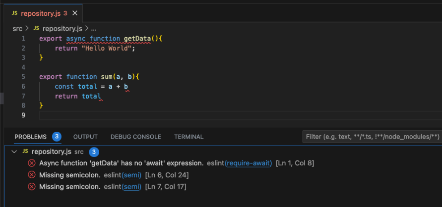

# Tutorial NodeJS ESLint

## Pengenalan ESLint

### Pengenalan Static Code Analysis
- Saat kita membuat kode program, kualitas kode yang kita buat haruslah baik
- Kualitas kode yang baik bisa menjadikan kode program kita mudah untuk dibaca dan mudah untuk dimaintain kedepannya
- Salah satu teknik untuk menjaga kualitas kode kita tetap baik, adalah dengan menggunakan Static Code Analysis
- **Static Code Analysis** adalah teknik analisis yang digunakan untuk mendeteksi ketika kode yang kita buat tidak baik, atau berpotensi menjadi masalah di kemudian hari

### Pengenalan ESLint
- ESLint adalah salah satu library yang sangat populer di JavaScript untuk melakukan Static Code Analysis
- ESLint mudah digunakan, dan terintegrasi baik dengan banyak kode editor, sehingga kita bisa membuat kode program, dan secara otomatis bisa melihat rekomendasi kode yang baik jika kita membuat kode yang kurang baik
- ESLint adalah library yang opensource dan gratis untuk kita gunakan
- https://eslint.org/ 

## Membuat Project

### Membuat Project
- Buat foler `belajar-nodejs-eslint`
- `npm init`
- Ubah `type` menjadi `module` di `package.json`

## Menginstall ESLint

### Menginstall ESLint
- Untuk menginstall ESLint di project kita, kita bisa gunakan perintah: `npm install --save-dev eslint`

## Configuration File

### Configuration File
- ESLint membutuhkan configuration file dengan nama `eslint.config.js`

### Kode: Configuration File
```js
export default [
    {
        "rules": {
            "semi": "error"
        }
    }
];
```

### Configuration Lama
- Pada ESLint versi lama, file konfugrasi bernama `.eslintrc.js`
- Jadi jika kita melihat konfugrasi ESLint dengan nama file tersebut, berarti menggunakan versi ESLint yang lama

## Menjalankan ESLint

### Menjalankan ESLint
- Untuk menjalankan ESLint, kita bisa gunakan perintah :

```bash
npx eslint namafile.js
npx eslint namafolder
```

- Secara otomatis ESLint akan melakukan Static Code Analysis berdasarkan file konfigurasi yang kita buat terhadap file tersebut

### Kode: src/main.js
```js
export const sayHello = (name) => {
    let message = `Hello ${name}!`
    console.log(message)
};
```

### Kode : Menjalankan ESLint
```npx eslint src```

## Otomatis Memperbaiki

### Otomatis Memperbaiki
- Secara otomatis ESLint juga bisa digunakan untuk memperbaiki kode yang kita buat
- Kita bisa tambahkan parameter `--fix` ketika menjalankan ESLint
- PERLU DIINGAT, tidak semua kode bisa di fix oleh ESLint, beberapa kode tetap harus di fix secara manual

### Kode : Otomatis Memperbaiki
```bash
npx eslint src --fix
```

## Files dan Ignores

### Files dan Ignores
- Secara default, saat kita menjalankan ESLint, semua aturan ESLint berlaku untuk semua file
- Kita bisa membatasi aturan yang diperlukan untuk melakukan Static Code Analysis hanya pada file-file yang kita pilih
- Kita bisa menggunakan attributes files (untuk include), dan ignores (untuk exclude)

### Kode : Configuration File
```javascript
export default [
    {
        "files": [
            "src/**/*.js",
        ],
        "ignores": [
            "src/person.js"
        ],
        "rules": {
            "semi": "error"
        }
    }
]
```

### Kode src/person.js
```js
export class Person {
    constructor(name) {
        this.name = name
    }

    greet() {
        return `Hello, ${this.name}!`
    }
}
```

### Kode : Menjalankan ESLint
```bash
npx eslint src
```

## Rules

### Rules
- Rules adalah aturan-aturan yang digunakan oleh ESLint untuk melakukan Static Code Analysis
- Sebelumnya kita sudah menggunakan Rules dengan nama “semi”, yaitu aturan yang mewajibkan untuk selalu menambahkan titik koma setelah statement di kode program yang kita buat

### Rules Values
Terdapat 3 nilai pada rules, yaitu :
  1. **error**, artinya jika tidak mengikuti aturan, akan dianggap error, sehingga saat menjalankan perintah, maka exit code akan bernilai tidak 0 (artinya error)
  2. **warn**, artinya jika tidak mengikuti aturan, akan keluar peringatan, namun tidak akan mengubah exit code, sehingga tidak dianggap error
  3. **off**, artinya aturannya dimatikan, dan tidak dilakukan pengecekan

### Daftar Rules
- ESLint mendukung banyak sekali rules yang bisa kita gunakan secara mudah
- Kita bisa melihat semua daftar rules yang terdapat di ESlint pada halaman berikut :
https://eslint.org/docs/latest/rules/
- Sangat direkomendasikan membaca rules-rules tersebut, karena berisi best practice saat membuat kode JavaScript

### Kode: Configuration File
```javascript
export default [
    {
        "files": [
            "src/**/*.js",
        ],
        "ignores": [
            "src/person.js"
        ],
        "rules": {
            "semi": "error",
            "prefer-const": "error",
            "require-await": "error"
        }
    }
]
```

### Kode : src/repository.js
```js
export async function getData() {
    return "Hello World";
}

export function sum(a, b){
    let total = a + b;
    return total;
}
```

## Formatter

### Formatter
- Saat ESLint menampilkan error, ESLint akan menggunakan formatter
- Pada kasus tertentu, kadang kita ingin menampilkan error yang dihasilkan oleh ESLint dalam format tertentu, misal HTML atau JSON
- ESLint mendukung banyak sekali jenis formatter, kita bisa lihat di halaman :
https://eslint.org/docs/latest/use/formatters/
- Kita bisa tambahkan parameter `--format namaformatter` ketika menjalankan ESLint

### Kode : Formatter
```bash
npx eslint src --format json
```

## Integration

### Integration
- ESLint bisa diintegrasikan dengan banyak Text Editor dan IDE yang populer
- Hal ini menjadikan kita bisa melihat error yang terjadi di ESLint secara langsung pada text editor
- Dengan begitu, akan lebih mudah ketika kita membuat kode program, tanpa harus menjalankan ESLint secara manual terlebih dahulu
- Kita bisa install plugin-plugin tambahkan di Text Editor atau IDE :
https://eslint.org/docs/latest/use/integrations 

### Kode: Visual Studio Code


## Materi Selanjutnya

### Materi Selanjutnya
- Belajar Library / Package Lainnya
- Perbanyak Studi Kasus

