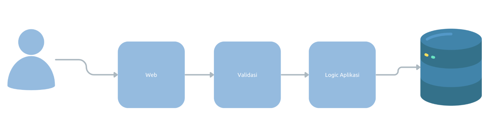

# Tutorial NodeJS Validation

## Pengenalan Validation

### Pengenalan Validation
- Saat kita membuat aplikasi, validasi adalah salah satu hal yang sangat penting untuk kita lakukan
- Validassi memastikan bahwa data sudah dalam keadaan benar atau sesuai sebelum diproses
- Validasi dilakukan untuk menjaga agar data kita tetap konsisten dan tidak rusak
- Validassi biasanya dilakukan di kode aplikasi, dan di constraint table di database

### Diagram Validasi
  

### Validai di NodeJS
- NodeJS sayangnya tidak menyediakan package untuk validasi, oleh karena itu kita perlu melakukan validasi secara manual
- Tapi untungnya, banyak package yang dibuat oleh komunitas programmer NodeJS yang bisa kita gunakan untuk mempermudah kita melakukan validasi
- Salah satu library yang populer untuk melakukan validasi adalah library Joi
- https://www.npmjs.com/package/joi
- Di kelas ini, kita akan menggunakan library Joi untuk belajar melakukan validasi

## Membuat Project

### Membuat Project
- Buat folder belajar-nodejs-validation
- `npm init`
- Buat `package.json`, dan ubah `type` menjadi `module`

### Menambah Library Jest untuk Unit Test
- `npm install --save-dev jest @types/jest`

### Menambah Library Babel
- `npm install --save-dev babel-jest @babel/preset-env`
- https://babeljs.io/setup#installation

### Menambah Package Joi
- `npm install joi`

## Validation

### Validation
- Joi mendukung validasi untuk banyak tipe data JavaScript, seperti string, number, boolean, dan lain-lain
- Untuk menggunakan Joi, kita cukup import Joi dari package joi
- Selanjutnya, kita bisa menggunakan method-method sesuai dengan tipe datanya

### Schema
- Hal pertama yang perlu kita lakukan untuk melakukan validasi adalah membuat Schema
- Schema adalah aturan-aturan yang sudah kita tentukan
- Setelah membuat schema, baru selanjutnya kita bisa melakukan validasi data menggunakan schema tersebut

### Validasi Tipe Data
- String: https://joi.dev/api/?v=17.9.1#string
- Number: https://joi.dev/api/?v=17.9.1#number
- Boolean: https://joi.dev/api/?v=17.9.1#boolean

## Date Validation

### Date Validation
- Joi juga bisa digunakan untuk melakukan validasi tipe data Date
- https://joi.dev/api/?17.9.1#date

## Validation Result

### Validation Result
- Saat kita melakukan validasi menggunakan method validate(), hasil dari method tersebut adalah object yang memiliki attribute value dan error
- Hasil data akan ada di attribute value, contohnya misal kita validasi Date namun inputnya berupa String, maka secara otomatis value Date yang akan di konversi ke result.value
- Namun jika terjadi error, secara otomatis result.error nya berisi ValidationError 

## Validation Error

### Validation Error
- Jika terjadi error karena data tidak valid, maka hasil result.error akan berisi ValidationError
- https://joi.dev/api/?v=17.9.1#validationerror

## Validation Option

### Validation Option
- Saat kita melakukan validasi menggunakan `validate()` method, sebenarnya terdapat opsi tambahan yang bisa kita kirim untuk mengatur cara melakukan validasi
- https://joi.dev/api/?v=17.9.1#anyvalidatevalue-options

## Object Validation

### Object Validation
- Saat kita membuat aplikasi, kita sering sekali membuat JavaScript Object
- Untungnya Joi juga bisa digunakan untuk melakukan validasi JS Object, sehingga mempermudah kita untuk melakukan sekaligus ke semua field di JS Object
- https://joi.dev/api/?v=17.9.1#object

### Nested Object
- Joi juga bisa digunakan untuk memvalidasi nested object
- Saat kita ingin memvalidasi nested object, kita harus tentukan object schema nya juga

## Array Validation

### Array Validation
- Selain Object, kita juga bisa melakukan valdiasi di data Array
- Baik itu array dengan isi data sederhana, atau array dengan isi data object
- https://joi.dev/api/?v=17.9.1#array

### Array of Object
- Untuk melakukan validasi Array of Object, kita bisa kombinasikan schema array dan schema object

## Custom Validation Message

### Custom Validation
- Saat kita menggunakan validation milik Joi, terdapat default error message yang direpresentasikan menggunakan message key
- Kita bisa lihat semua message key dan value nya disini: https://joi.dev/api/?v=17.9.1#list-of-errors
- Jika kita mau, kita bisa mengubah value dari message key, ketika membuat schema, sehingga secara otomatis
- Untuk mengubah message nya, kita bisa menggunakan method `messages()` pada schema
- https://joi.dev/api/?v=17.9.1#anymessagesmessages

## Custom Validation

### Custom Validation
- Saat kita membutuhkan validasi yang tidak disediakan di Joi, kita juga bisa buat custom validation di Joi
- Terdapat method `custom()` di semua Schema yang bisa kita gunakan untuk menambah validasi baru
- https://joi.dev/api/?v=17.9.1#anycustommethod-description

## Materi Selanjutnya

### Materi Selanjutnya
- NodeJS RESTful API
- Dan lain-lain
