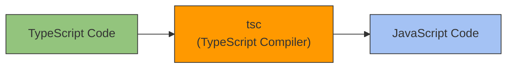

# Tutorial TypeScript Dasar

## Pengenalan TypeScript

### Pengenalan TypeScript
- TypeScript adalah bahasa pemrograman berorientasi objek yang dibuat oleh Microsoft
- TypeScript adalah bahaa pemrograman yang di kompilasi menjadi kode JavaScript
- Menggunakan TypeScript akan membuat kode kita lebih mudah di baca dan di debug dibandingkan menggunakan JavaScript
- TypeScript adalah bahasa pemrograman yang Strongly Type (Seperti Java, C#, dan C/C++)
- https://www.typescriptlang.org/

### Proses Development TypeScript


### Keuntungan Belajar TypeScript
- Saat ini banyak sekali perusahaan yang mulai mengadopsi TypeScript, hal ini karena banyak fitur yang dimiliki oleh TypeScript yang sangat memudahkan saat proses pemrograman aplikasi
- Karena TypeScript melakukan kompilasi kode menjadi JavaScript, hal ini secara otoamtis kita tidak perlu lagi pusing dengan fitur-fitur di JavaScript yang belum di support, karena TypeScript secara otomatis akan mengurusnya
- Selain itu, banyak juga framework-framework yang populer sekarang mulai beralih menggunakan TypeScript, seperti ReactJS, VueJS, NestJS, dan lain-lain

## Membuat Project

### Membuat Project
- Buat folder belajar-typescript-dasar
- `npm init`
- Buka `package.json`, dan tambah `type module`

### Menambah Library Jest untuk Unit Test
- `npm install --save-dev jest @types/jest`
- https://www.npmjs.com/package/jest

### Menambah Library Babel
- `npm install --save-dev babel-jest @babel/preset-env`
- https://babeljs.io/setup#installation

## Setup TypeScript Project

### Menambah TypeScript
- `npm install --save-dev typescript`
- https://www.npmjs.com/package/typescript

### Setup TypeScript Project
- `npx tsc --init`
- Semua konfigurasi akan idbuat di file tsconfig.json
- Ubah `module` dari `commonjs` menjadi `ES6`

### Setup TypeScript untuk Jest
- https://jestjs.io/docs/getting-started#using-typescript

## Say Hello Function

### Say Hello Function
- Sebelum mulai belajar, kita akan coba buat say hello function dengan file TypeScript

### Kode : src/say-hello.ts
```typescript
export function sayHello(name: String): String {
    return `Hello ${name}`;
}
```

### Kode : tests/say-hello.test.ts
```typescript
import {sayHello} from "../src/say-hello";

describe('sayHello', function (): void {
    it('should return hello Arfani', function (): void {
        expect(sayHello('Arfani')).toBe('Hello Arfani')
    });
});
```

### Kode : npm test
```test
-> belajar-typescript-dasar npm test
> belajar-typescript-dasar@1.0.0 test
> jest

PASS tests/say-hello.test.ts
  sayHello
  √ should return hello Arfani (1 ms)

Test Suites: 1 passed, 1 total
Test:        1 passed, 1 total
Snapshots:   0 total
Time:        0.289 s
Ran all test suites.
```

## Kompilasi TypeScript

### Kompilasi TypeScript
- Seperti yang dijelaskan di awal, bahwa kode TypeScript tidak bisa langsung dijalankan, kita harus melakukan kompilasi terlebih dahulu menjadi JavaScript
- Kita bisa menggunakan perintah : `npx tsc` 
- Secara default, semua file hasil kompilasi akan disimpan di lokasi yang sama dengan file TypeScript
- Kadang, praktek programmer TypeScript biasanya memisahkan lokasi hasil kompilasi ke sebuah folder misal dist (distribution)
- Untuk mengubah lokasi file hasil kompilasi, kita perlu ubah di `tsconfig.json`

### Include dan Exclude
- Secara default, semua file ts akan coba dikompilasi oleh TypeScript, kadang-kadang kita tidak membutuhkan hal tersebut
- Misal kita hanya ingin melakukan kompilasi untuk kode program, dan tidak butuh melakukan kompilasi untuk kode unit test
- Kita bisa tambahkan include dan exclude pada tsconfig.json nya
- https://www.typescriptlang.org/tsconfig#include 
- https://www.typescriptlang.org/tsconfig#exclude 

## Tipe Data Primitif

### Tipe Data Primitif
- TypeScript menggunakan tipe data di JavaScript, sehingga semua tipe data seperti string, number, boolean otomatis didukung oleh TypeScript

### Daftar Tipe Data Primitif
|Tipe Data Primitif|Keterangan|
|:-|:-|
|number|Number di JavaScript|
|boolean|Boolean di JavaScript|
|string|String di JavaScript|

### Deklarasi Variabel
- Karena TypeScript adalah Strongly Type Language, oleh karena itu saat kita membuat variabel, kita harus menentukan tipe data variabel nya
- Dan jika kita sudah menentukan tipe datanya, kita tidak boleh mengubah variabel tersebut menjadi tipe data yang berbeda
- TypeScript bisa secara otomatis mendeteksi tipe data yang sedang digunakan, tapi kita juga bisa menentukan secara eksplisit menggunakan :
`const namaVariable : tipedata = value`

### Kode : Tipe Data Primitif
```typescript
const name: string = "Muhammad Arfani Asra";
const balance: number = 1000000;
const isVip: boolean = true;

console.info(name);
console.info(balance);
console.info(isVip);
```

## Babel TypeScript

### Babel TypeScript
- Untuk menjalankan unit test, kita menggunakan Jest dan Babel
- Banyak programmer TypeScript yang mengeluh ketika proses development, menggunakan TypeScript lebih lambat karena harus melakukan kompilasi terlebih dahulu
- Oleh karena itu, @babel/typescript melakukan cara kompilasi nya dengan cara menghapus seluruh kode TypeScript dan menjadikan kode JavaScript, hal ini memang lucu, tapi inilah kenyataannya
- Oleh karena itu, error TypeScript yang sering harusnya terjadi di Unit Test kadang tidak terjadi karena kode TypeScript dihapus oleh Babel
- Oleh karena itu, kita harus secara regular melakukan pengecekan menggunakan perintah : npx tsc
- Untuk memastikan tidak ada kode TypeScript kita yang bermasalah

### Kode : Error TypeScript
```typescript
let name: string = "Muhammad Arfani Asra";
let balance: number = 1000000;
let isVip: boolean = true;

console.info(name);
console.info(balance);
console.info(isVip);

name = 1;   // error
balance = "1000000";    // error
isVip = 1;  // error
```

### TypeScript Compiler
- Untuk menjalankan TypeScript Compiler secara terus menerus, kita juga bisa menggunakan perintah:
`npx tsc --watch`

## Tipe Data Array

### Tipe Data Array
- Tipe data array di TypeScript juga sama seperti di JavaScript, cara pembuatannya dan penggunaannya
- Di TS tipe data Array bisa menggunakna tanda `TipeData[]` atau `Array<TipeData>`

### Kode : Tipe Data Array
```typescript
const names: string[] = ["arfani", "eko", "joko"];
const values: number[] = [1, 2, 3];

console.info(names);
console.info(values);
```

### Read Only Array
- Di TypeScript, kita bisa membuat Array dengan tipe readonly (tidak bisa diubah lagi) dengan menggunakan tipe data `Readonly<TipeData>`

### Kode : Read Only Array
```typescript
const hobbies: ReadonlyArray<string> = ["Membaca", "Menulis"];
console.info(hobbies);
```

### Tuple
- Tuple adalah tipe data Array, yang panjang array dan juga tipe data di tiap index sudah ditentukan
- Pada kasus tuple bersifat read only (tidak bisa diubah), kita bisa tambahkan kata kunci readonly

### Kode : Tuple
```typescript
const person: readonly [string, string, number] = ["Eko", "Kurniawan", 30];

console.info(person[0]);
console.info(person[1]);
console.info(person[2]);
```

## Tipe Data Any

### Tipe Data Any
```typescript
const person: any = {
    id: 1,
    name: "Muhammad Arfani Asra",
    age: 30
};

person.age = 31;

console.info(person);
```

## Union Type

### Union Type
- Seperti yang sudah kita tahu, JavaScript sebenarnya bisa menyimpan berbagai jenis tipe data di variabel yang sama
- Namun di TypeScript, hal itu dilarang karena praktek yang buruk
- Pada kasus jika kita ingin membuat variabel yang bisa berubah bentuk tipe data, kita bisa memberi tahunya menggunakan union type
- Secara otomatis TypeScript akan membolehkan kita mengubah tipe data, namun sesuai yang sudah ditentukan di union type nya

### Kode : Union Type
```typescript
let sample: number | string | boolean = "Arfani";
sample = 100;
sample = true;

console.info(sample);
```

### Menggunakan Union Type
- Saat kita membuat Union Type, kita perlu berhati-hati ketika memanggil method terhadap variabel tersebut
- Hal ini karena tipe datanya bisa berubah, oleh karena itu ada baiknya kita melakukan pengecekan tipe data terlebih dahulu menggunakan typeof

### Kode : Menggunakan Union Type
```typescript
function process(value: number | string | boolean) {
    if (typeof value === "string") {
        return value.toUpperCase();
    } else if (typeof value === "number") {
        return value + 2;
    } else {
        reurn !value;
    }
}

expect(process(100)).toBe(102);
expect(process("Arfani")).toBe("ARFANI");
expect(process(true)).toBe(false);
```

## Type Alias

### Type Alias
- Menggunakan tipe data Any sebenarnya tidak direkomendasikan
- Biasanya kita akan menggunakan tipe data Any, jika memang datanya kita gunakan misal dari library orang lain yang sudah tidak bisa diubah, atau memang ketika attribute nya tidak pasti datanya
- Pada kasus jika kita membuat tipe data JavaScript object sendiri, kita bisa membuat alias untuk struktur tipe data objectnya

### Kode : Alias
```typescript
export type Category = {
    id: string;
    name: string;
}

export type Product = {
    id: string;
    name: string;
    price: number;
    category: Category;
}
```

### Kode : Test Alias
```typescript
const category: Category = {
    id: "1",
    name: "Handphone"
};

const product: Product = {
    id: "1",
    name: "Samsung S20",
    price: 20000000,
    category: category
};

console.info(category);
console.info(product);
```

### Type Alias untuk Union Type
- Type Alias juga bisa digunakan untuk membuat union type

### Kode : Type Alias untuk Union Type
```typescript
export type ID = string | number;

export type Category = {
    id: ID;
    name: string;
}

export type Product = {
    id: ID;
    name: string;
    price: number;
    category: Category;
}
```

## Object Type

### Object Type
- Pada kasus yang sederhana, kadang membuat alias terlalu bertele-tele, kita juga bisa membuat tipe data JavaScript Object secara langsung dengan mendeklarasikan detail type nya ketika membuat  variabel nya
- Hal ini lebih sederhana dibandingkan membuat Type terlebih dahulu

### Kode : Object Type
```typescript
const person: { id: string, name: string } = {
    id: "1",
    name: "Eko"
};

console.info(person);

person.id = "2";
person.name = "Kurniawan";

console.info(person);
```

## Optional Properties

### Optional Properties
- Secara default, saat kita membuat attribute di Object atau Type, maka attribute tersebut wajib diisi nilainya
- Namun, kadang-kadang tidak semua attribute itu wajib diisi nilainya
- Pada kasus attribute nya tidak wajib diisi, kita bisa tambahkan tanda ? untuk menandakan bahwa itu adalah optional

### Kode : Optional Properties
```typescript
export type Category = {
    id: ID;
    name: string;
    description?: string;
}

export type Product = {
    id: ID;
    name: string;
    price: number;
    category: Category;
    description?: string;
}

const person: { id: string, name: string, hobbies?: string[] } = {
    id: "1",
    name: "Eko"
};

console.info(person);

person.id = "2";
person.name = "Kurniawan";

console.info(person);
```

## Enum
### Enum
- TypeScript memiliki tipe data enum, yaitu tipe data yang nilainya sudah pasti
- Tipe data ini tidak dimiliki di JavaScript
- Secara default tipe data enum ini akan dikonversi menjadi string di JavasScript, namun bisa juga dikonversi menjadi number

### Kode : Enum
```typescript
export enum CustomerType {
    REGULAR,
    GOLD,
    PLATINUM
}

export type Customer = {
    id: number;
    name: string;
    type: CustomerType;
}
```

### Kode : Menggunakan Enum
```typescript
const customer: Customer = {
    id: 1,
    name: "Arfani",
    type: CustomerType.GOLD
};

console.info(customer);
```
### Enum di JavaScript
- Secara default, enum di TypeScript akan dikonversi menjadi tipe data number
- Kadang kita ingin ubah dari number menjadi String, kita bisa lakukan hal itu ketika membuat enum nya

### Kode : Enum sebagai String
```typescript
export enum CustomerType {
    REGULAR = 'REGULAR',
    GOLD = 'GOLD',
    PLATINUM = 'PLATINUM'
}

export type Customer = {
    id: number;
    name: string;
    type: CustomerType;
}
```

## Null dan Undefined

### Null dan Undefined
- Saat kita menggunakan ? pada variabel atau parameter, secara otomatis kita bisa mengirim data undefined
- Tapi kadang, kadang, ada kasus kita juga ingin mengirim data null, pada kasus ini kita juga bisa menggunakan tipe data null

### Kode : Undefined
```typescript
function sayHello(name?: string) {
    if (name) {
        console.info(`Hello ${name}`);
    } else {
        console.info("Hello");
    }
}

sayHello("Eko");
const name: string | undefined = undefined;
sayHello(name);
```

### Kode : Null
```typescript
function sayHello(name?: string | null) {
    if (name) {
        console.info(`Hello ${name}`);
    } else {
        console.info("Hello");
    }
}

sayHello("Eko");
const name: string | undefined = undefined;
sayHello(name);
sayHello(null);
```

## Interface

### Interface
- Interface adalah cara lain melakukan deklarasi data selain menggunakan Type
- Lantas kalo begitu, apa bedanya Interface dan Type?
- Interface bisa dikembangkan dengan mudah dibanding dengan Type
- Oleh karena itu, kebanyakan untuk tipe data yang kompleks, kebanyakan programmer TypeScript akan menggunakan Interface dibandingkan menggunakan Type

### Kode : Interface
```typescript
export interface Seller {
    id: number;
    name: string;
    address?: string
}
```

### Kode : Menggunakan Interface
```typescript
const seller: Seller = {
    id: 1,
    name: "Toko Handphone",
};

console.info(seller);
```

### Readonly Properties
- Properties dapat kita jadikan readonly, yang artinya tidak bisa diubah lagi
- Kita bisa menggunakan kata kunci readonly pada attribute tersebut

### Kode : Readonly Properties
```typescript
export interface Seller {
    id: number;
    name: string;
    address?: string;
    readonly nib: string;
    readonly npwp: string;
}
```

## Function Interface
### Function Interface
- Di TypeScript, kita juga bisa membuat deklarasi Function dalam bentuk Interface
- Dengan demikian ketika kita ingin membuat variabel yang berisi function, kita bisa dengan mudah menggunakan interface tersebut

### Kode : Function Interface
```typescript
interface AddFunction {
    (value1: number, value2: number): number
}

const add: AddFunction = (value1: number, value2: number): number => {
    return value1 + value2;
};

console.info(add(1, 2));
```

## Indexable Interface
### Indexable Interface
- Interface juga bisa digunakan untuk membuat tipe data dengan jenis yang memiliki index, seperti Array atau Object

### Kode: Array
```typescript
interface StringArray {
    [index: number]: string
}

const names: StringArray = ["Eko", "Kurniawan", "Khannedy"];

console.info(names[0]);
console.info(names[1]);
console.info(names[2]);
```

### Kode : Object
```typescript
interface StringDictionary {
    [key: string]: string
}

const dictionary: StringDictionary = {
    name: "Eko",
    address: "Subang"
};

console.info(dictionary["name"]);
console.info(dictionary["address"]);
```

## Extending Interface

### Extending Interface
- Interface bisa melanjutkan (extends) ke Interface lain
- Secara otomatis attribute Interface yang dilanjutkan dimiliki juga oleh interface tersebut
- Ini membuat kita lebih mudah ketika membuat tipe data yang kompleks

### Kode : Employee
```typescript
export interface Employee {
    id: string;
    name: string;
    division: string;
}

export interface Manager extends Employee {
    numberOfEmployees: number;
}
```

### Kode : Extending Interface
```typescript
const employee: Employee = {
    id: "1",
    name: "Eko",
    division: "IT"
};

const manager: Manager = {
    id: "2",
    name: "Kurniawan",
    division: "IT",
    numberOfEmployees: 10
}
```

## Function di Interface

### Function di Interface
- Implementasi dari Interface di JavaScript sebenarnya adalah sebuah object
- Seperti yang kita tahu, di JavaScript, kita bisa menambahkan function sebagai attribute di object
- Hal ini juga bisa kita lakukan di Interface

### Kode : Interface Person
```typescript
interface Person {
    name: string;
    sayHello(name: string): string;
}
```

### Kode : Function di Interface
```typescript
const person: Person = {
    name: "Eko",
    sayHello: function (name: string): string {
        return `Hello ${name}, my name is ${this.name}`;
    }
};

console.info(person.sayHello("Budi"));
```

## Intersection Types

### Intersection Types
- Intersection merupakan cara membuat tipe data baru dengan cara menggabungkan dua tipe data lain
- Hal ini sangat cocok ketika kita tidak bisa melakukan extends pada Interface
- Kita bisa membuat type dengan menggunakan kata kunci `&` (dan)

### Kode : Intersection Types
```typescript
export interface HasName {
    name: string;
}


export interface HasId {
    id: string;
}

export type Domain = HasId & HasName;
```

### Kode : Menggunakan Intersection Types
```typescript
const domain: Domain = {
    id: "1",
    name: "Eko",
};

console.info(domain);
```

## Type Assertions

### Type Assertions
- Kadang, kita sering berada pada situasi dimana kita tahu tipe data yang kita gunakan, namun TypeScript tidak tahu tipe data tersebut
- Biasanya pada kasus kita menggunakan kode dari JavaScript sehingga membuat return value nya berupa tipe data Any
-Pada kasus ini, kita bisa melakukan konversi ke tipe data yang kita mau menggunakan kata kunci as
- Ini disebut dengan type assertions

### Kode :
```typescript
const person: any = {
    name: "Eko",
    age: 30
};

const person2: Person = person as Person;

console.info(person2);
```

## Function

### Function
- Sama seperti di JavaScript, TypeScript juga mendukung pembuatan function
- Cara pembuatan function di TypeScript pun sama dengan di JavaScript
- Salah satu yang membedakan adalah, pada parameter kita perlu menentukan tipe data, dan pada function kita juga perlu menentukan tipe data return value nya
- Pada kasus function tersebut tidak mengembalikan value, kita bisa menggunakan tipe data void, atau tidak perlu menyebutkan sama sekali seperti di JavaScript

### Kode : Say Hello Function
```typescript
function sayHello(name: string): string {
    return `Hello ${name}`;
}

expect(sayHello("Eko")).toBe("Hello Eko");

function printHello(name: string): void {
    console.info(`Hello ${name}`);
}
printHello("Eko");
```

## Function Parameter

### Function Parameter
- Sama seperti di JavaScript, function di TypeScript bisa memiliki banyak parameter, rest parameter (variable argument) sampai default value
- Fitur yang berbeda dengan JavaScript adalah, di TypeScript setiap parameter wajib diisi, kecuali kita tentukan sebagai optional menggunakan ? (tanda tanya)

### Kode : Say Hello Function
```typescript
function sayHello(name: string = "Guest"): string {
    return `Hello ${name}`;
}

expect(sayHello("Eko")).toBe("Hello Eko");
expect(sayHello()).toBe("Hello Guest");
```

### Kode : Sum Function
```typescript
function sum(...values: number[]): number {
    let total = 0;
    for (const value of values) {
        total += value;
    }
    return total;
}

expect(sum(1, 2, 3, 4, 5)).toBe(15);
```

## Function Overloading

### Function Overloading
- Function Overloading adalah kemampuan untuk membuat Function dengan nama yang sama, namun dengan parameter input yang berbeda
- Di JavaScript, membuat satu Function dengan input data yang berbeda dan output yang bisa menghasil data yang berbeda sudah biasa dilakukan
- Namun hal ini kadang bisa membuat sebuah Function tidak aman, karena bisa menghasilkan berbeda-beda tipe data.
- TypeScript memberikan kemampuan Function Overloading, agar pembuatan Function seperti ini lebih aman dilakukan

### Kode : Function Overloading
```typescript
function callMe(value: number): number;
function callMe(value: string): string;
function callMe(value: any) {
    if (typeof value === "string") {
        return value;
    } else if (typeof value === "number") {
        return value;
    }
}

expect(callMe(100)).toBe(100);
expect(callMe("Eko")).toBe("Eko");
```

## Function Sebagai Parameter

### Function Sebagai Parameter
- Sama seperti di JavaScript, di TypeScript juga kita bisa gunakan Function sebagai parameter
- Hal ini sudah sering kita lakukan, biasanya ketika memanggil function yang membutuhkan callback function lainnya
- Pada TypeScript parameter yang berupa function, perlu kita beri tahu bahwa parameter tersebut adalah function
- Kita bisa gunakan Function Interface, atau bisa langsung sebutkan pada parameter nya, jumlah parameter dan return value function yang dibutuhkan

### Kode : Function sebagai Parameter
```typescript
function sayHello(name: string, filter: (name: string) => string) {
    return `Hello ${filter(name)}`;
}

function toUpper(name: string): string {
    return name.toUpperCase();
}

expect(sayHello("Eko", toUpper)).toBe("Hello EKO");
```

### Kode : Anonymous Function
```typescript
function sayHello(name: string, filter: (name: string) => string) {
    return `Hello ${filter(name)}`;
}

expect(sayHello("Eko", function (name: string): string {
    return name.toUpperCase();
})).toBe("Hello EKO");
```

### Kode : Arrow Function
```typescript
function sayHello(name: string, filter: (name: string) => string) {
    return `Hello ${filter(name)}`;
}

expect(sayHello("Eko", (name: string): string => name.toUpperCase())).toBe("Hello EKO");
```

## If Statement
### If Statement
- Sama seperti di JavaScript, di TypeScript juga kita bisa melakukan if statement
- If statement fi TypeScript sama seperti If statement di JavaScript

### Kode : If Statement
```typescript
const examValue = 90;

if (examValue > 80) {
    console.info("Good");
} else if (examValue > 60) {
    console.info("Not Bad");
} else {
    console.info("Try Again");
}
```

## Ternary Operator

### Ternary Operator
- Ternary Operator yang dilakukan di JavaScript juga bisa dilakukan di TypeScript

### Kode: Ternary Operator
```typescript
const value = 80;
const say = value ?= 75 ? "Congratulation" : "Try Again";

console.info(say);
```

## Switch Statement

### Switch Statement
- Switch statement di TypeScript juga sama seperti di JavaScript

### Kode : Switch Statement
```typescript
function sayHello(name: string): string {
    switch (name) {
        case "Eko":
            return "Hi Eko";
        case "Budi":
            return "Halo Budi";
        default:
            return "Hello"; 
    }
}

console.info(sayHello("Eko"));
console.info(sayHello("Budi"));
console.info(sayHello("Joko"));
```

## For Loop

### For Loop
- Perulangan For di TypeScript sama saja seperti perulangan For di JavaScript
- TypeScript mendukung semua for loop seperti for loop biasa, for in, dan for of

### Kode : For Loop
```typescript
const names = ["Eko", "Kurniawan", "Khannedy"];

// for i
for (let i = 0; i < names.length; i++) {
    console.info(names[i]);
}

// for of
for (const name of names) {
    console.info(name);
}

// for in
for (const index in names) {
    console.info(names[index]);
}
```

## While Loop

### While Loop
- TypeScript juga mendukung perulangan While Loop seperti di JavaScript

### Kode : While Loop
```typescript
let counter = 0;
while (counter < 10) {
    console.info(counter);
    counter++;
}
```

## Do While Loop

### Do While Loop
- TypeScript juga mendukung perulangan menggunakan Do While Loop

### Kode : Do While Loop
```typescript
let counter = 0;
do {
    console.info(counter);
    counter++;
} while (counter < 10);
```

## Break dan Continue

### Break dan Continue
- Seperti di JavaScript, pada perulangan While atau Do While, kita sering menggunakan kata kunci `break` dan `continue`
- Hal ini juga bisa dilakukan di TypeScript

### Kode : Break dan Continue
```typescript
let counter = 0;
do {
    counter++;

    if (counter == 10) {
        break;
    }

    if (counter % 2 == 0) {
        continue;
    }

    console.info(counter);
} while (true);
```

## JavaScript Feature

### JavaScript Feature
- Semua fitur yang pernah kita bahas di kelas JavaScript, bisa dilakukan di TypeScript
- Seperti Operator Matematika, Perbandingan, Logika, String Template, Optional Chaining, With Statement, Default Parameter, Function Generator, Getter Setter, Destructuring, Modules, Standard Library dan lain-lain
- Yang membedakan adalah, pada fitur TypeScript, karena Strongly Type, kita harus menentukan tipe data dari tiap variabel dan parameter
- Pada kasus jika kita ingin seperti di JavaScript, dimana variabel atau parameter bisa menggunakan tipe data apapun, maka kita harus menggunakan tipe data Any di TypeScript

## Materi Selanjutnya

### Materi Selanjutnya
- TypeScript Object Oriented Programming
- TypeScript Generic
- TypeScript Decorator
